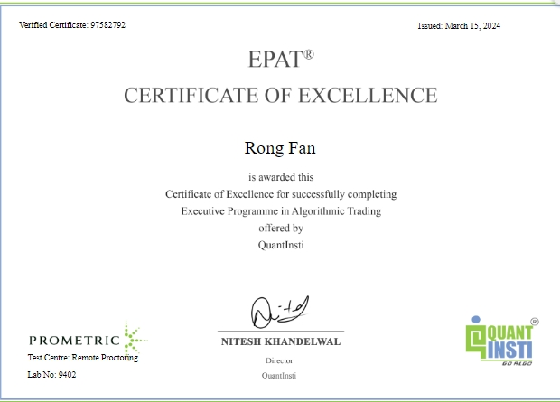

# Quant.Infra.Net

[](https://github.com/memoryfraction/Quant.Infra.Net/actions/workflows/ci.yml)  [](https://dotnet.microsoft.com/download/dotnet/8.0)  [](https://www.nuget.org/packages/Quant.Infra.Net)  [](https://www.nuget.org/packages/Quant.Infra.Net.Runtime)  [](LICENSE)

> A one-stop .NET **framework** for quantitative trading: multi-source data ingestion, unified broker execution (Binance/IB/Schwab), real-time alerting, and built-in portfolio analytics — go from idea to backtest to paper to live by changing config and a strategy file, not your codebase.
>
> 面向量化交易的一站式 .NET **框架**：多源数据接入、统一券商执行（币安/盈透/嘉信）、实时消息推送与内置组合分析工具——从想法到回测、模拟盘、实盘，改配置、改一个策略文件就行，不用改动你的代码库。
>
> 📖 [Documentation / GitHub Pages](https://memoryfraction.github.io/Quant.Infra.Net/) · 📦 [NuGet packages](https://www.nuget.org/profiles/memoryfraction)

---

## Languages / 语言

- [English](docs/readme-en.md)
- [中文](docs/readme-ch.md)

---

## 🎯 Does this sound familiar? / 这些痛点，是不是也卡住过你？

Building a trading system in .NET is usually not one problem — it's **four problems glued together with duct tape**:

1. **Data keeps breaking.** Free feeds go stale, endpoints 404, the anti-bot wall moves — and your *strategy* is the one that suffers. 数据源三天两头抽风：免费接口过期、端点 404、反爬墙一挪，最后背锅的却是你的策略。
2. **You can't trust your backtester.** Look-ahead bias, peeking at future bars, a hand-rolled loop that "works" in testing but behaves differently in live. 回测引擎不靠谱：前视偏差、偷看未来 bar、自己搓的循环"测试能过"却和实盘表现两码事。
3. **Backtest and live are two codebases.** One works, the other doesn't, and you never know which to believe. 回测与实盘是两套代码：一个能跑、一个跑不了，你永远不知道信哪个。
4. **Every broker is a rewrite.** Want to switch from Binance to Schwab or IB? Re-learn the SDK, re-test everything, re-shape your strategy. 每换一个券商就要重改：币安换嘉信/盈透，重学 SDK、重跑测试、重调策略。

**Quant.Infra.Net gives you the answer to all four — one framework, one interface.** You write the strategy *once*; data sources, brokers, and backtest↔live all swap by **config, not code**.
**Quant.Infra.Net 一次性解决这四个问题——一套框架、一个接口。** 你只写一次策略；数据源、券商、回测↔实盘都靠**改配置**切换，而不是改代码。

---

## ✅ The answer, in a real backtest / 解决方案：先看一个真实回测


> **A real, reproducible backtest — not a mock.** The example below runs the bundled `QQQM reverse-MA200 DCA` strategy over **real QQQM daily closes (2020-12 → 2026-08)**, with the exact console output and equity curve from the actual run. Nothing is fabricated.
>
> 下面是一个**可复现的真实回测**——不是演示假数据。`QQQM 逆向 MA200 定投` 策略跑在 **QQQM 真实日线（2021 → 2026）** 上，控制台输出与权益曲线均取自真实运行，无任何虚构。


> Target weight over time — the strategy holds more when price is below the SMA200 and trims when above (the contrarian buy-the-dip in action).

**Real run result (real QQQM daily closes, 2020-12-01 → 2026-08-27):**

| Metric | Value | What it means |
|--------|-------|---------------|
| Initial equity | **$10,000** | starting capital |
| Final equity | **$14,556** | **+45.6%** over ~5.7 years |
| CAGR | **8.0%** | annualized return (1,241 tradable bars, post-warmup) |
| Max Drawdown | **−18.82%** | worst peak-to-trough (2022 bear market) |
| Sharpe \| **0.67** | buy-and-hold over the same window: 0.72 — a *different* risk/return trade-off, not better or worse |
| Win Rate | **52.9%** | |
| Trades | **684** | daily rebalancing decisions |
| Bars | **1,241** | (after 200-bar warmup) |

> **This is a comparison, not a verdict.** Reverse-DCA deliberately holds more when price is below the SMA200 and trims when above. Versus buy-and-hold over the same window (Sharpe 0.72, max drawdown ≈ −35%), it shows a *different* profile (Sharpe 0.66, max drawdown ≈ −18.8%). **Neither is objectively better or worse** — the right choice depends on *your* risk tolerance, your income, and your stage of life. Quant.Infra.Net is a tool: it produces the numbers, **you** make the decision.
>
> **这是一次对比，而不是好坏判断。** 逆向定会在价格低于 SMA200 时加仓、高于时减仓。相比同一窗口的买入持有（Sharpe 0.72、最大回撤 ≈ −35%），它呈现的是**另一种**风险/收益画像（Sharpe 0.66、最大回撤 ≈ −18.8%）。**两者并不存在客观的好坏**——哪个更适合，取决于*你*的风险偏好、你的收入、以及你人生的阶段。Quant.Infra.Net 只是工具：它给出数字，**判断由你来做**。

**The strategy, in one sentence / 一句话策略:** every day, compute `SMA200` of QQQM closes — if price is *below* the MA (cheap), increase target weight; if *above* (expensive), reduce it. The full 30-line strategy code is in [Section 4](#-3-modify-the-strategy--改一下策略验证自己的想法).
> 每天算 QQQM 收盘价的 `SMA200`——价格在均线**下方**（便宜）时加仓，在**上方**（贵）时减仓。完整的 30 行策略代码见[第 4 节](#-3-modify-the-strategy--改一下策略验证自己的想法)。

---

## Is this for you? / 这适合我吗？

**You are the target reader if / 如果你是：**

- Building a quantitative trading system in .NET — you want **data → signal → risk → execution → portfolio** handled by one consistent pipeline, not five disconnected SDKs.
- **Backtest-first:** you want to prove a strategy on historical data *before* touching a real broker — and the *same* strategy code runs in Backtest / Paper / Testnet / Live.
- Tired of **look-ahead bias** in hand-rolled backtesters — this engine replays bar-by-bar through the same 8-stage pipeline live mode uses, so what you backtest is what you deploy.
- A researcher who needs a **statistical analysis toolkit** (ADF, OLS, Z-Score, Shapiro-Wilk, pair-trading spread) and a **multi-broker execution layer** (Binance Futures, Alpaca, Schwab, Interactive Brokers) behind unified interfaces.

**It is not for you if / 如果你需要的是：**

- A turnkey "buy this and get rich" bot — this is *infrastructure*, you write the strategy.
- A Python-only or non-.NET stack.
- A guarantee of profit — past backtest performance is not indicative of future results. See [Disclaimer](docs/Disclaimer.md).

> **The NuGet packages are tools for your process / NuGet 包是过程中的工具** — they are building blocks that make *your* strategy development faster, not a black box that trades for you.
> **NuGet 包是过程中的工具** —— 它们是加速*你*策略开发的构件，而不是替你交易的黑盒。

---

## 🎓 Credentials / 资质认证



> **Maintainer certified in Algorithmic Trading — EPAT®, QuantInsti (2024).** / 维护者已通过 QuantInsti 颁发的 **EPAT® 算法交易认证**（2024 年）。
>
> 📝 EPAT graduation project / 毕业论文: [Crypto Perpetual Contract Pair Trading (QuantInsti Blog)](https://blog.quantinsti.com/crypto-perpetual-contract-pair-trading-project-rong-fan/) / [加密永续合约配对交易（QuantInsti 博客）](https://blog.quantinsti.com/crypto-perpetual-contract-pair-trading-project-rong-fan/)

---

## 📡 Data Sources — the thing people get wrong / 数据来源——很多人踩坑的地方

> **Data source is the #1 reason a quant project quietly dies.** The classic failure: you build on a .NET wrapper for Yahoo Finance, then Yahoo changes their API, the wrapper's author doesn't update for 3–6 months, and your whole pipeline is dead — for months. **This repo is designed so that can't be your single point of failure.**
>
> **数据来源是量化项目悄悄死掉的第一原因。** 经典死法：你建在某个 Yahoo Finance 的 .NET 封装库上，然后 Yahoo 改了 API，封装库作者 3–6 个月不更新，你的整条管道就死了——一死就是几个月。**本仓库的设计就是为了让你不至于把命门押在单一数据源上。**

**The core idea: data source is a *swappable interface*, not a hard dependency.** `ITraditionalFinanceSourceDataService` / `ICryptoSourceDataService` are the contract; the implementation behind them is a config value (`Runtime:DataSource`). When one source breaks or gets stale, you **swap the source, not the strategy** — your signal/risk/execution code doesn't change a line.
> **核心思想：数据源是*可替换的接口*，不是硬依赖。** 契约是 `ITraditionalFinanceSourceDataService` / `ICryptoSourceDataService`，背后的实现是一个配置值（`Runtime:DataSource`）。某个源坏了或过期了，你**换数据源，而不是改策略**——信号/风控/执行代码一行不动。

**Recommended default, then fallbacks, in order of preference / 首推默认，其余为兜底，按优先级：**

| # | Source | Mechanism | Why |
|---|--------|-----------|-----|
| ⭐ | **Alpaca Market Data** (free IEX tier) — `DataSourceKind.Alpaca` | Core library's `AlpacaClient`, built on the **officially maintained** `Alpaca.Markets` .NET SDK (already a core dependency) | This is the one with an actual maintainer on the hook — not a reverse-engineered endpoint. Free API key, no credit card, real historical bars. **This is what "run in 60s" points at once you're past the zero-network demo.** |
| 2 | **Yahoo Finance via `yfinance`** (Python) | `pythonnet` runs the Python `yfinance` library directly | Community-maintained, patched fast when Yahoo changes — but it's still an unofficial wrapper around an undocumented endpoint. Fine for research; don't build a business on it alone. |
| 3 | **Yahoo Finance Chart API** (direct HTTP) | Thin in-repo C# client (`query1.finance.yahoo.com/v8/finance/chart`) | If `yfinance` breaks, this ~50-line endpoint is *your* code — you can patch it yourself in hours. Still unofficial/undocumented. |
| 4 | **Stooq** (free public daily bars) | Plain HTTP to `stooq.com` | A last-resort, completely independent free feed for when the whole Yahoo path is down. Has intermittently required browser verification (anti-bot) — treat as best-effort, not a dependency to build on. |

**Why lead with Alpaca / 为什么首推 Alpaca：**

1. **It's the only layer with an actual SDK maintainer.** `Alpaca.Markets` is officially published and versioned; Yahoo/Stooq here are unofficial HTTP clients against endpoints nobody promises to keep stable.
2. **Free tier, no scraping risk.** IEX-fed historical bars via a real API key — not a JS anti-bot page, not an undocumented chart endpoint.
3. **The rest are still there as fallbacks.** Yahoo/Stooq stay in the codebase for zero-signup research use — just not the thing to depend on for anything beyond that.
4. **Your strategy never knows which source is active.** Backtest/Paper/Live all consume the same interface, so a source swap is one config value, not a rewrite.

> **Bottom line / 结论:** the .NET-ecosystem "unofficial wrapper" risk is real for Yahoo/Stooq — which is why the *recommended* path is Alpaca's officially maintained SDK, with Yahoo/`yfinance`/Stooq kept as free, zero-signup fallbacks for research. **You write the strategy once; you swap data sources by config.**
> **一句话：** .NET 生态里 Yahoo/Stooq 这类"非官方封装"的风险是真实的——所以*推荐路径*是 Alpaca 官方维护的 SDK，Yahoo/`yfinance`/Stooq 作为免注册的研究用兜底保留。**你只写一次策略；换数据源只是改配置。**


**Going beyond free feeds / 免费源之外：**
The same `ITraditionalFinanceSourceDataService` interface accepts **any** data provider - including other professional paid feeds (Polygon, IEX direct, Databento, your broker feed, a local CSV file, etc.). The pattern is the same: implement the interface, register it in DI, set `Runtime:DataSource` to your provider. Your strategy, pipeline, and backtest runner code do not change.
> 免费源之外：同一个 `ITraditionalFinanceSourceDataService` 接口可以对接**任意**数据供应商——包括其他付费专业数据源（Polygon、IEX 直连、Databento、券商自有行情、本地 CSV 文件等）。做法完全一致：实现接口 → 注册到 DI → 配置 `Runtime:DataSource`。策略、管线、回测运行器代码零改动。

> ⚠️ **Free public data, research use only / 免费公共数据，仅供研究** — Alpaca's free IEX tier, Yahoo/`yfinance`, and Stooq are all **no-SLA** feeds intended for **research/backtesting**, not production order flow. For live trading, point the same interface at your broker's data feed (Binance Futures, Alpaca, Schwab, IB) — the strategy code is unchanged.
> ⚠️ **免费公共数据，仅供研究** —— Alpaca 免费 IEX 层、Yahoo/`yfinance`、Stooq 均为**无 SLA** 的免费行情，仅供**研究/回测**，不应用于生产下单。实盘请让同一接口指向你的券商行情（Binance Futures、Alpaca、Schwab、IB）——策略代码不变。

---

## 🚀 1. Run the real backtest in 60 seconds / 一分钟跑通真实回测

**Prereqs:** [.NET 8 SDK](https://dotnet.microsoft.com/download/dotnet/8.0). No API keys, no broker account — the default run is fully offline.

```bash
git clone https://github.com/memoryfraction/Quant.Infra.Net.git
cd Quant.Infra.Net

# One command — runs the real QQQM backtest and prints the metrics above:
dotnet run --project src/Quant.Infra.Net.Runtime.Console -- QqqmDoc
```

**Expected output (abridged) / 预期输出（节选）:**

```
=== Quant.Infra.Net CompleteWalkthrough — QQQM reverse-MA200 DCA (real data backtest) ===
bars loaded: 1441  (2020-12-01 .. 2026-08-27)
initial equity: 10000 USD | warmup bars: 200 | commission/slippage: 0 bps | fill: SameBarClose
=== backtest metrics (real run) ===
bars=1241  trades=684
CAGR=8.00%  Sharpe=0.67  Calmar=0.43
MaxDrawdown=-18.82%  WinRate=52.9%  ProfitFactor=1.16  Commission=0 USD
```

> **Why no network is needed:** the example reads the **local cached snapshot of real QQQM daily closes** (`docs/assets/_qqqm_yfinance.json`) first - zero network, fully deterministic. If that file is missing, it falls back to the free public **Stooq** feed (stooq.com). Refresh the cache any time with `node docs/assets/qqqm_fetch_data.js`. Both are free public data for **research/backtesting only**.
> **为什么不需要联网：** 示例**优先读取本地缓存的真实 QQQM 日线快照**（`docs/assets/_qqqm_yfinance.json`）——零网络、完全确定性。若该文件缺失，再回退到免费公共 **Stooq** 行情（stooq.com）。随时用 `node docs/assets/qqqm_fetch_data.js` 刷新缓存。两者均为仅供**研究/回测**的免费公共数据。

**Switch the mode with ONE config value / 用一个配置值切换模式:**

| `RunMode` | What happens | Data | Execution |
|-----------|--------------|------|-----------|
| `Backtest` | replays historical bars, prints metrics (the run above) | historical | in-memory (zero network) |
| `Paper` | full event trail on a simulated broker, zero real orders | live feed | in-memory Paper broker |
| `Testnet` | real broker API, testnet sandbox | live feed | Binance testnet |
| `Live` | real broker API, production | live feed | Binance live |

**Want live-fetched data instead of the cached snapshot?** Set `DataSource: Alpaca` and provide a free API key (sign up at [alpaca.markets](https://alpaca.markets), no credit card, IEX tier is free):

```json
{
  "Runtime": {
    "RunMode": "Backtest",
    "DataSource": "Alpaca",
    "AlpacaApiKey": "<your-key>",
    "AlpacaApiSecret": "<your-secret>"
  }
}
```
> **想要实时拉取数据而不是用缓存快照？** 把 `DataSource` 设为 `Alpaca`，提供一个免费 API Key（在 [alpaca.markets](https://alpaca.markets) 注册，无需信用卡，IEX 层免费）。缺 Key/Secret 时会 fail-fast 报错，不会静默退回其他数据源。

---

## 📦 2. Install the NuGet packages / 安装 NuGet 包

The project is a **family of packages**. Most users only need the top one — its dependencies pull in the rest:

| Package | Version | What it gives you |
|---------|---------|-------------------|
| [`Quant.Infra.Net`](https://www.nuget.org/packages/Quant.Infra.Net) | 1.5.1 | Core: data sources, broker & order execution, statistical analysis, portfolio analytics, notifications |
| [`Quant.Infra.Net.Orchestration`](https://www.nuget.org/packages/Quant.Infra.Net.Orchestration) | 1.6.0 | Event-driven strategy pipeline: signal → risk → target position → execution → portfolio state |
| [`Quant.Infra.Net.Backtest`](https://www.nuget.org/packages/Quant.Infra.Net.Backtest) | 1.6.0 | Event-driven (bar-by-bar) backtest engine with look-ahead-bias guards |
| [`Quant.Infra.Net.Runtime`](https://www.nuget.org/packages/Quant.Infra.Net.Runtime) | 1.6.0 | Unified `RunMode` switch (Backtest/Paper/Testnet/Live) + one-file-per-strategy plugin convention — **recommended entry point** |

**Dependency chain / 依赖链:** `Runtime 1.6.0` → `Backtest 1.6.0` + `Orchestration 1.6.0` → `Quant.Infra.Net 1.5.1`

```bash
dotnet new console -n MyQuantApp && cd MyQuantApp

# Full stack (one command pulls in everything above):
dotnet add package Quant.Infra.Net.Runtime

# ...or core only (data / broker / analysis / notifications, no strategy pipeline):
dotnet add package Quant.Infra.Net --version 1.5.1
```

> **One `dotnet add package` on `Quant.Infra.Net.Runtime` installs the whole stack.** Add `Quant.Infra.Net` alone only if you need the building blocks without the strategy pipeline.
> **对 `Quant.Infra.Net.Runtime` 执行一次 `dotnet add package` 即装齐整个技术栈。** 若只需数据/券商/分析/通知等构件，单独装 `Quant.Infra.Net` 即可。

---

## ✍️ 3. Modify the strategy — validate your own idea / 改一下策略，验证自己的想法

**This is the moment that convinces people.** The entire QQQM strategy is **one ~30-line method** in `src/Quant.Infra.Net.Runtime.Console/Strategies/QqqmReverseDcaStrategy.cs`. Change the numbers, change the symbol, add your own logic — and re-run the exact same backtest. No framework changes.

**The core (abridged) / 核心代码（节选）:**

```csharp
protected override async Task ExecuteCoreAsync(IPipelineContext context, CancellationToken ct)
{
    var symbol      = context.GetParameter("Symbol") ?? "QQQM";
    var maPeriod    = Math.Max(2, GetInt(context, "MaPeriod", 200));
    var baseWeight  = GetDouble(context, "BaseWeight", 0.5);
    var addIntensity= GetDouble(context, "AddIntensity", 1.5);
    var trimIntensity = GetDouble(context, "TrimIntensity", 1.0);

    var closes = await LoadClosesAsync(context, symbol, ct);   // base class loads for you
    var close  = closes[^1];
    var sma    = closes.TakeLast(maPeriod).Average();

    var targetWeight = QqqmReverseDcaStrategy.ComputeTargetWeight(
        close, sma, baseWeight, addIntensity, trimIntensity,
        GetDouble(context, "MinWeight", 0.0), GetDouble(context, "MaxWeight", 1.0));

    var signal = new Signal { Symbol = symbol, GeneratedUtc = DateTime.UtcNow,
        Direction = targetWeight > 0 ? SignalDirection.Long : SignalDirection.Flat,
        Strength = targetWeight,
        Reason = $"close={close} SMA{maPeriod}={sma:F4} targetWeight={targetWeight:F4}" };
    Publish(context, new Signal(), new TargetPosition { Symbol = symbol, TargetWeight = targetWeight });
}
```

**Tweak the parameters (no code change) / 调参数（零代码）:**

| Parameter | Default | Meaning |
|-----------|---------|---------|
| `Symbol` | `QQQM` | any symbol your data source serves |
| `MaPeriod` | `200` | SMA window |
| `BaseWeight` | `0.5` | target weight at the MA |
| `AddIntensity` | `1.5` | how hard to add when *below* the MA |
| `TrimIntensity` | `1.0` | how hard to trim when *above* the MA |

Set them in `appsettings.json` under `Orchestration:Parameters`, or pass them in the `o => o.Parameters[...]` callback — then re-run the **same** `dotnet run` command and read the new metrics. **Your hypothesis, measured against the same real data.**

**Add a brand-new strategy (one file) / 新增一个策略（一个文件）:**

1. Create `MyStrategy.cs` in your project — one class implementing `IStrategyDescriptor` wrapping an `ISignalGenerator` (or subclass `Strategy` and override `ExecuteCoreAsync`), see `ExampleCustomStrategy.cs` in the repo for the minimal case.
2. The `AddQuantInfraNet(..., strategyAssemblies: typeof(MyStrategy).Assembly)` reflection scan discovers it automatically.
3. Set `Orchestration:Parameters:Strategy = "MyStrategy"` in `appsettings.json`. Done — it now runs in **Backtest, Paper, Testnet, and Live** with identical logic.

> **Why this matters:** the strategy is a *plugin* on a fixed pipeline. Risk gate, execution, portfolio state, and notifications are provided by the framework — you only supply the signal/weight logic. The same file runs in every `RunMode`, which is what prevents the classic "backtest ≠ live" drift.
> **为什么重要：** 策略是固定管道上的*插件*。风控、执行、组合状态、通知都由框架提供——你只提供信号/权重逻辑。同一个文件在所有 `RunMode` 下运行，这正是消除"回测 ≠ 实盘"漂移的关键。

---

## 🧱 Architecture / 架构

```
┌─────────────────────────────────────────────────────────────────┐
│                     Your Strategy Logic                          │
│                  (Write once, run anywhere)                       │
└──────────────────────┬──────────────────────────────────────────┘
┌──────────────────────────────────────────────────────────────────┐
│  UNIFIED RUNTIME / 统一运行时层 (Quant.Infra.Net.Runtime)          │
│  One entry: AddQuantInfraNet + ONE switch: appsettings "RunMode"  │
│  单入口 + 一个开关：Backtest / Paper / Testnet / Live              │
│  ───────────────────────────────────────────────────────────────  │
│  Orchestration Layer (Quant.Infra.Net.Orchestration) / 编排层     │
│  DataIngest → Analysis → Signal → TargetPosition → Risk          │
│  → Execution (Paper broker, zero network) → PortfolioState       │
│  → Notification   PipelineRunner + AddQuantInfraNetOrchestration │
│  ───────────────────────────────────────────────────────────────  │
│  Backtest Layer (Quant.Infra.Net.Backtest) / 回测层                │
│  Same 8 stages, replay clock: bar-by-bar, zero look-ahead by design│
│  同样的八个阶段、逐 bar 回放时钟——架构级零前视                      │
└───────────────────────────────┬──────────────────────────────────┘
                       │ IQuantInfraNet API
   ┌───────────────────┼──────────────────────────────────────────┐
   │                   │                                          │
   ▼                   ▼                                          ▼
┌──────────┐    ┌──────────────┐                          ┌──────────────┐
│  Source  │    │   Broker     │                          │ Notification │
│  Data    │    │   & Orders   │                          │              │
│ Yahoo    │    │ Binance      │                          │ DingTalk     │
│ Finance  │    │ Futures      │                          │ WeChat Work  │
│ Binance  │    │ Alpaca       │                          │ Email (SMTP) │
│ Spot/Perp│    │ Schwab       │                          │ Brevo        │
│ CSV/SQL  │    │ Interactive  │                          │              │
└──────────┘    │ Brokers      │                          └──────────────┘
                │ (Testnet/Live)│
                └──────────────┘
```

**Why this matters / 为什么重要:**
- **One consistent pipeline** across Backtest / Paper / Live — the same strategy file, so no "backtest ≠ live" drift
- **Unified interfaces** — `ITraditionalFinanceSourceDataService`, `IBrokerService`, `IEmailService` — swap implementations without changing your strategy code
- **Out-of-the-box analysis** — ADF test, OLS regression, Z-Score, Sharpe ratio — all included

---

## 📚 Documentation / 文档

| Document | Description |
|----------|-------------|
| 📖 [**GitHub Pages**](https://memoryfraction.github.io/Quant.Infra.Net/) | **Bilingual documentation site** — modules, API, examples, live language toggle |
| [Complete Walkthrough (EN)](docs/CompleteWalkthrough-en.md) / [完整图文教程 (中文)](docs/CompleteWalkthrough-ch.md) | **From "a few lines of code" to the real QQQM backtest** — the exact run, output, charts, and next steps |
| [Unified Runtime Quick Start (EN)](docs/UnifiedRuntimeQuickStart-en.md) / [统一运行时使用说明 (中文)](docs/UnifiedRuntimeQuickStart-ch.md) | The single demo host: run Backtest/Paper with one config value, and how to swap data source, strategy, or credentials |
| [Orchestration Quick Start (EN)](docs/OrchestrationQuickStart-en.md) / [编排层使用说明 (中文)](docs/OrchestrationQuickStart-ch.md) | What the demo's data source/symbol/strategy are, and how to swap in your own |
| [Backtest Quick Start (EN)](docs/BacktestQuickStart-en.md) / [回测引擎使用说明 (中文)](docs/BacktestQuickStart-ch.md) | Bar-by-bar engine, look-ahead guards, metrics, sweep |
| [Orchestration Layer Design / 编排层设计](docs/OrchestrationLayerDesign.md) | E2E orchestration contract: signal generation, risk gate, Paper execution, pipeline & DI |
| [Trading Runtime Design / 统一运行时设计](docs/TradingRuntimeDesign.md) | Phase-2 unified runtime: one entry, one switch, Backtest replay + live driving + parity regression |
| [User Manual / 使用手册](docs/Manual.md) | Installation, module usage guide, API examples |
| [Architecture Overview / 架构概览](docs/Architect.md) | System design, module relationships, data flow |
| [Code Standards / 代码规范](docs/CodeStandard.md) | SOLID principles, XML docs, naming conventions, checklist |
| [**How-to Guides (docs/manual)**](docs/manual/README-en.md) / [任务导向深度指南 (中文)](docs/manual/README-ch.md) | Task-oriented deep guides for the Runtime/Orchestration/Backtest layers: full configuration reference, writing a strategy, custom risk/data source/broker, testing & deployment, FAQ |
| [🤖 **MCP Server (AI Agent access)**](docs/manual/mcp-server-en.md) / [AI Agent 接入 (中文)](docs/manual/mcp-server-ch.md) | Drive Quant.Infra.Net from Claude Desktop / Cursor / any MCP client — `list_strategies` · `run_backtest` · `run_paper_cycle` · `fetch_ohlcv`. Natural-language prompts, SOLID data sources (Finnhub / FMP / TwelveData / LocalFile), explicit no-live-order boundary |

---

## ❓ FAQ — common questions & search keywords / 常见问题

**Q: How do I backtest crypto strategies in C#? / 怎么用 C# 回测加密货币策略？**
A: Use Quant.Infra.Net's backtest engine with the built-in Binance Futures data source. Define a strategy as a target-weight or signal function, feed it `Ohlcv` bars, and the `BacktestRunner` returns CAGR, Sharpe, Calmar, MaxDrawdown, WinRate and ProfitFactor. `用 Quant.Infra.Net 的回测引擎 + 内置币安合约数据源，把策略写成目标权重或信号函数，`BacktestRunner` 直接给出 CAGR / Sharpe / Calmar / 最大回撤 / 胜率 / 盈亏比。` See the 60-second example above. 见上面的 60 秒示例。

**Q: What's the best .NET library for pair trading? / .NET 做配对交易（pair trading）最好的库？**
A: Quant.Infra.Net ships pair-trading / statistical-arbitrage primitives: OLS spread regression, spread z-score and cointegration checks over OHLCV data, so you can build and backtest a pairs strategy without leaving C#. `内置配对交易 / 统计套利基础件：OLS 价差回归、价差 z-score、协整检验，直接在 C# 里完成配对策略的回测。`

**Q: How do I connect Interactive Brokers from .NET? / 怎么用 .NET 接 Interactive Brokers（盈透）？**
A: Use the unified `IBrokerService` abstraction — Quant.Infra.Net wraps Interactive Brokers (via InterReact), Alpaca, Charles Schwab and Binance Futures behind one interface, so live and backtest code share the same call path. `用统一的 `IBrokerService` 接口：Quant.Infra.Net 把盈透（InterReact）、Alpaca、Charles Schwab、币安合约封装成同一接口，实盘与回测共用同一套调用。`

**Q: Best .NET quantitative trading framework in 2026? / 2026 年最好的 .NET 量化交易框架？**
A: For C# developers who want a compact, self-hostable framework (not a hosted cloud like QuantConnect), Quant.Infra.Net gives you data → strategy → backtest → execution → notifications in a few NuGet packages you own and can extend. `对想用 C#、希望自托管（而非 QuantConnect 这类云端托管）的开发者，Quant.Infra.Net 用几个 NuGet 包就能串起 数据 → 策略 → 回测 → 执行 → 通知，且完全归你掌控、可自由扩展。`

**Q: How do I backtest a C# mean-reversion strategy? / 怎么用 C# 回测均值回归策略？**
A: The QQQM reverse-MA200 DCA walkthrough in this repo is a working mean-reversion example: target weight = base ± add/trim around the SMA200, re-run it with your own thresholds and bars. `本仓库的 QQQM 反向 MA200 DCA 就是一个可运行的均值回归示例：目标权重 = 基准 ± 围绕 SMA200 的加/减系数，换成你自己的阈值和数据即可复跑。`

---

## 🗒️ Changelog / 变更记录

| Date | Change / 变更 |
|---|---|
| 2026-08-29 | **v1.6.0 — three new NuGet packages**: `Quant.Infra.Net.Orchestration`, `Quant.Infra.Net.Backtest`, `Quant.Infra.Net.Runtime` (all 1.6.0) on top of core `Quant.Infra.Net` 1.5.1. Unified `RunMode` switch + one-file-per-strategy plugin convention. Core package unchanged at 1.5.1. |
| 2026-07-20 | Phase 2 unified runtime (feature/backtest-engine): `AddQuantInfraNet` one entry + `RunMode` one switch; Backtest↔Paper parity regression tests; demo hosts converged into `Quant.Infra.Net.Runtime.Console` |

---

> 📖 [GitHub Pages](https://memoryfraction.github.io/Quant.Infra.Net/) — full documentation site

## Related Projects / 相关项目

| Project | Description |
|---|---|
| [LLSDA](https://github.com/memoryfraction/LLSDA-Lightning-Location-System-Data-Analyzer) | Open-source lightning location system (LLS) data analysis library — published on NuGet, cited in a TechRxiv preprint. 开源闪电定位系统数据分析类库 —— 已发布 NuGet 包，并被 TechRxiv 预印本引用。 |
| [HealthData-Interoperability-Csharp](https://github.com/memoryfraction/HealthData-Interoperability-Csharp) | AI-driven FHIR R4/R5 healthcare interoperability engine for .NET — HIPAA compliance helpers, US Core conformance, local AI semantic validation. 基于 .NET 的 AI 驱动 FHIR R4/R5 医疗数据互操作引擎 —— HIPAA 合规辅助、US Core 一致性校验、本地 AI 语义验证。 |

> More projects by the same author: [github.com/memoryfraction](https://github.com/memoryfraction) / 同一作者的更多项目

---


## 💼 Business Inquiries / 商务合作

Using Quant.Infra.Net in a commercial product or team? / 想在商业产品或团队中使用 Quant.Infra.Net？

| Option | What you get | Starting at 起价 | Start |
|---|---|---|---|
| **1 · Consulting 咨询** | 30–60 min: architecture / data / execution / backtest design | **$200/hr** | [Book 30 min](https://calendly.com/rex-fan18/30min) |
| **2 · Broker Integration 券商集成** | Wire a single broker (Schwab / Interactive Brokers / Binance / Alpaca) into your stack — auth, order routing, positions/fills sync | **$5,000** | [Book a scoping call](https://calendly.com/rex-fan18/30min) |
| **3 · Multi-Broker Execution Layer 多券商执行层** | Unified execution across 2+ brokers; backtest → paper → live parity | **$12,000** | [Book a scoping call](https://calendly.com/rex-fan18/30min) |
| **4 · Bespoke 定制开发** | Custom modules scoped to your product needs | **$15,000+** | [Book a scoping call](https://calendly.com/rex-fan18/30min) |
| **5 · E-book 电子书** | 《区块链量化投资实战 / Blockchain Quant Trading in Practice》 | — | [Amazon](https://www.amazon.com/dp/B0D7W89ZQD) · [小红书笔记](https://www.xiaohongshu.com/discovery/item/6a9366b4000000002102fbff) |

- **Email / 邮箱**: [rex.fan18@gmail.com](mailto:rex.fan18@gmail.com)
- **Book a call / 预约会议**: [https://calendly.com/rex-fan18/30min](https://calendly.com/rex-fan18/30min)

> Open source is MIT-licensed and free for commercial use. Paid services cover consulting, onboarding, and bespoke development. Prices above are starting points — final scope/quote is set on the scoping call.
> 开源版本遵循 MIT 许可，可免费商用；付费服务覆盖咨询、落地接入与定制开发。以上为起价，最终范围与报价在通话后确认。

> 完整服务与报价说明见 [docs/Commercial.md](docs/Commercial.md)。
---

> **Disclaimer**: See [DISCLAIMER](docs/Disclaimer.md) for full disclaimer and limitation of liability. Backtest performance is not indicative of future results. **Not investment advice.** / 详见免责声明了解完整免责条款与责任限制。回测表现不代表未来收益。**非投资建议。**

