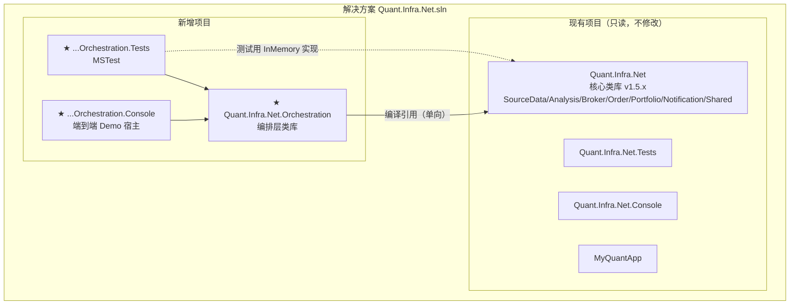
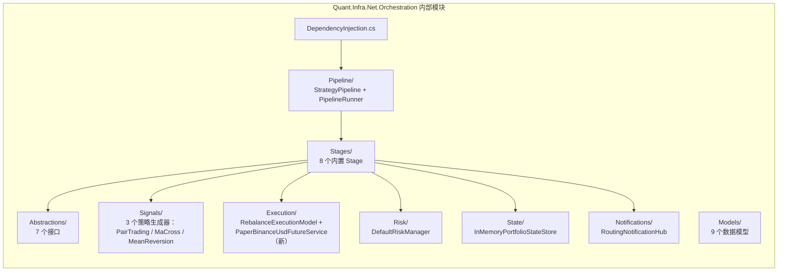
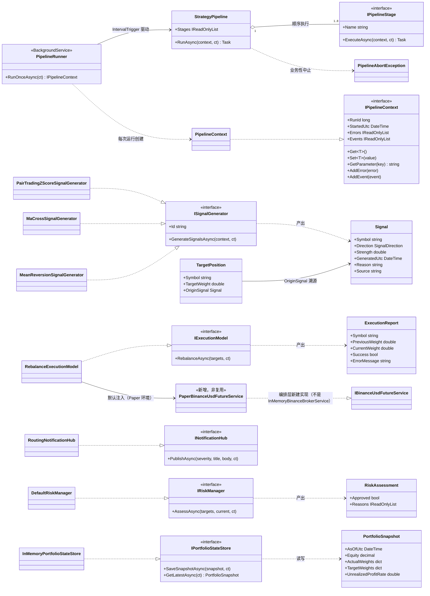
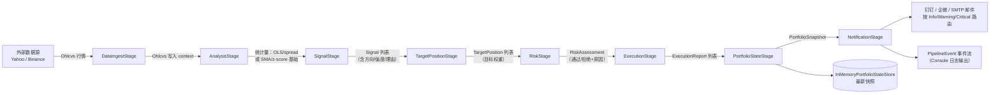
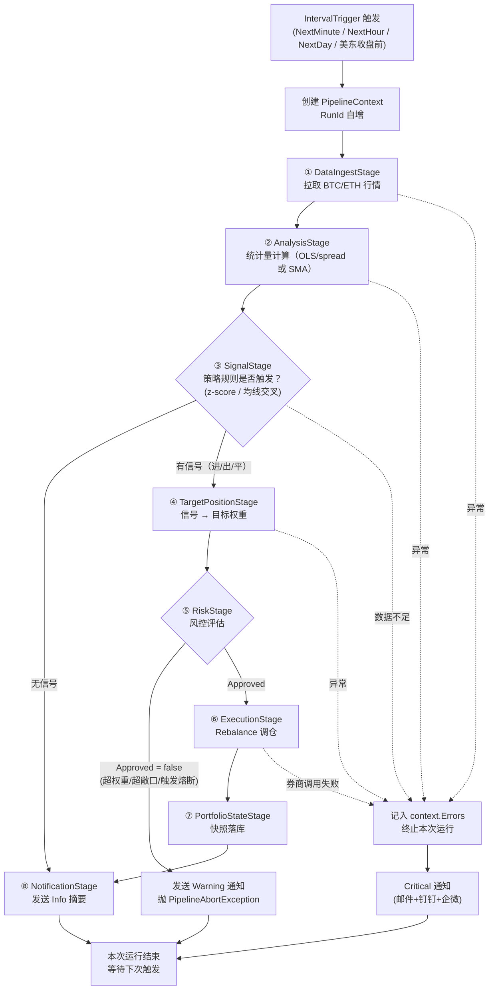
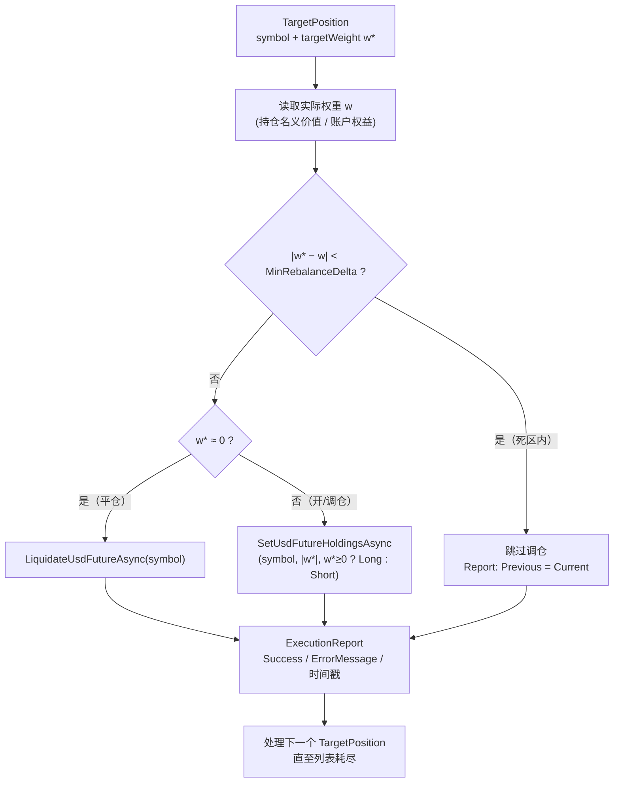

# Quant.Infra.Net Orchestration Layer 设计方案（研究→执行 编排层）

> Research-to-Execution Orchestration Layer — 把现有基础库升级为端到端量化交易框架
>
> **本文档的双重用途**：本方案既是一份「可自主执行的规格说明书」（供人或本地 LLM 编码代理，如 qwen3:27b 在无人值守时段实现），也是一份供人类评审的架构设计文档。因此包含完整的可视化图（§3：架构图、模块图、类图、数据流图、流程图）与实现后的预期使用效果（§10）。所有接口签名、目录结构、里程碑验收标准均已定死，实现时**不得擅自更改公共契约**。

---

## 文档版本控制

| 版本 | 日期 | 更新内容 | 更新人 |
|------|------|---------|--------|
| 1.4.2 | 2026-08-28 | **Demo 默认策略改为单标的 `MaCross`**（原为双标的 `PairTradingZScore`）：单标的 = 一条信号/一条目标仓位/一条执行报告，新读者更容易肉眼核对结果；appsettings.json 同步移除了对 MaCross 无用的 `SymbolA`/`SymbolB` 残留参数（此前会导致 DataIngestStage 多余加载一组未使用的配对数据）。新增独立的 [编排层详细使用说明（中文）](OrchestrationQuickStart-ch.md) / [Orchestration Quick Start Guide (English)](OrchestrationQuickStart-en.md)：明确 Demo 用的数据源（`DemoTraditionalFinanceSourceDataService`，合成数据、零网络）、标的（合成 AAPL）、策略（MaCross），以及接入真实数据源 / 更换标的 / 自定义策略的分步说明；根 README 与 readme-en/readme-ch 均已链接到这两份新文档 | agent(claude-sonnet-5) |
| 1.4.1 | 2026-08-28 | **审阅整改**：补齐 `TargetPosition.OriginSignal`（§5.4，此前缺失，"全链路溯源"实际不可用，现已在 `TargetPositionStage` 回填并有 M6 端到端测试覆盖）；`PipelineEvent` 补齐 `Severity` 字段（§5.7）；`OrchestrationOptions` 风控默认值改回与 §5.7 契约一致（`MaxWeightPerSymbol=0.3`/`MaxGrossExposure=1.0`/`KillSwitchDrawdownRate=-0.15`/`MinRebalanceDelta=0.01`，Console Demo 的 appsettings.json 仍显式覆盖为放宽值，不受影响）；Console Demo `Program.cs` 修正重复 `using`、去除与 `AddQuantInfraNetOrchestration()` 内部重复的 `IntervalTrigger` 注册，精简至 37 行（≤40 行验收线内）；补充 `M6DependencyInjectionTests` 中 MaCross / MeanReversion 两条端到端用例（此前只有 PairTradingZScore 有端到端证据）；消除编排层自身引入的 3 个编译警告（CS0105 重复 using、CS8619/CS8620 可空性）；`docs/readme-en.md`/`docs/readme-ch.md`（完整版说明文档）补充编排层 Quick Start 小节，根 README 架构图追加中文标注。`IPipelineContext` 的文件/命名空间位置（§4 目录结构 vs 实际 `Models/PipelineContext.cs`）与 `PortfolioSnapshot` 字段命名（`Equity`/`AsOfUtc` vs 实际 `AccountEquityUsd`/`SnapshotUtc`）仍与 §4/§5 契约文本不完全一致——重命名涉及面较广，本轮未动，留待后续单独整改 | agent(claude-sonnet-5) |
| 1.4.0 | 2026-08-28 | **M0–M6 全部实施完成**：新增 `Quant.Infra.Net.Orchestration{,.Tests,.Console}` 三个项目（§6 全里程碑落地：契约/信号/风控/Paper执行/管道/DI与Runner/Demo）；Orchestration.Tests 93/93 全绿；Console Demo 三策略（PairTradingZScore/MaCross/MeanReversion）Paper 单周期实测通过；根 README 架构图与文档表已追加编排层 | agent(qwen3.8:27b) |
| 1.3.0 | 2026-08-27 | **审阅修正（关键）**：`InMemoryBinanceBrokerService` 核实为 `BrokerServiceBase` 的空壳实现（非 `IBinanceUsdFutureService`，方法体全部 `throw NotImplementedException`），且现有唯一的 `IBinanceUsdFutureService` 实现（`BinanceUsdFutureService`）只支持 Testnet/Live、会打真实 Binance API——**编排层必须新建纸上交易实现 `PaperBinanceUsdFutureService`**（新增 §3.5 D3 重写 + §5.4.1 + M3 任务）；修正 `ITraditionalFinanceSourceDataService` 的数据拉取方法名（`DownloadOhlcvListAsync` 而非 `GetOhlcvListAsync`）；补充 `Ohlcvs.OhlcvSet` 为 `HashSet<Ohlcv>`（无序）必须按时间戳排序的规则；补充 `PipelineRunner` 的事件→异步循环桥接与 `IntervalTrigger.Start()` 调用说明；修正 §2 表格对 `PortfolioCalculationService` 的错误归因 | rex |
| 1.2.0 | 2026-08-27 | 内置范例策略扩充为 3 个：新增 MaCross（含经典 200MA 均线）与 MeanReversion 两个生成器，§9 重写为三策略 Demo | rex |
| 1.2.1 | 2026-08-27 | ADF 平稳性门限改为可选（仅 C# 实现，D9）：编排层禁用 Python 互操作，M2 增加 `UseAdfFilter` 参数与专用测试 | rex |
| 1.1.0 | 2026-08-27 | 增补：模块图/类图/数据流图/流程图（Mermaid，GitHub 可渲染）、预期使用效果章节 | rex |
| 1.0.0 | 2026-08-27 | 初版：编排层完整落地设计 | rex |

---

## 目录

1. [背景与目标](#1-背景与目标)
2. [可行性评估](#2-可行性评估)
3. [总体架构](#3-总体架构)
   - 3.1 [模块图（项目依赖）](#31-模块图项目依赖)
   - 3.2 [类图（核心契约 UML）](#32-类图核心契约-uml)
   - 3.3 [数据流图](#33-数据流图)
   - 3.4 [流程图](#34-流程图)
   - 3.5 [关键设计决策](#35-关键设计决策)
4. [目录结构](#4-目录结构)
5. [核心契约（接口与模型，实现必须逐字遵守）](#5-核心契约)
6. [里程碑与验收标准](#6-里程碑与验收标准)
7. [测试策略](#7-测试策略)
8. [实现护栏（自主编码代理必读）](#8-实现护栏)
9. [范例策略与端到端 Demo](#9-范例策略与端到端-demo)
10. [实现后的预期使用效果](#10-实现后的预期使用效果)
11. [仓库策略与后续演进](#11-仓库策略与后续演进)

---

## 1. 背景与目标

### 1.1 现状

Quant.Infra.Net 目前是「水平能力库」：数据、分析、券商、通知、组合绩效各自独立，用户需要自己写胶水代码把模块串起来。README 中宣称的 `AddQuantInfraNet()` 统一注册扩展方法**实际并不存在**（Console 项目是手工注册 DI 的），这是本方案要一并补齐的债。

### 1.2 目标（本方案完成的定义）

构建 `Quant.Infra.Net.Orchestration` 编排层，实现一条**单一、一致、可观测的流水线**：

```
数据采集 → 统计分析 → 信号生成 → 风控前置检查 → 执行调仓 → 组合状态更新 → 通知推送 → 持久化/遥测
```

完成后，用户用 ~30 行代码即可运行一个端到端策略（见 §9），而不是 300 行胶水代码。

### 1.3 非目标

- 不引入回测引擎（已有 `InMemoryBinanceBrokerService` 提供模拟执行，够用）
- 不新增券商接入（复用现有 Broker 模块）
- 不做多进程/分布式（单进程 BackgroundService 托管即可）
- 不修改任何现有模块的公共 API（只做增量）

---

## 2. 可行性评估

"research-to-execution orchestration layer" 方向**可行且时机正确**。逐项映射：

| 提案要素 | 库内已有能力 | 缺口（本方案补齐） |
|---------|------------|------------------|
| 信号传递 | `IAnalysisService`（相关性/ADF/OLS/Z-Score）、`SpreadCalculator*` 系列 | 无 `Signal` 标准模型，无信号生成器抽象 |
| 分析结果输出 | `AnalysisService` 返回裸 double | 无带上下文（时间戳/标的/理由）的结果模型 |
| 执行假设 | `IBinanceUsdFutureService.SetUsdFutureHoldingsAsync(symbol, rate, positionSide)` 按"组合比例"调仓 | 无「目标组合 → 订单」的执行模型抽象，无 Rebalance 语义 |
| **Paper 纸上交易** | **无。** 唯一具体实现 `BinanceUsdFutureService` 只支持 `Testnet`/`Live`，会打真实 Binance API；`InMemoryBinanceBrokerService` 是另一套 `BrokerServiceBase` 抽象且方法体全部 `throw NotImplementedException`，两者均不可用 | **必须新建** `IBinanceUsdFutureService` 的纯内存实现（见 §3.5 D3、§5.4.1），这是安全默认（"绝不触实盘"）成立的前提，不是可选项 |
| 组合状态 | `PortfolioCalculationService`（账户余额/持仓）；CAGR/Sharpe/Calmar/回撤实际在 `StrategyPerformanceAnalyzer` | 无运行时状态存储（目标持仓 vs 实际持仓） |
| 统一管道 | `IntervalTrigger`（NextSecond/NextMinute/NextHour/NextDay/美东收盘前） | 各模块间无统一 Pipeline/Context/事件流 |
| 监控告警 | 钉钉/企微/SMTP/Brevo | 无按严重级别路由的通知网关 |

**结论：不是重写，是把已有积木加一层薄编排壳——但"Paper 执行"这块积木实际上不存在，编排层必须自己造，不能当作复用项。** 风险不在技术，在于范围失控——因此本方案用固定契约 + 分里程碑 + 每步验收来控制。

---

## 3. 总体架构

```
┌──────────────────────────────────────────────────────────────────────┐
│                    Quant.Infra.Net.Orchestration                      │
│                                                                      │
│  ┌────────────────┐   ┌──────────────────────────────────────────┐  │
│  │ PipelineRunner  │   │           StrategyPipeline                │  │
│  │ (Background-    │──▶│  Stage[0]→Stage[1]→…→Stage[n] 顺序执行，   │  │
│  │  Service 托管)  │   │  共享一个 PipelineContext                 │  │
│  └───────┬────────┘   └──────────────────────────────────────────┘  │
│          │ 由 IntervalTrigger 驱动（复用 Shared.Service）             │
│          ▼                                                           │
│  ┌────────────────────────────────────────────────────────────────┐  │
│  │                      内置 Stage 实现                            │  │
│  │                                                                │  │
│  │  DataIngestStage ──▶ AnalysisStage ──▶ SignalStage             │  │
│  │        │                                    │                  │  │
│  │        ▼                                    ▼                  │  │
│  │  PortfolioStateStage ◀── RiskStage ◀── TargetPositionStage      │  │
│  │        │                (前置风控/熔断)         │                 │  │
│  │        ▼                                    ▼                  │  │
│  │  ExecutionStage ─────────────▶ NotificationStage ─▶ Telemetry    │  │
│  │  (Rebalance 执行)               (分级路由)        (内存事件总线)  │  │
│  └────────────────────────────────────────────────────────────────┘  │
│                                                                      │
│  复用（不改动）: ITraditionalFinanceSourceDataService / IBinance-     │
│  UsdFutureService（接口）/ IAnalysisService / PortfolioCalculation-   │
│  Service / IDingtalkService / IEmailService / IWeChatService /       │
│  IntervalTrigger / RollingWindow<T>                                  │
│  新增（非复用）: PaperBinanceUsdFutureService —— IBinanceUsdFuture-   │
│  Service 的纸上交易实现。`InMemoryBinanceBrokerService` 实现的是     │
│  BrokerServiceBase（不同接口，方法全 NotImplementedException），      │
│  `BinanceUsdFutureService` 只支持 Testnet/Live（打真实 API），二者    │
│  均不可作为 Paper 执行路径直接复用，详见 §3.5 D3、§5.4.1              │
└──────────────────────────────────────────────────────────────────────┘
```

### 3.1 模块图（项目依赖）

解决方案级视图：新增三个项目（★），现有四个项目一律只读（§8 护栏）。



模块内视图（Orchestration 项目内部）：



### 3.2 类图（核心契约 UML）

> 下图与 §5 的 C# 签名一一对应；实现者以 §5 文本契约为准，本图用于快速建立全局认知。



### 3.3 数据流图

一次 Pipeline 运行中，数据在 Stage 之间的类型化流转（边上的标注即 `PipelineContext` 中传递的具名类型）：



关键数据形态变化链：**原始行情(Ohlcvs) → 统计量(Slope/spread) → 交易意图(Signal) → 目标权重(TargetPosition) → 风控裁决(RiskAssessment) → 执行结果(ExecutionReport) → 组合快照(PortfolioSnapshot)**。每一步都是纯数据对象，可单测、可序列化、可审计。

### 3.4 流程图

**图 A：单次 Pipeline 运行生命周期（PipelineRunner 视角）**



**图 B：Rebalance 调仓决策（ExecutionStage 内部，对应 `RebalanceExecutionModel`）**



### 3.5 关键设计决策

| # | 决策 | 理由 |
|---|------|------|
| D1 | Stage 之间用 `PipelineContext`（类型化键值容器）传递数据，不用强类型链条 | 允许用户插入/删除任意 Stage 而不改其他 Stage 签名 |
| D2 | 执行语义定为**目标持仓 Rebalance**（target-portfolio reconciliation），非逐笔订单 | 与现有 `SetUsdFutureHoldingsAsync(symbol, rate, side)` 语义天然对齐，零新下单接口 |
| D3 | 模拟执行优先：默认注册编排层**新建**的 `PaperBinanceUsdFutureService`（实现 `IBinanceUsdFutureService`，纯内存记账，不发任何网络请求），实盘/测试网需显式将 `Environment` 改为 `Testnet`/`Live` 并切换为核心库的 `BinanceUsdFutureService` | 夜间自主开发期间绝不触实盘。**核实结论**：`InMemoryBinanceBrokerService` 实现的是 `BrokerServiceBase`（另一套抽象，方法体全部 `throw NotImplementedException`），并非 `IBinanceUsdFutureService`，不可复用；核心库里唯一具体实现 `BinanceUsdFutureService` 的 `ExchangeEnvironment` 只处理 `Testnet`/`Live` 两支，没有 Paper 分支，会打真实 Binance REST API。因此"默认 Paper、绝不触实盘"这条安全前提在编排层落地前**不存在对应实现**，必须新写，详见 §5.4.1 与 M3 |
| D4 | 通知走 `INotificationHub`，按 `NotificationSeverity` 路由，Stage 不直接依赖具体通道 | 解耦：Signal→Info 通道，Risk 拒单→Warning 通道，异常→Critical 全通道 |
| D5 | 遥测 = 进程内 `Channel<PipelineEvent>` 事件总线，Console 消费打印；不引外部 APM | 零新依赖 |
| D6 | 新增 NuGet 依赖白名单：仅 `Microsoft.Extensions.Hosting.Abstractions`、`Microsoft.Extensions.Logging.Abstractions`、`Microsoft.Extensions.Options` | 现有库已依赖 Microsoft.Extensions.*，风险最低 |
| D7 | 所有策略生成器输出**状态型信号**（"当前应持方向"），而非事件型信号（"仅在交叉瞬间触发"） | 进程重启后无需恢复历史状态即可重建目标持仓；实现与测试都更简单 |
| D8 | 内置 3 个范例策略生成器，策略选择走配置参数 `Strategy`，未知值启动期抛异常（fail-fast） | 范例即文档：经典 200MA 均线、配对交易 z-score、均值回归覆盖三类主流风格；换策略零代码 |
| D9 | 配对交易 ADF 平稳性门限：**只用 C# 的 `bool AugmentedDickeyFullerTest(IEnumerable<double> timeSeries, double adfTestStatisticThreshold = -2.86)` 重载**（`IAnalysisService` 另有一个返回 `AdfTestResult` 的非 bool 重载，同样禁止在编排层使用 Python 互操作路径），做成 `UseAdfFilter` 可选参数；编排层**禁用** `AugmentedDickeyFullerTestPython` | Python 互操作依赖 Python.NET + conda venv + 硬编码 Windows 路径（`D:\ProgramData\PythonVirtualEnvs\pair_trading` + `python39.dll`），会破坏单仓库可移植性、Linux 部署与"build 全绿即验收"的自主回路；C# 版作为 240 根窗口的粗过滤器精度足够 |

---

## 4. 目录结构

在解决方案内**新增两个项目**（不移动现有项目）：

```
src/
├── Quant.Infra.Net/                        # 现有核心库（不动）
├── Quant.Infra.Net.Tests/                  # 现有测试（不动）
├── Quant.Infra.Net.Console/                # 现有演示（不动）
├── MyQuantApp/                             # 现有示例（不动）
│
├── Quant.Infra.Net.Orchestration/          # ★ 新增：编排层类库
│   ├── Abstractions/
│   │   ├── IPipelineStage.cs
│   │   ├── IPipelineContext.cs
│   │   ├── ISignalGenerator.cs
│   │   ├── IExecutionModel.cs
│   │   ├── IRiskManager.cs
│   │   ├── IPortfolioStateStore.cs
│   │   └── INotificationHub.cs
│   ├── Models/
│   │   ├── PipelineContext.cs              # IPipelineContext 默认实现
│   │   ├── Signal.cs
│   │   ├── TargetPosition.cs
│   │   ├── RiskAssessment.cs
│   │   ├── ExecutionReport.cs
│   │   ├── PortfolioSnapshot.cs
│   │   ├── PipelineEvent.cs
│   │   ├── NotificationSeverity.cs
│   │   └── OrchestrationOptions.cs
│   ├── Pipeline/
│   │   ├── StrategyPipeline.cs
│   │   └── PipelineRunner.cs               # BackgroundService
│   ├── Stages/
│   │   ├── DataIngestStage.cs
│   │   ├── AnalysisStage.cs
│   │   ├── SignalStage.cs
│   │   ├── TargetPositionStage.cs
│   │   ├── RiskStage.cs
│   │   ├── ExecutionStage.cs
│   │   ├── PortfolioStateStage.cs
│   │   └── NotificationStage.cs
│   ├── Signals/
│   │   ├── PairTradingZScoreSignalGenerator.cs   # 策略一：配对交易 z-score
│   │   ├── MaCrossSignalGenerator.cs             # 策略二：均线交叉（含经典 200MA）
│   │   └── MeanReversionSignalGenerator.cs       # 策略三：均值回归（z-score）
│   ├── Execution/
│   │   ├── RebalanceExecutionModel.cs
│   │   └── PaperBinanceUsdFutureService.cs # ★新增：IBinanceUsdFutureService 纯内存实现（见 §5.4.1）
│   ├── Risk/
│   │   └── DefaultRiskManager.cs
│   ├── State/
│   │   └── InMemoryPortfolioStateStore.cs
│   ├── Notifications/
│   │   └── RoutingNotificationHub.cs
│   └── DependencyInjection.cs              # AddQuantInfraNetOrchestration()
│
├── Quant.Infra.Net.Orchestration.Tests/    # ★ 新增：MSTest 测试
│   ├── PipelineContextTests.cs
│   ├── StrategyPipelineTests.cs
│   ├── SignalStageTests.cs
│   ├── PairTradingZScoreSignalGeneratorTests.cs
│   ├── MaCrossSignalGeneratorTests.cs
│   ├── MeanReversionSignalGeneratorTests.cs
│   ├── RebalanceExecutionModelTests.cs
│   ├── PaperBinanceUsdFutureServiceTests.cs
│   ├── DefaultRiskManagerTests.cs
│   ├── PortfolioStateStoreTests.cs
│   └── PipelineRunnerTests.cs
│
└── (R6 已退役：本历史快照中的独立 Demo 宿主 Program.cs/appsettings.json → 现由 Quant.Infra.Net.Runtime.Console 承载，RunMode=Paper)
```

同时更新 `Quant.Infra.Net.sln`：`dotnet sln add` 三个新项目。

---

## 5. 核心契约

> **实现者注意**：以下 C# 签名是**最终契约**。命名空间统一为 `Quant.Infra.Net.Orchestration.*`（如 `Quant.Infra.Net.Orchestration.Abstractions`）。所有公共类型必须有中英双语 XML 注释（遵循 docs/CodeStandard.md）。如发现签名与现有库类型冲突，以现有库为准调整实现细节，但**公共方法名与参数语义不得变**。

### 5.1 管道上下文

```csharp
namespace Quant.Infra.Net.Orchestration.Abstractions;

/// <summary>
/// 管道上下文：一次 Pipeline 运行内各 Stage 共享的类型化键值容器。
/// Pipeline context: a typed key-value container shared by stages within one pipeline run.
/// </summary>
public interface IPipelineContext
{
    /// <summary>运行序号，从 1 开始递增 / Monotonic run sequence starting at 1.</summary>
    long RunId { get; }

    /// <summary>本次运行开始时间(UTC) / UTC start time of this run.</summary>
    DateTime StartedUtc { get; }

    /// <summary>获取或设置类型化槽位 / Get or set a typed slot.</summary>
    T Get<T>() where T : class;

    /// <summary>设置类型化槽位 / Set a typed slot.</summary>
    void Set<T>(T value) where T : class;

    /// <summary>读取命名参数（来自 OrchestrationOptions.Parameters）/ Read a named parameter.</summary>
    string? GetParameter(string key);

    /// <summary>记录本次运行的错误（不清空，供后续 Stage 判断）/ Record an error for this run.</summary>
    void AddError(Exception error);

    /// <summary>本次运行累计的错误列表 / Errors accumulated in this run.</summary>
    IReadOnlyList<Exception> Errors { get; }

    /// <summary>本次运行的日志条目 / Log entries of this run.</summary>
    IReadOnlyList<PipelineEvent> Events { get; }

    /// <summary>记录事件 / Append an event.</summary>
    void AddEvent(PipelineEvent evt);
}
```

`PipelineContext.Get<T>()` 未设置时返回 `null!`？——**不允许**。规定：未设置返回 `null`（调用方判空），这是最简单且 LLM 实现最不易错的语义。测试必须覆盖「未设置→null」「设置→取回」「覆盖→新值」三个用例。

### 5.2 Stage 与 Pipeline

```csharp
namespace Quant.Infra.Net.Orchestration.Abstractions;

/// <summary>
/// 管道阶段：一次原子步骤 / One atomic step of the pipeline.
/// </summary>
public interface IPipelineStage
{
    /// <summary>阶段名（唯一，用于日志与排序）/ Unique stage name.</summary>
    string Name { get; }

    /// <summary>执行阶段 / Execute this stage. Throws on failure.</summary>
    Task ExecuteAsync(IPipelineContext context, CancellationToken cancellationToken);
}
```

```csharp
namespace Quant.Infra.Net.Orchestration.Pipeline;

/// <summary>
/// 顺序执行 Stage 列表的策略管道 / Sequentially executes an ordered stage list.
/// </summary>
public class StrategyPipeline
{
    /// <param name="stages">按执行顺序传入 / stages in execution order</param>
    public StrategyPipeline(IEnumerable<IPipelineStage> stages);

    public IReadOnlyList<IPipelineStage> Stages { get; }

    /// <summary>
    /// 依次执行 Stage；任一 Stage 抛出 PipelineAbortException 则终止本次运行（不算致命错误），
    /// 其他异常同样终止本次运行并记入 context.Errors。始终产出结尾事件。
    /// </summary>
    Task RunAsync(IPipelineContext context, CancellationToken cancellationToken);
}
```

```csharp
namespace Quant.Infra.Net.Orchestration.Pipeline;

/// <summary>
/// 中止信号：风控拒绝、市场休市等"业务正常但停止执行"的场景。
/// Abort signal for business-normal early termination (e.g. risk rejection).
/// </summary>
public class PipelineAbortException : Exception
{
    public string StageName { get; }
    public PipelineAbortException(string stageName, string reason) : base(reason) { StageName = stageName; }
}
```

```csharp
namespace Quant.Infra.Net.Orchestration.Pipeline;

/// <summary>
/// 托管运行器：按 IntervalTrigger 周期触发 StrategyPipeline.RunAsync。
/// Hosted runner triggering the pipeline on an IntervalTrigger schedule.
/// </summary>
public class PipelineRunner : BackgroundService
{
    public PipelineRunner(
        StrategyPipeline pipeline,
        Microsoft.Extensions.Options.IOptions<OrchestrationOptions> options,
        Microsoft.Extensions.Logging.ILogger<PipelineRunner> logger,
        IntervalTrigger trigger);

    /// <summary>手动触发一次（测试与预热用）/ Trigger one run manually.</summary>
    Task<IPipelineContext> RunOnceAsync(CancellationToken cancellationToken);
}
```

> **实现提示（易错点）**：`IntervalTrigger` 是基于 `event EventHandler IntervalTriggered` 的同步事件触发器，构造后**不会自动计时**，必须显式调用 `trigger.Start()`（`BackgroundService.StartAsync`/`ExecuteAsync` 开始处）；`Stop()`/`Dispose()` 应在 `StopAsync` 中调用。要在 `ExecuteAsync` 里把事件转成可 `await` 的循环，推荐用 `System.Threading.Channels.Channel<bool>`：事件处理器里 `channel.Writer.TryWrite(true)`，`ExecuteAsync` 里 `await foreach (var _ in channel.Reader.ReadAllAsync(cancellationToken)) { await RunOnceAsync(cancellationToken); }`。禁止用 `Task.Delay` 轮询代替事件订阅。

### 5.3 信号模型与生成器

```csharp
namespace Quant.Infra.Net.Orchestration.Models;

/// <summary>信号方向 / Signal direction.</summary>
public enum SignalDirection { Flat = 0, Long = 1, Short = -1 }

/// <summary>
/// 标准信号：一次分析产出的可执行意图 / A tradable intent produced by analysis.
/// </summary>
public class Signal
{
    /// <summary>标的，如 "BTCUSDT"、"AAPL" / Instrument symbol.</summary>
    public string Symbol { get; init; } = string.Empty;

    /// <summary>方向 / Direction.</summary>
    public SignalDirection Direction { get; init; }

    /// <summary>信号强度 |z|、置信度等，语义由生成器定义 / Strength, e.g. |z-score|.</summary>
    public double Strength { get; init; }

    /// <summary>信号时间戳(UTC) / UTC timestamp of the signal.</summary>
    public DateTime GeneratedUtc { get; init; }

    /// <summary>人类可读理由（进通知）/ Human-readable reason for notifications.</summary>
    public string Reason { get; init; } = string.Empty;

    /// <summary>生成器标识，如 "PairTradingZScore" / Generator identifier.</summary>
    public string Source { get; init; } = string.Empty;
}
```

```csharp
namespace Quant.Infra.Net.Orchestration.Abstractions;

/// <summary>
/// 信号生成器：输入行情，输出本周期信号集合 / Produces signals from market data.
/// </summary>
public interface ISignalGenerator
{
    /// <summary>生成器标识（写入 Signal.Source）/ Generator id.</summary>
    string Id { get; }

    Task<IReadOnlyList<Signal>> GenerateSignalsAsync(IPipelineContext context, CancellationToken cancellationToken);
}
```

### 5.4 目标持仓、风控、执行

```csharp
namespace Quant.Infra.Net.Orchestration.Models;

/// <summary>
/// 目标持仓：信号翻译后的目标组合权重 / Target position as portfolio weight.
/// </summary>
public class TargetPosition
{
    public string Symbol { get; init; } = string.Empty;
    /// <summary>目标权重，多头为正、空头为负，绝对值 ≤ 1 / Target weight, long positive, short negative.</summary>
    public double TargetWeight { get; init; }
    /// <summary>信号来源，供审计 / Originating signal for audit.</summary>
    public Signal? OriginSignal { get; init; }
}
```

```csharp
namespace Quant.Infra.Net.Orchestration.Abstractions;

/// <summary>
/// 风控前置检查：在执行前评估本次目标组合 / Pre-trade risk gate.
/// </summary>
public interface IRiskManager
{
    /// <summary>
    /// 返回评估结果；Approved=false 时 Pipeline 以 PipelineAbortException 终止本次运行，
    /// 并发送 Warning 级通知。
    /// </summary>
    Task<RiskAssessment> AssessAsync(
        IReadOnlyList<TargetPosition> targets,
        PortfolioSnapshot current,
        CancellationToken cancellationToken);
}
```

```csharp
namespace Quant.Infra.Net.Orchestration.Models;

public class RiskAssessment
{
    public bool Approved { get; init; }
    /// <summary>拒绝原因 / Rejection reasons (empty when approved).</summary>
    public IReadOnlyList<string> Reasons { get; init; } = Array.Empty<string>();
}
```

```csharp
namespace Quant.Infra.Net.Orchestration.Abstractions;

/// <summary>
/// 执行模型：把目标持仓与当前持仓的差异变成券商调用 / Turns target-vs-actual delta into broker calls.
/// </summary>
public interface IExecutionModel
{
    /// <summary>
    /// 按 TargetWeight 调仓。实现必须复用 IBinanceUsdFutureService.SetUsdFutureHoldingsAsync /
    /// LiquidateUsdFutureAsync 语义。Paper 环境下注入的是编排层新建的
    /// PaperBinanceUsdFutureService（见 §5.4.1），**不是** InMemoryBinanceBrokerService——
    /// 后者实现的是不相关的 BrokerServiceBase 接口且方法体全部 NotImplementedException。
    /// </summary>
    Task<IReadOnlyList<ExecutionReport>> RebalanceAsync(
        IReadOnlyList<TargetPosition> targets,
        CancellationToken cancellationToken);
}
```

```csharp
namespace Quant.Infra.Net.Orchestration.Models;

public class ExecutionReport
{
    public string Symbol { get; init; } = string.Empty;
    /// <summary>执行前权重 / Weight before.</summary>
    public double PreviousWeight { get; init; }
    /// <summary>执行后权重 / Weight after.</summary>
    public double CurrentWeight { get; init; }
    public bool Success { get; init; }
    public string? ErrorMessage { get; init; }
    public DateTime ExecutedUtc { get; init; }
}
```

### 5.4.1 Paper 执行实现（新增，非复用——关键澄清）

> **审阅核实结论**：核心库里不存在任何可安全复用的 `IBinanceUsdFutureService` 纸上交易实现。`InMemoryBinanceBrokerService`（`Quant.Infra.Net.Account.Service` 命名空间）实现的是完全不同的 `BrokerServiceBase` 抽象，其 `SetHoldings`/`Liquidate`/`GetHoldingAsync` 等方法体均为 `throw new NotImplementedException()`。核心库里唯一真正实现了 `IBinanceUsdFutureService` 的类 `BinanceUsdFutureService` 只处理 `ExchangeEnvironment.Testnet`/`Live` 两个分支，会通过 Binance.Net SDK 发出真实网络请求。因此"默认 Paper、绝不触实盘"这条安全前提**必须由编排层自己实现**，不是配置切换就能获得的现成能力。

```csharp
namespace Quant.Infra.Net.Orchestration.Execution;

/// <summary>
/// 纸上交易实现：编排层自建的 IBinanceUsdFutureService 纯内存实现，不发任何网络请求。
/// In-memory paper-trading implementation of IBinanceUsdFutureService — issues no network calls.
/// 默认在 Paper 环境下由 AddQuantInfraNetOrchestration() 注册为 IBinanceUsdFutureService 单例。
/// </summary>
public class PaperBinanceUsdFutureService : IBinanceUsdFutureService
{
    /// <summary>固定为 Paper，setter 允许但编排层永不主动切换 / Fixed to Paper; setter exists only to satisfy the interface.</summary>
    public ExchangeEnvironment ExchangeEnvironment { get; set; } = ExchangeEnvironment.Paper;

    // 内部状态：账户权益（默认取 OrchestrationOptions 的 InitialEquityUsd，缺省 10000）
    // 及各 symbol 的名义持仓（正数=多头，负数=空头，单位 USD）。
    // Internal state: account equity (from OrchestrationOptions.InitialEquityUsd, default 10000)
    // and per-symbol notional holdings in USD (positive = long, negative = short).

    // 行情来源：不自行拉取行情——GetOhlcvListAsync 委托给注入的
    // ITraditionalFinanceSourceDataService/真实 IBinanceUsdFutureService 只读转发用于估值，
    // 或直接从 PipelineContext 已加载的 Ohlcvs 取最新收盘价（由 DataIngestStage 保证先于
    // ExecutionStage 执行）。不得连接真实交易所行情/交易接口。

    // SetUsdFutureHoldingsAsync(symbol, rate, positionSide)：按 rate * 当前权益 计算目标名义
    // 持仓并直接覆盖内部字典（不模拟滑点/手续费，Paper 场景不需要）。
    // LiquidateUsdFutureAsync(symbol)：内部字典该 symbol 归零。
    // GetusdFutureAccountBalanceAsync/GetusdFutureUnrealizedProfitRateAsync/
    // GetHoldingPositionAsync：全部基于内部字典与最新收盘价计算，不发请求。
    // ShowPositionModeAsync/SetPositionModeAsync/HasUsdFuturePositionAsync：Paper 场景下
    // 直接返回/记录内存状态，不抛异常。
}
```

- **依赖白名单澄清**：实现 `PaperBinanceUsdFutureService` 与 `RebalanceExecutionModel` 时需要引用 `Binance.Net.Enums.PositionSide`、`Binance.Net.Objects.Models.Futures.BinancePositionDetailsUsdt` 等类型——这些是 `IBinanceUsdFutureService` 接口签名自带的传递依赖（核心库已引用 `Binance.Net`），**不算违反 §8 依赖白名单**（不需要新增 `PackageReference`，`Quant.Infra.Net.Orchestration.csproj` 通过引用 `Quant.Infra.Net` 已经能拿到这些类型）。
- **测试要求**：`PaperBinanceUsdFutureServiceTests` 覆盖：开仓后权重正确、`MinRebalanceDelta` 死区、`LiquidateUsdFutureAsync` 清零、余额/浮盈计算、`GetHoldingPositionAsync` 返回内容与内部状态一致。全部测试**不得访问网络**。

### 5.5 组合状态存储

```csharp
namespace Quant.Infra.Net.Orchestration.Abstractions;

/// <summary>
/// 组合状态存储：记录最新快照（目标/实际权重、权益、绩效指标）/ Portfolio state store.
/// </summary>
public interface IPortfolioStateStore
{
    /// <summary>保存快照（覆盖式）/ Upsert latest snapshot.</summary>
    Task SaveSnapshotAsync(PortfolioSnapshot snapshot, CancellationToken cancellationToken);

    /// <summary>读取最新快照；无记录时返回 null / Latest snapshot or null.</summary>
    Task<PortfolioSnapshot?> GetLatestAsync(CancellationToken cancellationToken);
}
```

```csharp
namespace Quant.Infra.Net.Orchestration.Models;

public class PortfolioSnapshot
{
    public DateTime AsOfUtc { get; init; }
    /// <summary>账户权益（USD）/ Account equity in USD.</summary>
    public decimal Equity { get; init; }
    /// <summary>各标的实际权重 / Actual weights by symbol.</summary>
    public IReadOnlyDictionary<string, double> ActualWeights { get; init; }
    /// <summary>各标的目标权重 / Target weights by symbol.</summary>
    public IReadOnlyDictionary<string, double> TargetWeights { get; init; }
    /// <summary>未实现收益率 / Unrealized profit rate.</summary>
    public double UnrealizedProfitRate { get; init; }
}
```

### 5.6 通知网关

```csharp
namespace Quant.Infra.Net.Orchestration.Models;

/// <summary>通知严重级别 / Notification severity.</summary>
public enum NotificationSeverity { Info = 0, Warning = 1, Critical = 2 }
```

```csharp
namespace Quant.Infra.Net.Orchestration.Abstractions;

/// <summary>
/// 通知网关：按严重级别路由到已配置通道（钉钉/企微/邮件）/ Severity-routed notification hub.
/// Stage 永远只依赖本接口，不直接依赖 IDingtalkService 等。
/// </summary>
public interface INotificationHub
{
    Task PublishAsync(NotificationSeverity severity, string title, string body, CancellationToken cancellationToken);
}
```

`RoutingNotificationHub` 默认实现行为：
- `Info` → 钉钉（若 DI 中已注册 `IDingtalkService` 且 options 配置了 token）
- `Warning` → 钉钉 + 企微
- `Critical` → 钉钉 + 企微 + 邮件（`IEmailService`）
- 任何通道未注册/未配置 → 静默跳过并 `ILogger.LogWarning`，**绝不抛异常**（通知失败不能杀死交易管道）

### 5.7 事件与配置

```csharp
namespace Quant.Infra.Net.Orchestration.Models;

/// <summary>
/// 管道事件：统一遥测载体 / Unified telemetry record.
/// </summary>
public class PipelineEvent
{
    public long RunId { get; init; }
    public string StageName { get; init; } = string.Empty;
    public NotificationSeverity Severity { get; init; }
    public string Message { get; init; } = string.Empty;
    public DateTime TimestampUtc { get; init; }
    public IReadOnlyDictionary<string, string> Data { get; init; } = new Dictionary<string, string>();
}
```

```csharp
namespace Quant.Infra.Net.Orchestration.Models;

/// <summary>
/// 编排层配置（appsettings.json 的 "Orchestration" 节）/ Options bound from "Orchestration" section.
/// </summary>
public class OrchestrationOptions
{
    /// <summary>执行环境，默认 Paper / Execution environment, defaults to Paper.</summary>
    public ExchangeEnvironment Environment { get; set; } = ExchangeEnvironment.Paper;

    /// <summary>Paper 环境下 PaperBinanceUsdFutureService 的起始账户权益(USD)，默认 10000 / Starting equity for the paper account.</summary>
    public decimal InitialEquityUsd { get; set; } = 10000m;

    /// <summary>单标的最大绝对权重，默认 0.3 / Max absolute weight per symbol.</summary>
    public double MaxWeightPerSymbol { get; set; } = 0.3;

    /// <summary>组合总绝对权重上限，默认 1.0 / Max gross exposure.</summary>
    public double MaxGrossExposure { get; set; } = 1.0;

    /// <summary>未实现亏损熔断阈值（如 -0.15 即 -15% 触发熔断平仓）/ Kill-switch threshold on unrealized loss.</summary>
    public double KillSwitchDrawdownRate { get; set; } = -0.15;

    /// <summary>权重变化小于该阈值不调仓（去噪）/ Rebalance dead-band.</summary>
    public double MinRebalanceDelta { get; set; } = 0.01;

    /// <summary>命名参数表，供 Stage/SignalGenerator 读取 / Named parameters for stages.</summary>
    public Dictionary<string, string> Parameters { get; set; } = new();
}
```

### 5.8 DI 注册扩展

```csharp
namespace Quant.Infra.Net.Orchestration;

public static class DependencyInjection
{
    /// <summary>
    /// 注册编排层默认实现（Paper 环境）。
    /// Registers default orchestration layer (Paper environment).
    /// </summary>
    /// <remarks>
    /// 策略选择：当 customSignalGenerator 为 null 时，按 options.Parameters["Strategy"]
    /// 注册对应的内置生成器（Singleton，三选一）：
    ///   "PairTradingZScore"（默认）→ PairTradingZScoreSignalGenerator（§9.1）
    ///   "MaCross"               → MaCrossSignalGenerator（§9.2，含经典 200MA 配置）
    ///   "MeanReversion"         → MeanReversionSignalGenerator（§9.3）
    /// 未知值启动期抛 ArgumentException（fail-fast）。
    /// Strategy selection: falls back to options.Parameters["Strategy"] when no custom generator.
    /// </remarks>
    public static IServiceCollection AddQuantInfraNetOrchestration(
        this IServiceCollection services,
        Action<OrchestrationOptions>? configure = null,
        IEnumerable<IPipelineStage>? customStages = null,
        ISignalGenerator? customSignalGenerator = null,
        IExecutionModel? customExecutionModel = null);
}
```

依赖注入关系：
- `IPortfolioStateStore` → `InMemoryPortfolioStateStore`（Singleton）
- `IRiskManager` → `DefaultRiskManager`（Singleton）
- `INotificationHub` → `RoutingNotificationHub`（Singleton）
- `IBinanceUsdFutureService` → `PaperBinanceUsdFutureService`（Singleton，仅当 `options.Environment == Paper`；非 Paper 时不由本方法负责注册，由调用方自行注入核心库的 `BinanceUsdFutureService`）
- `IExecutionModel` → `RebalanceExecutionModel`（Singleton，注入上面解析出的 `IBinanceUsdFutureService`）
- `ISignalGenerator` → 按 `Strategy` 参数三选一（Singleton，仅注册一个实现）
- `StrategyPipeline` → Singleton（由 Stage 有序列表构造）
- `PipelineRunner` → `AddHostedService<PipelineRunner>()`

---

## 6. 里程碑与验收标准

> **执行协议（自主编码代理必读）**：按 M0→M6 顺序实现，每个里程碑完成后：①`dotnet build` 零 warning 零 error；②`dotnet test` 全绿（含新增测试）；③git commit（信息格式 `orchestration(M1): core abstractions & context`）。任一验收不过则修复后再进入下一里程碑，禁止跳过。

### M0 — 脚手架（预计 0.5h 人工 / 1 轮 LLM）

- [ ] 创建 `src/Quant.Infra.Net.Orchestration`（net8.0 类库，`LangVersion` 与主库一致）
- [ ] 创建 `src/Quant.Infra.Net.Orchestration.Tests`（MSTest，参照现有 Tests 项目 csproj 的 PackageReference）
- [ ]（已执行；该独立宿主已于 R6 移除，`dotnet run` 等价命令现指向 `Quant.Infra.Net.Runtime.Console`，见 TradingRuntimeDesign.md R6——保留本行作为里程碑记录）创建 `src/Quant.Infra.Net.Orchestration.Console`（引用 Orchestration 项目 + `Microsoft.Extensions.Hosting`）
- [ ] `dotnet sln add` 三个项目；`dotnet build` 通过
- **验收**：解决方案编译通过，空测试项目 `dotnet test` 通过

### M1 — 核心抽象与上下文

- [ ] `Abstractions/` 全部接口 + `Models/PipelineContext.cs`、`PipelineEvent.cs`、`NotificationSeverity.cs`、`OrchestrationOptions.cs`、`Signal.cs`、`TargetPosition.cs`、`RiskAssessment.cs`、`ExecutionReport.cs`、`PortfolioSnapshot.cs`（全按 §5 契约）
- [ ] `Pipeline/StrategyPipeline.cs` + `PipelineAbortException.cs`
- [ ] 测试：`PipelineContextTests`（未设置→null / 设置→取回 / 覆盖→新值 / Errors 累计 / Events 追加）、`StrategyPipelineTests`（顺序执行断言、Abort 提前终止、异常记入 Errors 且后续 Stage 不执行）
- **验收**：上述测试全绿；`StrategyPipelineTests` 中用 Fake Stage（记录调用顺序的闭包）断言执行顺序

### M2 — 信号层（3 个范例策略生成器）

> 三者共用同一套数据读取规则：优先 `context.Get<Ohlcvs>()`（DataIngestStage 放入），否则按参数 `DataSource`（"yahoo" | "binance"）直接调用 `ITraditionalFinanceSourceDataService.DownloadOhlcvListAsync(symbol, startDt, endDt, resolutionLevel, DataSource.YahooFinance)`（**注意方法名是 `DownloadOhlcvListAsync`，不是 `GetOhlcvListAsync`**——`ITraditionalFinanceSourceDataService` 上确实存在一个 `GetOhlcvListAsync`，但它的签名是 `GetOhlcvListAsync(string fullPathFilename)`，语义是从本地文件读取，与 Yahoo 拉取无关，禁止误用）/ `IBinanceUsdFutureService.GetOhlcvListAsync(symbol, startDt, endDt, resolutionLevel)`。全部输出**状态型信号**（D7），数据不足时返回空集并记事件。
>
> **强制规则（易错点）**：两个方法都返回 `Ohlcvs`，其 K 线集合字段 `OhlcvSet` 类型是 `HashSet<Ohlcv>`——**无序**，不保证任何遍历顺序。所有生成器在做 SMA / z-score / OLS / spread / ADF 计算前，必须先 `ohlcvs.OhlcvSet.OrderBy(x => x.DateTimeUtc)` 取得按时间升序的序列，再取"最近 N 根"。直接对 `OhlcvSet` 做 LINQ 聚合（不排序）会得到不确定且错误的结果，测试必须能捕获这个问题（例如断言乱序插入后结果仍然正确）。

- [ ] `Signals/PairTradingZScoreSignalGenerator.cs`（Id = "PairTradingZScore"）：
  - 参数：`SymbolA`、`SymbolB`、`LookbackBars`（默认 240）、`ZScoreEntryThreshold`（默认 2.0）、`ZScoreExitThreshold`（默认 0.5）
  - 计算：`IAnalysisService.CalculateCorrelation` → 相关性 < 参数 `MinCorrelation`（默认 0.7）返回空集；`PerformOLSRegression` 得 (Slope, Intercept)；spread 序列 = `B - Slope*A - Intercept`；末值 z-score = `CalculateZScores(spreadMean, spreadStd, lastSpread)`
  - **ADF 平稳性门限（可选，D9）**：参数 `UseAdfFilter`（默认 "true"）为 true 时，对 spread 序列调用 **C# 版** `IAnalysisService.AugmentedDickeyFullerTest(spread)`（bool 重载，阈值 −2.86 ≈ 5% 显著水平），不平稳则返回空集且 Reason 记录 `ADF stat`；false 则跳过该门限。**只许用 C# 重载，禁止调用 `AugmentedDickeyFullerTestPython`**（见 §8 第 8 条）。已知局限：C# 实现固定 lag=1（无 AIC 自动定阶），检验偏保守；对 240 根窗口而言它是粗过滤器，不是精确推断——这正是 `UseAdfFilter` 可关闭的原因
  - 规则：z ≥ +Entry → 空 A 多 B（反向）；z ≤ −Entry → 多 A 空 B；|z| ≤ Exit 且当前有信号 → 平仓信号（Direction=Flat）
  - 产出 2 个 `Signal`（A、B 各一），Reason 含具体数值
- [ ] `Signals/MaCrossSignalGenerator.cs`（Id = "MaCross"，**经典 200MA 均线策略在此**）：
  - 参数：`Symbol`、`FastPeriod`（默认 1，即收盘价本身）、`SlowPeriod`（默认 200）、`AllowShort`（默认 "false"）
  - **经典 200MA 配置 = FastPeriod 1 + SlowPeriod 200 + AllowShort false**：收盘价 ≥ SMA200 → Long；收盘价 < SMA200 → Flat。`AllowShort=true` 时跌破转为 Short
  - 双均线变体：`FastPeriod=20, SlowPeriod=60`，金叉（快线在慢线上方）→ Long，死叉 → Short/Flat（由 AllowShort 决定）
  - SMA 用最近 N 根收盘价的算术平均（直接 LINQ 求和即可，不引入指标库）；数据不足 `SlowPeriod+1` 根 → 返回空集
  - 产出 1 个 `Signal`，Strength = |fast−slow|/slow（相对偏离幅度），Reason 含两线数值
- [ ] `Signals/MeanReversionSignalGenerator.cs`（Id = "MeanReversion"）：
  - 参数：`Symbol`、`LookbackBars`（默认 100）、`EntryZ`（默认 2.0）、`ExitZ`（默认 0.5）、`AllowShort`（默认 "true"）
  - 计算：最近 LookbackBars 根收盘价的均值与标准差，末值 z = `IAnalysisService.CalculateZScores(mean, std, lastClose)`
  - 规则：z ≤ −EntryZ → Long（超跌买入）；z ≥ +EntryZ → Short（超涨卖出，AllowShort=false 时为 Flat）；|z| ≤ ExitZ → Flat（回归即平仓）
  - 产出 1 个 `Signal`，Strength = |z|，Reason 含 z 值
- [ ] `Stages/DataIngestStage.cs`：读取行情放入 context；`Stages/AnalysisStage.cs` + `Stages/SignalStage.cs`：调用生成器、结果写 context
- [ ] 测试：`PairTradingZScoreSignalGeneratorTests` —— 用手工构造的已知 spread 序列（如 A=常数+噪声、B=2*A+偏移，保证平稳）断言信号方向与 Reason；`MinCorrelation` 拒绝路径返回空；**ADF 门限两条专用用例**：① 平稳 spread（B=2A+偏移，`UseAdfFilter=true`）→ 信号正常产出；② 随机游走 spread（B=A+累积随机步长）→ 空集且 Reason 含 ADF 拒绝；③ `UseAdfFilter=false` 时随机游走不再被 ADF 拦截（仅相关性门限生效）
- [ ] 测试：`MaCrossSignalGeneratorTests` —— 单调上升序列（价格始终在慢线上方）→ Long；下降序列跌破慢线 → Flat（AllowShort=false）/ Short（true）；数据不足 → 空集；**必须有 200MA 参数组合的专用用例**
- [ ] 测试：`MeanReversionSignalGeneratorTests` —— 末值显著低于均值 → Long；显著高于 → Short；回归区间内 → Flat；数据不足 → 空集
- **验收**：全部测试全绿；三个生成器的数值用例均手工可复核

### M3 — 执行层（Rebalance）

- [ ] `Execution/PaperBinanceUsdFutureService.cs`（§5.4.1 契约）：实现全部 `IBinanceUsdFutureService` 成员的纯内存版本，起始权益取 `OrchestrationOptions.InitialEquityUsd`。**不得复用/修改 `InMemoryBinanceBrokerService`**（它实现的是不相关的 `BrokerServiceBase`，见 D3）
- [ ] `State/InMemoryPortfolioStateStore.cs`
- [ ] `Execution/RebalanceExecutionModel.cs`：
  - 注入 `IBinanceUsdFutureService`（Paper 环境下 DI 指向上面新建的 `PaperBinanceUsdFutureService`）
  - 对每个 Target：|target − actual| < `MinRebalanceDelta` 跳过；target≈0 调 `LiquidateUsdFutureAsync`；否则 `SetUsdFutureHoldingsAsync(symbol, |w|, w≥0?PositionSide.Long:PositionSide.Short)`
  - 权重换算：actual weight = 持仓名义价值 / 账户权益（`GetusdFutureAccountBalanceAsync`）
  - 每次调用产出 `ExecutionReport`
- [ ] `Stages/TargetPositionStage.cs`、`Stages/ExecutionStage.cs`、`Stages/PortfolioStateStage.cs`（执行后读 `GetHoldingPositionAsync` + 余额 → 组快照 → 存 store）
  - TargetPositionStage 映射规则（三策略通用）：|TargetWeight| = 参数 `WeightPerSymbol`（默认 0.3，且不高于 `MaxWeightPerSymbol`）；PairTradingZScore → A、B 各 `WeightPerSymbol` 且方向相反；MaCross / MeanReversion → 单标的 ± `WeightPerSymbol`；Direction=Flat → TargetWeight=0
- [ ] 测试：`PaperBinanceUsdFutureServiceTests` —— 开仓/平仓/余额/浮盈计算正确，不发网络请求；`RebalanceExecutionModelTests` —— 注入 `PaperBinanceUsdFutureService` 断言：开仓调用、低于死区不调仓、平仓走 Liquidate、权重换算正确；`PortfolioStateStoreTests` —— Save/GetLatest/空返回 null
- **验收**：测试全绿且不触网（全部走新建的 `PaperBinanceUsdFutureService`，不依赖 `InMemoryBinanceBrokerService`）

### M4 — 风控层

- [ ] `Risk/DefaultRiskManager.cs`，规则按序检查，任一失败即 Approved=false 并给出 Reasons：
  1. 单标的 |TargetWeight| > `MaxWeightPerSymbol`
  2. Σ|TargetWeight| > `MaxGrossExposure`
  3. 当前 `UnrealizedProfitRate` ≤ `KillSwitchDrawdownRate`（触发时附带"建议全部平仓"的 Reason）
- [ ] `Stages/RiskStage.cs`：不通过 → 发 Warning 通知 + 抛 `PipelineAbortException`
- [ ] 测试：`DefaultRiskManagerTests` —— 三条规则各自通过/拒绝 + 多规则同时触发全部列出的边界用例
- **验收**：测试全绿

### M5 — 通知层

- [ ] `Notifications/RoutingNotificationHub.cs`（§5.6 行为）
- [ ] `Stages/NotificationStage.cs`：汇总本次运行（信号、执行报告、快照、错误）发送一条 Info 摘要
- [ ] 测试：注入 Fake `IDingtalkService`/`IEmailService`（测试项目内建 Fake 类，不引 Mock 框架）断言路由矩阵：Info→仅钉钉、Warning→钉钉+企微、Critical→全部、通道缺失不抛异常
- **验收**：测试全绿；通知失败不影响管道的用例存在

### M6 — 宿主、DI、端到端 Demo

- [ ] `DependencyInjection.cs`（§5.8 全部扩展方法）
- [ ] `Pipeline/PipelineRunner.cs`（`StartAsync`/`ExecuteAsync` 开始处调用 `trigger.Start()`；`ExecuteAsync` 循环按 §5.2 "实现提示"用 `Channel<bool>` 把 `IntervalTrigger.IntervalTriggered` 事件桥接为 `await foreach` → `RunOnceAsync`；`StopAsync` 调用 `trigger.Stop()`/`Dispose()`）
- [ ] `Orchestration.Console`：`Program.cs`（§9.4，≤40 行，策略由配置选择）+ appsettings.json（默认 PairTradingZScore）
- [ ] 测试：`PipelineRunnerTests` —— `RunOnceAsync` 端到端：Fake 数据源 → 断言 context 中出现 Signal、ExecutionReport、PortfolioSnapshot，且 `InMemoryBinanceBrokerService` 持仓发生变化
- [ ] 更新根 README 的架构图（追加 Orchestration 层）+ 本文档版本表
- **验收**：`dotnet run --project src/Quant.Infra.Net.Runtime.Console`（`Runtime:RunMode = "Paper"`；原独立宿主已于 R6 退役）完整跑通一个周期：控制台打印事件流、内存持仓变化、（若配置）钉钉收到摘要；把 appsettings 的 `Strategy` 改为 `"MaCross"`（200MA 参数组合）重跑，同样跑通——**三个策略都必须在 Demo 中实测一遍**

---

## 7. 测试策略

| 原则 | 说明 |
|------|------|
| 框架 | MSTest，与现有 `Quant.Infra.Net.Tests` 一致 |
| 无网络 | 所有测试不得访问外网：券商一律编排层自建的 `PaperBinanceUsdFutureService`（§5.4.1，不是 `InMemoryBinanceBrokerService`），数据一律手工构造序列 |
| Fake 优先 | 不引入 Mock 框架；在测试项目内手写 Fake 实现（记录调用参数的闭包对象） |
| 数值可复核 | 信号/风控数值断言用手工可推导的构造数据，阈值边界用 `[DataRow]` 覆盖 |
| 命名 | `方法名_场景_期望结果`，如 `Assess_SingleSymbolOverWeight_Rejected` |
| 覆盖底线 | 每个公共类 ≥1 个测试文件；每个分支逻辑 ≥1 个用例；新公共 API 必须有中文+英文 XML 注释 |

---

## 8. 实现护栏（自主编码代理必读）

1. **禁止修改现有模块**：`Quant.Infra.Net`、`Tests`、`Console`、`MyQuantApp` 四个现有项目内的文件一律只读。发现契约冲突时，改编排层实现去适配，不改老代码。**明确示例**：`InMemoryBinanceBrokerService` 是空壳（`BrokerServiceBase` 的实现，方法体全部 `NotImplementedException`），**不得**去"修好"它——正确做法是在编排层新建 `PaperBinanceUsdFutureService`（§5.4.1），完全不碰现有文件。
2. **禁止实盘**：DI 默认绑定 `ExchangeEnvironment.Paper` 并注入编排层自建的 `PaperBinanceUsdFutureService`（纯内存，零网络请求）；任何代码路径不得默认写 Live，也不得默认注入核心库的 `BinanceUsdFutureService`（它只支持 Testnet/Live，会打真实 API）。Demo 的 appsettings 显式写 `"Environment": "Paper"`。
3. **依赖白名单**：新项目 PackageReference 仅允许 `Microsoft.Extensions.Hosting.Abstractions`、`Microsoft.Extensions.Logging.Abstractions`、`Microsoft.Extensions.Options`、`Microsoft.Extensions.Configuration.Abstractions`（Orchestration 主库）；Console 宿主可加 `Microsoft.Extensions.Hosting`。测试项目仅 MSTest 相关。**其余一律不加。**（`Binance.Net` 的枚举/模型类型如 `PositionSide`、`BinancePositionDetailsUsdt` 属于引用 `Quant.Infra.Net` 带来的传递依赖，用于实现 `IBinanceUsdFutureService` 接口签名，不算违反本条，不需要单独加 `PackageReference`。）
4. **语言规范**：C# 12 / net8.0；nullable enable；文件范围命名空间；遵循 docs/CodeStandard.md（SOLID、双语 XML 注释）。
5. **节奏**：严格按 §6 里程碑顺序，每里程碑 build + test + commit，commit message 格式 `orchestration(M{n}): ...`。
6. **卡住时**：优先重读本节与 §5 契约；仍无法解决则记录到 `docs/OrchestrationLayerDesign-Issues.md`（每行一条：里程碑/文件/问题/尝试过的方案）并继续下一个不依赖项，不得静默绕过或伪造测试。
7. **禁止**：`Thread.Sleep` 轮询测试、删除/跳过失败测试、提交 bin/obj、硬编码任何密钥。

---

## 9. 范例策略与端到端 Demo

编排层内置 **3 个范例策略**，覆盖三类主流量化风格（统计套利 / 趋势跟踪 / 均值回归）。三者共用同一 8-Stage 管道、同一风控、同一执行与通知层，仅 `Parameters` 不同——策略切换零代码。

### 9.1 策略一：配对交易 z-score（统计套利）

逻辑：BTC/ETH 价差 OLS 回归 → spread z-score 越阈反向开仓，回归即平仓。参数见 §6 M2。

```json
{
  "Orchestration": {
    "Environment": "Paper",
    "Parameters": {
      "Strategy": "PairTradingZScore",
      "DataSource": "binance",
      "SymbolA": "BTCUSDT",
      "SymbolB": "ETHUSDT",
      "LookbackBars": "240",
      "ZScoreEntryThreshold": "2.0",
      "ZScoreExitThreshold": "0.5",
      "MinCorrelation": "0.7"
    }
  }
}
```

### 9.2 策略二：经典 200MA 均线（趋势跟踪，MaCross）

逻辑：收盘价与 200 日简单均线的关系决定多空——站上 SMA200 做多，跌破平仓（可选做空）。这是最经典的趋势跟踪基线策略，也是检验"数据→信号→执行"最小闭环的首选。

```json
{
  "Orchestration": {
    "Environment": "Paper",
    "Parameters": {
      "Strategy": "MaCross",
      "DataSource": "yahoo",
      "Symbol": "AAPL",
      "FastPeriod": "1",
      "SlowPeriod": "200",
      "AllowShort": "false"
    }
  }
}
```

变体：双均线金叉/死叉（`"FastPeriod": "20", "SlowPeriod": "60", "AllowShort": "true"`）；加密货币可把 `DataSource` 换成 `"binance"`（此时建议 `SlowPeriod` 用小时线刻度，如 4800）。

预期行为（一个周期）：`[Analysis] SMA200=184.32` → `[Signal] close=189.10 >= SMA200=184.32 => AAPL Long (MaCross)` → 风控通过 → InMemory 建立多头模拟仓位 → 快照落库。

### 9.3 策略三：均值回归（z-score，MeanReversion）

逻辑：单标的收盘价相对回看窗口均值的 z-score——超跌买入（z ≤ −2），超涨卖出（z ≥ +2），回归到 |z| ≤ 0.5 平仓。适合震荡市中的股票/ETF 日线。

```json
{
  "Orchestration": {
    "Environment": "Paper",
    "Parameters": {
      "Strategy": "MeanReversion",
      "DataSource": "yahoo",
      "Symbol": "SPY",
      "LookbackBars": "100",
      "EntryZ": "2.0",
      "ExitZ": "0.5",
      "AllowShort": "true"
    }
  }
}
```

### 9.4 通用宿主（三个策略共用，≤40 行，零代码切换）

Demo 完成后的用户代码形态（写入 `Orchestration.Console/Program.cs`，此为验收标准之一——代码量必须控制在 40 行以内）：

```csharp
var builder = Host.CreateApplicationBuilder(args);

builder.Services.Configure<OrchestrationOptions>(builder.Configuration.GetSection("Orchestration"));
builder.Services.AddQuantInfraNetOrchestration();          // Paper 环境 + 按 Strategy 参数装配管道
builder.Services.AddSingleton<IntervalTrigger>(_ =>
    new IntervalTrigger(StartMode.NextMinute, TimeSpan.Zero));  // 每分钟触发

var host = builder.Build();
await host.RunAsync();
```

运行后每周期应可观测：事件流（Console 日志）→ 策略信号（含具体数值的 Reason）→ 风控评估 → InMemory 持仓变化 → 快照落库 → （可选）钉钉摘要。换策略只需改 appsettings 的 `"Strategy"` 一个词。

---

## 10. 实现后的预期使用效果

### 10.1 前后对比

| 维度 | 实现前（当前 v1.5.x） | 实现后 |
|------|---------------------|--------|
| 接入方式 | 手工 DI 注册 + 300 行胶水代码串模块 | `AddQuantInfraNetOrchestration()` 一次注册，≤40 行启动策略（§9.4） |
| 范例策略 | 无，用户从零写 | 内置 3 个开箱即用：经典 200MA 均线（趋势）、配对交易 z-score（套利）、均值回归（振荡），改一个词即切换（§9） |
| 研究到执行 | 用户自己写定时器、拼数据、调券商、发通知 | 声明式配置（appsettings `Parameters`），管道自动跑全链路 |
| 安全性 | 用户自己记得切 Testnet | 默认 Paper（`InMemoryBinanceBrokerService`），实盘需显式配置，风控前置 + 熔断 |
| 可观测性 | 散落的 Console.WriteLine | 统一 `PipelineEvent` 事件流 + 分级通知（Info/Warning/Critical） |
| 组合状态 | 每次重启丢失 | `IPortfolioStateStore` 快照，含目标/实际权重、权益、浮盈 |
| 审计 | 无 | Signal→TargetPosition→ExecutionReport 全链路溯源（`OriginSignal`） |

### 10.2 用户旅程（两个视角）

**策略研究者**：改 appsettings 里的 `Parameters`（换策略只改 `"Strategy"` 一个词、换标的、调阈值、改回看窗口）→ `dotnet run` → 盯控制台事件流和钉钉摘要 → 满意后把 `Environment` 从 `Paper` 改成 `Testnet` 再观察 → 全程不写代码。

**运维 / rex 本人**：夜间让本地 LLM（qwen3:27b）按本文档实现，早上 10 分钟验收（见 10.5）；生产期关注 Warning/Critical 通知通道——熔断、券商调用失败会自动触达邮件。

### 10.3 运行时控制台输出（预期形态）

```
[17:03:00 INF] PipelineRunner run #1 started (8 stages, environment=Paper)
[17:03:01 INF] [DataIngest] BTCUSDT/ETHUSDT 240 hourly bars loaded (binance)
[17:03:01 INF] [Analysis] correlation=0.87 slope=12.42 intercept=-312.50
[17:03:01 INF] [Signal] z-score=2.31 => BTCUSDT Long / ETHUSDT Short (PairTradingZScore)
[17:03:01 INF] [Risk] approved (gross exposure 0.36 <= 1.00, per-symbol 0.18 <= 0.30)
[17:03:02 INF] [Execution] BTCUSDT 0.00 -> +0.18 (paper)
[17:03:02 INF] [Execution] ETHUSDT 0.00 -> -0.18 (paper)
[17:03:02 INF] [Portfolio] equity=$10,000.00 unrealized=+0.3% snapshot saved
[17:03:02 INF] [Notification] Info summary dispatched (dingtalk)
[17:03:02 INF] PipelineRunner run #1 finished in 2.1s, next trigger 17:04:00Z
```

切换为经典 200MA 策略（`"Strategy": "MaCross"`）后的输出形态：

```
[17:03:00 INF] PipelineRunner run #1 started (8 stages, environment=Paper)
[17:03:01 INF] [DataIngest] AAPL 260 daily bars loaded (yahoo)
[17:03:01 INF] [Analysis] SMA(fast=1)=189.10 SMA(slow=200)=184.32
[17:03:01 INF] [Signal] close 189.10 >= SMA200 184.32 => AAPL Long (MaCross)
[17:03:01 INF] [Risk] approved (gross exposure 0.30 <= 1.00, per-symbol 0.30 <= 0.30)
[17:03:02 INF] [Execution] AAPL 0.00 -> +0.30 (paper)
[17:03:02 INF] [Portfolio] equity=$10,000.00 unrealized=+0.0% snapshot saved
[17:03:02 INF] [Notification] Info summary dispatched (dingtalk)
```

### 10.4 钉钉通知样例（预期形态）

```
[PairTrading] 信号摘要 (run #1)
────────────────────────
z-score 2.31 | 相关性 0.87 | spread 触发入场
目标: BTCUSDT +18% / ETHUSDT -18%
执行: 2 笔成功 (paper) | 死区内跳过 0 笔
权益: $10,000.00 | 浮盈: +0.3%
```

风控拒绝时（Warning 级）：

```
[PairTrading] 风控拒绝 (run #7)
────────────────────────
原因: 单标的权重 0.55 超过上限 0.30
本次运行已中止，未产生任何订单
```

### 10.5 夜间 LLM 实现后的晨检验收清单

1. `git log --oneline` → 应有 `orchestration(M0)` 至 `orchestration(M6)` 共 7 个里程碑 commit
2. `dotnet build` → 0 error 0 warning
3. `dotnet test` → 全绿（含 Orchestration.Tests 全部新增用例）
4. `dotnet run --project src/Quant.Infra.Net.Runtime.Console`（`Runtime:RunMode = "Paper"`）→ 输出形态与 10.3 一致
5. 护栏核查：`git diff main..HEAD -- src/Quant.Infra.Net src/Quant.Infra.Net.Tests src/Quant.Infra.Net.Console src/MyQuantApp` → **必须为空**（现有项目零改动）
6. 若 `docs/OrchestrationLayerDesign-Issues.md` 存在 → 逐条 review LLM 记录的卡点

---

## 11. 仓库策略与后续演进

**决策：同一仓库 + 新分支（`feature/orchestration-layer`），不做新仓库。**

理由：
1. **编译耦合**：编排层直接引用主库内部接口（`IBinanceUsdFutureService` 等），新仓库意味着每次主库接口变动都要跨仓库发版、升版本，夜间自主开发的迭代速度会被版本对齐成本吃掉。
2. **主库尚在快速迭代期**：v1.5.x 仍在加券商、加分析函数，契约未冻结，正是同仓共生演化的窗口。
3. **LLM 自主实现需要原子性**：一个 PR 同时动 sln + 新项目 + README，单仓库单分支 `dotnet build` 全绿即可验收，跨仓库会让自主实现的验证回路复杂化。
4. **风险隔离靠分支而非仓库**：夜间 LLM 在 `feature/orchestration-layer` 上按里程碑 commit，`main` 不受影响；CI 全绿后 squash merge。

流程：`git checkout -b feature/orchestration-layer` → M0..M6 逐里程碑提交 → `dotnet test` 全绿 → PR → 人工 review（重点：§8 护栏是否被遵守）→ merge → 发 `Quant.Infra.Net.Orchestration` 独立 NuGet 包（主库包不动）。

**何时再拆仓库**：编排层拥有独立发布节奏（例如回测引擎、多进程调度进来之后）、外部贡献者多于主库、或主库契约冻结进入维护期——满足任两条再拆。

**贡献者协作建议**：欢迎以本方案为共同起点参与；先在 `feature/orchestration-layer` 分支上认领里程碑（建议从 M2 信号层或 M4 风控层切入，两者独立性强、可并行），每个里程碑一个 PR，公共契约以本文档 §5 为准，变更需先提 RFC 修订本文档。
