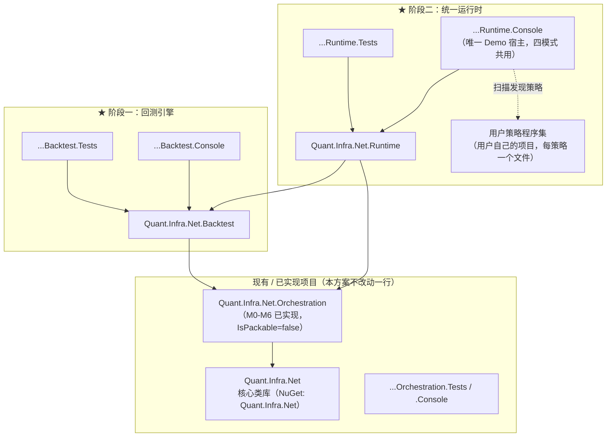
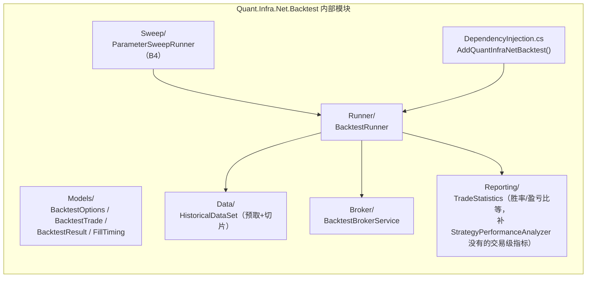
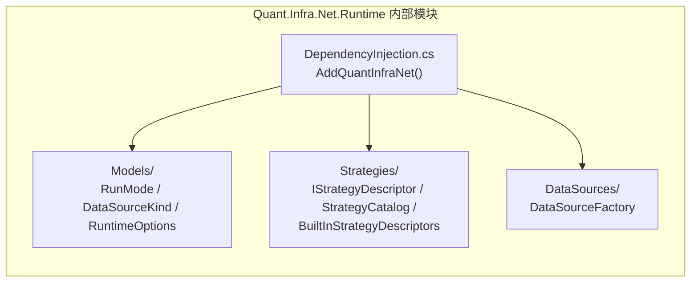
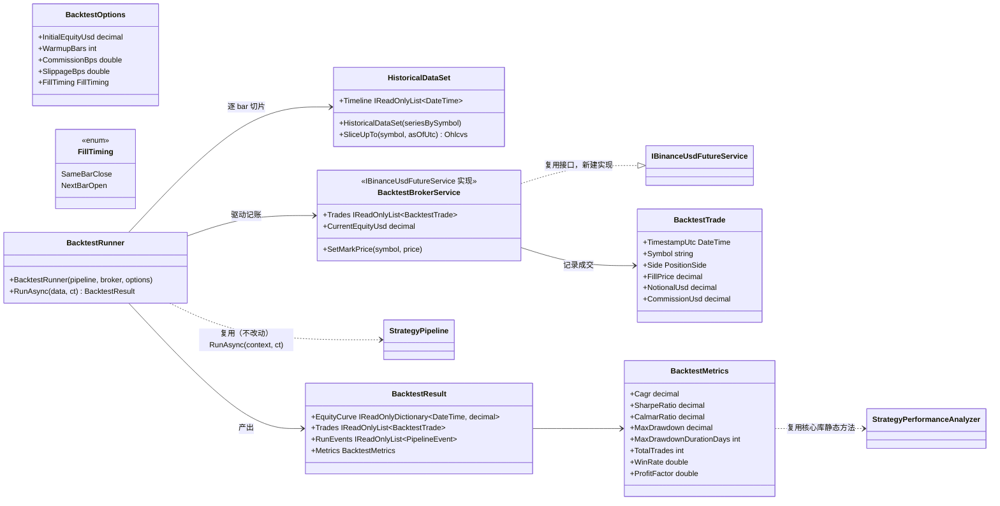
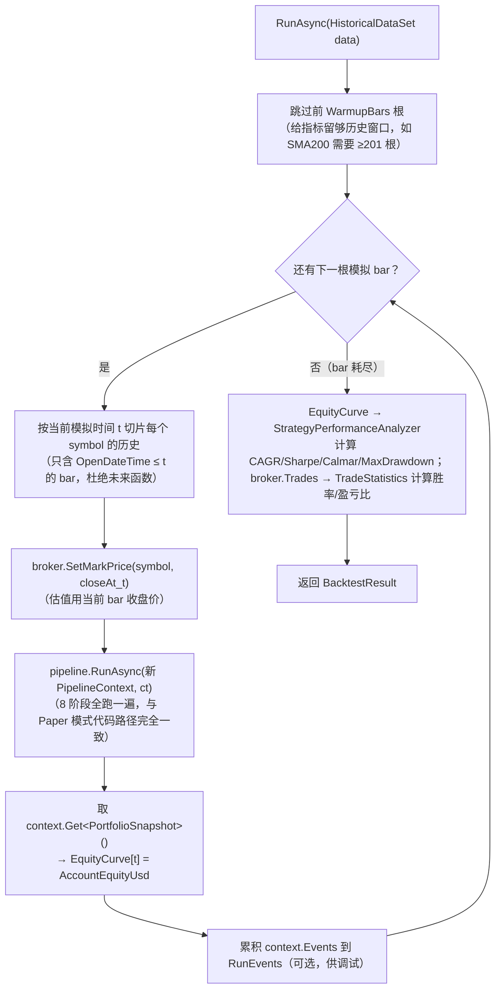

# Quant.Infra.Net 回测与统一运行时设计方案（Backtest Engine + One-Switch Runtime）

> Event-Driven Backtest Engine + Unified Trading Runtime — 补齐 "Idea → Backtest → Paper → Live" 最后一环，并用一个开关杜绝"回测一套策略、实盘另一套"的经典事故
>
> **背景**：[编排层设计文档](OrchestrationLayerDesign.md)（v1.4.2，已实现 M0-M6）打通了 Paper/实盘那一半——`DataIngest→Analysis→Signal→TargetPosition→Risk→Execution→PortfolioState→Notification` 八阶段管道 + 3 个内置策略 + Paper 零网络执行。但"我有一个策略想法"到"能上 Paper"之间缺一环：**回测**。用户目前只能凭感觉把参数写进 `appsettings.json`，跑一次 Paper 周期，肉眼看信号方向对不对，既不能算历史胜率，也不能调参。
>
> 更根本的问题是量化圈的经典事故：**回测用一套策略实现，上线时因为各种原因（重写、抄漏一行、参数改了忘记同步）变成了另一套逻辑，回测的历史表现和实盘完全对不上**。单纯"加一个回测模块"不能防住这件事——如果回测和 Paper/实盘是两个互不相干的入口，用户依然要自己保证传给两边的策略参数一致，这个"自己保证"正是事故的根源。
>
> 本方案分两个阶段一次性解决这两个问题：**阶段一（B0-B6）**建一个事件驱动回测引擎，与编排层零侵入集成；**阶段二（R0-R6）**在两者之上加一层唯一入口，用一个 `RunMode` 开关自动切 Backtest/Paper/Testnet/Live，把"策略即插件文件"变成正式约定，并在唯一入口落地后收敛掉过渡期的两个独立 Demo 项目（R6），从架构上让"两套实现"这件事物理上不可能发生。
>
> 本文档沿用 [编排层设计文档](OrchestrationLayerDesign.md) 的写法：既是可自主执行的规格说明书，也是供人类评审的架构设计文档，接口签名、目录结构、里程碑验收标准均已定死，实现时**不得擅自更改公共契约**。

---

## 文档版本控制

| 版本 | 日期 | 更新内容 | 更新人 |
|------|------|---------|--------|
| 1.1.1 | 2026-08-28 | 新增 R6「收敛 Console 项目」里程碑：`Runtime.Console` 落地（R5）后，`Orchestration.Console`/`Backtest.Console` 两个过渡期 Demo 项目不再提供增量信息，改为删除，最终稳态收敛为 `MyQuantApp`（外部用户示例）+ `Runtime.Console`（唯一内部端到端 Demo）+ 各层独立 `.Tests` 项目（不合并）；起因：人工审阅 Solution Explorer 发现 3 个 Console 项目并存有维护负担 | agent(claude-sonnet-5) |
| 1.1.0 | 2026-08-28 | 合并原 `BacktestEngineDesign.md`（回测引擎，B0-B6）与 `UnifiedRuntimeDesign.md`（统一运行时，R0-R5）为单一实施文档；新增 §3「仓库与发布策略」正面回答：继续在本仓库改还是另起仓库、要不要现在发 NuGet、老用户升级影响多大 | agent(claude-sonnet-5) |
| 1.0.0 | 2026-08-28 | （已废弃，内容并入本文档）初版分拆为两份文档：事件驱动回测引擎设计 + 统一运行时设计 | agent(claude-sonnet-5) |

---

## 目录

1. [背景与选型：为什么是事件驱动，不是向量化](#1-背景与选型为什么是事件驱动不是向量化)
2. [问题诊断：策略为什么会"跑歪"](#2-问题诊断策略为什么会跑歪)
3. [仓库与发布策略（新问题的正面回答）](#3-仓库与发布策略)
4. [可行性评估：复用矩阵](#4-可行性评估复用矩阵)
5. [总体架构](#5-总体架构)
6. [目录结构](#6-目录结构)
7. [核心契约](#7-核心契约)
8. [一致性保证矩阵：三种模式到底哪里允许不一样](#8-一致性保证矩阵三种模式到底哪里允许不一样)
9. [里程碑与验收标准（阶段一 B0-B6 + 阶段二 R0-R6）](#9-里程碑与验收标准)
10. [测试策略](#10-测试策略)
11. [实现护栏](#11-实现护栏)
12. [范例：一个策略文件，四种模式全打通](#12-范例一个策略文件四种模式全打通)
13. [实现后的预期使用效果](#13-实现后的预期使用效果)
14. [后续演进（含向量化回测何时该做）](#14-后续演进)

---

## 1. 背景与选型：为什么是事件驱动，不是向量化

### 1.1 两种回测范式的本质区别

| | **事件驱动回测（Event-Driven）**<br>如 QuantConnect/Backtrader | **向量化回测（Vectorized）**<br>如 vectorbt |
|---|---|---|
| 计算模型 | 逐 bar 顺序推进，每根 K 线重新跑一遍完整策略逻辑 | 整段历史序列一次性做矩阵/数组运算 |
| 策略代码 | 与实盘/Paper **完全同一份代码**（同一个 `ISignalGenerator`） | 必须用向量化写法重写一遍策略逻辑，不能直接用逐 bar 的策略代码 |
| 速度 | 慢（bar 数 × 策略复杂度） | 极快（几秒内跑完几万种参数组合） |
| 典型用途 | 验证"这个策略能不能上 Paper/实盘" | 验证"这一大类参数里哪个区域值得关注" |
| 与本仓库契合度 | **高**——编排层已把策略拆成 `ISignalGenerator`/`IRiskManager`/`IExecutionModel` 可插拔契约，天然适合"同一份代码换一个驱动源" | **低**——向量化要求策略用数组表达，`ISignalGenerator.GenerateSignalsAsync(IPipelineContext, ...)` 这种逐次调用形态无法直接向量化，必须整套重新实现 |

### 1.2 选型结论：先做事件驱动，向量化作为未来可选扩展（不在本方案范围）

**决策：本方案只做事件驱动回测引擎，不做 vectorbt.NET 式的向量化模块。** 理由：

1. **代码复用 vs 代码分裂**：事件驱动回测复用编排层现有的 `StrategyPipeline`/`ISignalGenerator`/`IRiskManager`/`IExecutionModel` 契约——同一个 `PairTradingZScoreSignalGenerator` 不改一行代码，直接可以拿去跑回测、跑 Paper、跑实盘。向量化回测做不到：它要求"给我整段序列，一次性算出所有时间点该干什么"，这是策略逻辑的**第二套独立实现**，两套实现会随时间漂移不一致——这正是 §2 要专门诊断的事故模式的技术根源。
2. **"Idea → Backtest → Paper → Live" 全链路一致性是本仓库的差异化卖点**：QuantConnect 靠"同一个 Algorithm Framework 既能回测也能实盘"取胜；vectorbt 完全没有实盘/Paper 能力，研究出来的策略上线必须整个重写。Quant.Infra.Net 的编排层已经有了这条链路的架构骨架，用事件驱动回测补上最后一块拼图，是相对 vectorbt 最大的潜在优势，不应该反过来做一个和 vectorbt 拼速度但注定拼不过、又和主线架构脱节的向量化模块。
3. **对当前最痛的需求影响最大**：用户当前唯一的验证手段是跑一次 Paper 周期肉眼看方向对不对。能报出"这个策略过去两年 CAGR/夏普/最大回撤是多少"的事件驱动回测引擎，比"参数扫描快 100 倍但结果不能直接上线"的向量化引擎，对决策链条的实际价值更高。
4. **向量化不是不能做，是不着急做**：§14 给出向量化回测未来作为独立可选扩展的路径建议（结论：即使要做，也应该是"调用事件驱动回测跑参数网格"的并行化包装，或桥接到 Python/vectorbt 做纯研究用途，而不是重写一套 C# 向量化核心）。本方案的 B4（参数扫描）已用最小代价覆盖"调参"诉求的大部分场景——虽是并行跑多次事件驱动回测（慢），但零代码分裂、结果可信度与实盘完全一致。

### 1.3 目标

构建 `Quant.Infra.Net.Backtest` 模块，让同一个策略（例如 `MaCrossSignalGenerator`）不改一行代码，就能：① 用历史数据跑回测算出 CAGR/夏普/最大回撤；② 满意后原地切到 Paper；③ 再切到 Testnet/Live——**idea → backtest → paper → live 全程零策略代码重写**。

### 1.4 非目标

- 不做 tick 级/L2 订单簿撮合仿真（本方案只做 bar 级回放）
- 不做 vectorbt.NET 式向量化引擎（见 §1.2，留作未来独立方案）
- 不做网格搜索之外的参数优化算法（贝叶斯优化/遗传算法等）
- 不修改编排层或核心库任何现有文件的公共契约——本方案是纯增量模块

---

## 2. 问题诊断：策略为什么会"跑歪"

在没有统一运行时之前，一个典型团队的做法是：

```
研究员写一份 Python/Excel 版策略逻辑做回测
        ↓ 人工翻译
工程师用 C#/Java 重写一份"一样"的逻辑接实盘
        ↓ 时间推移，两边各自打了几个补丁
半年后：回测版本 if (z > 2.0) 开仓，实盘版本因为一次"临时修复"变成了 if (z >= 2.0)
```

这类问题的共同根因**不是**"程序员不细心"，而是**架构上允许同一个策略存在两份独立实现**。对策不是"多写测试、多做 code review 去防止翻译错误"（治标），而是**让翻译这个动作本身在架构上不存在**——回测、模拟盘、实盘调用的必须是同一个 `.dll` 里同一个类的同一份 `GenerateSignalsAsync` 方法，没有第二份代码可以偷偷不一致。

本方案第一阶段（事件驱动回测引擎）具备了这个能力的**必要条件**（复用 `ISignalGenerator`/`StrategyPipeline.RunAsync`，见 §4）。第二阶段（统一运行时）补上**充分条件**：一个用户唯一会调用的入口、一个开关决定运行模式、策略文件本身不需要知道自己在哪种模式下跑（见 §8 一致性保证矩阵）。

设计原则：

| # | 原则 | 落地方式 |
|---|------|---------|
| P1 | **策略源唯一**：任何策略从写下第一行代码到上线，物理上只存在一份 `.cs` 文件 | `ISignalGenerator` 实现文件 + 其 `IStrategyDescriptor` 注册（§7.6）共处一个文件；不存在"回测版策略"和"实盘版策略"两个类 |
| P2 | **入口唯一**：用户代码只调用一次 `AddQuantInfraNet(...)`，不分别调用回测引擎和编排层各自的注册方法 | `Quant.Infra.Net.Runtime.DependencyInjection.AddQuantInfraNet(RunMode mode, ...)` 内部按 `mode` 分派 |
| P3 | **开关是数据，不是代码分支**：切模式是改一个配置值，不是切分支/切项目/改 `#if` | `"RunMode": "Backtest" \| "Paper" \| "Testnet" \| "Live"`，同一份 `Program.cs` |
| P4 | **允许不同的地方必须显式列清单，其余一律共享** | §8 一致性保证矩阵——只有 3 个组件允许因模式而异，其余全部共享同一类型 |
| P5 | **数据源与策略解耦，两者独立可配置切换** | 数据源走 `DataSourceKind` 开关，策略走 `Strategy` 参数 + 自动发现，互不感知 |

---

## 3. 仓库与发布策略

> 这一节直接回答三个问题：这些改动继续在 `Quant.Infra.Net` 本仓库做，还是另起仓库？现在要不要发 NuGet？老用户升级影响多大？——放在架构细节之前，因为它决定了后面章节该怎么读。

### 3.1 继续在本仓库做，不另起仓库

**结论**：`Quant.Infra.Net.Backtest`/`Quant.Infra.Net.Runtime` 与编排层一样，**留在 `Quant.Infra.Net` 这个仓库**，走新分支（`feature/backtest-engine` → `feature/unified-runtime`），不拆独立仓库。

理由与 [编排层设计文档 §11](OrchestrationLayerDesign.md#11-仓库策略与后续演进) 完全一致，且本方案的耦合程度比编排层更高，拆仓库的代价更大：

1. **编译耦合更紧**：`Quant.Infra.Net.Backtest` 直接依赖编排层刚发布的 `ISignalGenerator`/`IExecutionModel`/`StrategyPipeline` 等契约；`Quant.Infra.Net.Runtime` 又直接依赖 `Backtest` 和 `Orchestration` 两层的具体类型（`BacktestBrokerService`、`PaperBinanceUsdFutureService` 等）。三层任何一层的契约演进，跨仓库都要发版对齐，同仓库一次 PR 就能原子提交。
2. **编排层本身还是 Beta**：前一轮审阅已经发现编排层有若干契约偏离（`OriginSignal` 缺失曾被修复、`PortfolioSnapshot` 字段命名等仍未完全对齐设计文档），说明这层契约还在收敛期。在契约没冻结之前跨仓库，等于把"契约还在变"的不确定性放大成"两个仓库的版本矩阵都在变"。
3. **验收回路要保持原子**：本方案 §10 的一致性回归测试（`ParityRegressionTests`）需要同时驱动 Backtest 和 Orchestration/Runtime 三层代码，单仓库 `dotnet build && dotnet test` 全绿即可验收；跨仓库会把这个验收回路拆成"发布→拉取→再验证"的多步流程，拖慢自主/半自主实现的迭代速度。
4. **风险隔离靠分支不靠仓库**：延续编排层已经验证过的模式——新功能在 feature 分支上开发，`main` 不受影响，CI 全绿后再合并。

**什么时候才考虑拆**：沿用编排层文档定义的三条标准（任两条满足即可评估拆分）——① 这几层拥有独立于核心库的发布节奏；② 外部贡献者数量多于核心库；③ 核心库契约冻结进入纯维护期。目前一条都不满足。

**唯一的例外场景**：如果未来有人想基于这套 Runtime 做一个**面向最终用户的产品/应用**（例如一个带 Web 界面的回测可视化平台、一个策略托管 SaaS），那应该是**新仓库**，模式与本仓库现有的 [`Quant.Infra.Net.Pro`](https://github.com/memoryfraction/Quant.Infra.Net.Pro)（生产级 Charles Schwab Web 应用，依赖本仓库但独立发布）完全一致——**库留在这个仓库，应用去新仓库**，不要反过来。

### 3.2 现在不发 NuGet；发的时候必须是独立包，不能并入核心包

**结论**：`Quant.Infra.Net.Orchestration` 目前 `IsPackable=false`（已核实：`src/Quant.Infra.Net.Orchestration/Quant.Infra.Net.Orchestration.csproj` 第 8 行），版本号独立为 `1.0.0`（第 9 行），与核心包 `Quant.Infra.Net`（`PackageId=Quant.Infra.Net`，`Version=1.5.1`）完全脱钩——**这个既有设置本身就是正确方向，本方案延续它，`Quant.Infra.Net.Backtest`/`Quant.Infra.Net.Runtime` 新项目从一开始就应该同样设 `IsPackable=false`，直到满足下面的发布门槛**。

**为什么现在不发**：

1. **编排层还没走出 Beta**：上一轮审阅发现的契约偏离问题目前修了一部分，但公共类型（`TargetPosition`/`PipelineEvent`/`PortfolioSnapshot` 等）还没有一次"冻结公告"。NuGet 一旦发布，`SemVer` 就是对外承诺——今天发 `1.0.0`，明天再改 `TargetPosition` 的字段名就是 Breaking Change，必须发 `2.0.0`，而现在很可能过几周就要改。**过早发布等于过早许下做不到的承诺。**
2. **回测引擎/统一运行时目前只是设计文档，一行代码都没有**：连"能不能编译通过"都还没验证，谈发布为时过早。
3. **发布这件事本身没有反悔空间**：NuGet 包一旦有人下载引用，就不能真正撤回（`nuget.org` 的 unlist 不等于删除，已下载的用户不受影响）。宁可晚发布，不要发布了再回滚。

**发布门槛（建议，达到即可发布，不需要三层同时凑齐）**：

| 门槛 | 说明 |
|------|------|
| 公共契约冻结声明 | 在设计文档版本表里明确写一行"契约冻结于 vX.Y，此后只做兼容式增量"，而不是持续在 changelog 里记录"这次又改了哪个字段名" |
| 达到设计文档自定的验收线 | `dotnet build` 零 warning 零 error，`dotnet test` 全绿，且 §9 的端到端/一致性回归测试覆盖到全部内置策略 |
| 有真实使用场景跑过至少一段时间 | 哪怕只是作者自己的 Paper 账户跑了几周没有出现"文档说的和实际行为不一致"的情况 |

**发布形态（到时候怎么发）**：三个**独立** NuGet 包，不并入核心包：

- `Quant.Infra.Net.Orchestration`
- `Quant.Infra.Net.Backtest`（依赖上面这个）
- `Quant.Infra.Net.Runtime`（依赖上面两个）

版本号**从 `0.1.0` 起步，不从 `1.0.0` 起步**——`0.x` 是 SemVer 里"仍可能有breaking change"的标准信号，能让下游用户在 `.csproj` 里用 `Version="0.*"` 而不是精确锁死版本，同时清楚地知道"这个包还没到我可以完全放心大版本不变的阶段"。等契约真正稳定、有人依赖它做了生产用途且没有大问题，再发 `1.0.0`。

**为什么不并入核心 `Quant.Infra.Net` 包**：

1. **不想用编排层/回测/Runtime 的用户不应该被迫多拉一堆依赖**——核心包目前依赖白纸只到 `Microsoft.Extensions.*` 的少数几个包（Orchestration 的依赖白名单，见 [编排层设计文档 §8](OrchestrationLayerDesign.md#8-实现护栏) 第 3 条），并入核心包会让所有核心库用户的依赖树变大，即使他们从不 `using Quant.Infra.Net.Orchestration`。
2. **独立版本号让 Beta 阶段的破坏性变更不牵连核心包**——核心包 `1.5.1` 已经是相对成熟、有历史用户的版本；Orchestration/Backtest/Runtime 处于 `0.x` 快速迭代期，两者的发布节奏不该被绑在一起。
3. **这正是 [编排层设计文档 §11](OrchestrationLayerDesign.md#11-仓库策略与后续演进) 原本就写明的计划**——"发 `Quant.Infra.Net.Orchestration` 独立 NuGet 包（主库包不动）"，本方案只是把它具体化并延伸到 Backtest/Runtime 两层。

### 3.3 老用户升级影响评估

**核心结论：只用核心 `Quant.Infra.Net` 包的现有用户，本次改动（含未来的 Backtest/Runtime）影响为零。**

依据（不是承诺，是已经验证过的事实）：

1. **编排层实现期间，四个既有项目零改动**——`docs/OrchestrationLayerDesign.md` §8 护栏第 1 条要求，且已用 `git diff main..feature/orchestration-layer -- src/Quant.Infra.Net src/Quant.Infra.Net.Tests src/Quant.Infra.Net.Console src/MyQuantApp` 实测核实为空 diff（见此前的编排层审阅记录）。本方案的护栏（§11）延续同一条规则，并把范围扩大到"编排层项目本身也不再改动"。
2. **核心包不会因为这些新功能而升版本发新包**——因为核心包源码没有变化，没有理由重新打包发布；即使未来某天核心包因为别的原因升版本（比如修复一个 core 库自己的 bug），Orchestration/Backtest/Runtime 的存在与否也不影响那次发布的内容。
3. **`ExchangeEnvironment` 枚举没有新增 `Backtest` 值**——这是本方案里一个刻意的保护性设计决策（见 §5.5 决策 U1）：`Backtest` 模式的语义放在新增的 `Quant.Infra.Net.Runtime.RunMode` 枚举里，不往核心库 `ExchangeEnvironment`（`Testnet/Live/Paper`）里加新枚举值。这不是随便的取舍——**给一个公共枚举新增成员，对任何在自己代码里对该枚举做穷尽 `switch`（`switch` 表达式不带 `default`，或者用了分析器强制穷尽检查）的下游用户，都是一次源码级破坏性变更**。刻意不碰它，是本方案对老用户的一个具体保护措施，不是笼统的"我们会小心"。
4. **哪些用户会受到影响、影响多大——分层说明**：

   | 用户类型 | 影响 |
   |---|---|
   | 只用 `Quant.Infra.Net` 核心包（数据/分析/券商/通知） | **零影响**。源码不改，不重新发包，什么都不用做 |
   | 已经在用编排层（`Quant.Infra.Net.Orchestration`，目前只能源码引用，未发包） | 需要关注 §3.2 提到的契约冻结声明——冻结之前，`git pull` 更新到最新 `main`/`feature/*` 分支时，公共类型字段可能还会变（比如本方案实现期间如果又发现 `PortfolioSnapshot` 命名该改，会在冻结前改掉）；冻结声明之后不会再有这类变更 |
   | 未来想用 Backtest/Runtime 的新用户 | 从 `0.x` 版本开始用，需要接受"这是 Beta"的预期，跟 §3.2 的门槛表一致 |

**给维护者的具体操作建议**（不属于代码契约，但属于"如何保护老用户"的落地动作）：
- 在根 `README.md`/`readme-en.md`/`readme-ch.md` 的版本历史表里，新功能（Backtest/Runtime）作为**次要版本号或独立行**出现，不要写成好像核心包也升级了同一个版本号，避免老用户误以为 `dotnet add package Quant.Infra.Net` 会自动带来这些新能力（实际上它们是需要用户主动 `dotnet add package Quant.Infra.Net.Runtime` 才会引入的独立包）
- 核心包 `Quant.Infra.Net` 的版本号（当前 `1.5.1`）在本方案整个实现期间**不应该因为这些新增项目而改变**——只有当核心库源码本身发生变化时才应该升版本号

---

## 4. 可行性评估：复用矩阵

| 回测需要的能力 | 现有实现 | 是否可直接复用 | 备注 |
|---|---|---|---|
| 策略信号逻辑 | `ISignalGenerator` 及 3 个内置实现 | ✅ 完全复用，零改动 | `PairTradingZScoreSignalGenerator`/`MaCrossSignalGenerator`/`MeanReversionSignalGenerator` 原样可用 |
| 目标仓位映射 | `TargetPositionStage` | ✅ 完全复用 | |
| 风控前置检查 | `IRiskManager`/`DefaultRiskManager`/`RiskStage` | ✅ 完全复用 | 回测也会跑真实的风控/熔断逻辑，能验证"这个策略在历史上有没有被自己的风控拦过" |
| 调仓执行语义 | `IExecutionModel`/`RebalanceExecutionModel` | ✅ 完全复用 | 只依赖 `IBinanceUsdFutureService` 接口，不关心背后是 Paper 还是回放 |
| 账本/成交记账 | `IBinanceUsdFutureService` 接口 + `PaperBinanceUsdFutureService` 的记账算法模式 | ⚠️ 接口复用，实现新建 | `PaperBinanceUsdFutureService` 是 `sealed`，且没有手续费/滑点/成交明细记录，需要新建 `BacktestBrokerService`（同样实现 `IBinanceUsdFutureService`，记账算法参照其模式） |
| 管道编排 | `StrategyPipeline`（顺序执行 Stage，`RunAsync(context, ct)`，与触发方式无关） | ✅ 完全复用 | `StrategyPipeline` 本身不知道、也不关心是谁在驱动它跑——这是本方案能"零侵入"接入的关键 |
| 定时/驱动 | `IntervalTrigger`（纯墙钟驱动，内部用 `System.Timers.Timer` + `DateTime.UtcNow`，无法注入模拟时间） | ❌ 不能复用 | 回测需要"快进"通过历史时间戳，需要一个新的、不依赖真实时钟的驱动循环（`BacktestRunner`），**不使用** `PipelineRunner`/`IntervalTrigger` |
| 历史数据装载 + 防未来函数 | `SignalDataLoader`（context 缓存优先，命中缓存则不再发起网络请求） | ✅ 关键复用点 | `SignalDataLoader.LoadClosesAsync`/`HasCachedSeries` 会优先读 `context.Get<Ohlcvs>()`/`context.Get<HashSet<Ohlcv>>()`；只要 `BacktestRunner` 在每个模拟 bar 之前，把"**只包含 ≤ 当前模拟时间**"的历史切片塞进新的 `PipelineContext`，`DataIngestStage` 与所有内置策略生成器就会原样命中缓存、不发起任何实时拉取——天然杜绝未来函数，且**不用改一行 `DataIngestStage`/`SignalDataLoader`/策略生成器代码** |
| 绩效指标 | `StrategyPerformanceAnalyzer`（`Quant.Infra.Net.Portfolio.Services`，输入 `Dictionary<DateTime, decimal>` 市值序列，纯静态方法，无 "now" 假设） | ✅ 完全复用 | 回测产出的权益曲线正好是这个形状，`CalculateCAGR`/`CalculateSharpeRatio`/`CalculateCalmarRatio`/`CalculateMaximumDrawdown` 直接调用即可 |
| Paper→回测的经纪商切换机制 | `AddQuantInfraNetOrchestration()` 对 `IBinanceUsdFutureService` 用 `TryAddSingleton`（"已注册则不覆盖"） | ✅ 关键复用点 | 已有测试 `CallerRegistered_Broker_Wins_Over_Paper_Default`（`M6DependencyInjectionTests.cs`）验证过这个机制——本方案只需在调用 `AddQuantInfraNetOrchestration()` **之前**先注册 `BacktestBrokerService`，就能让回测复用整条 DI 装配链路（信号生成器解析、`StrategyPipeline` 组装、风控/执行/组合状态全部原样），不需要在编排层新增任何 DI 分支 |

**结论**：8 个能力点里 6 个可以零改动直接复用，1 个（经纪商实现）需要新建但复用现成的记账模式，1 个（驱动方式）需要新建但不影响任何现有契约。这就是"无缝结合"的具体含义——不是比喻，是接口层面确实严丝合缝。

---

## 5. 总体架构

```
┌────────────────────────────────────────────────────────────────────────────┐
│                         用户唯一入口 / Single User Entry Point               │
│  appsettings.json: "RunMode": "Backtest" | "Paper" | "Testnet" | "Live"      │
│  Program.cs:  builder.Services.AddQuantInfraNet(mode, strategyAssembly)      │
└───────────────────────────────────┬────────────────────────────────────────┘
                                     │
                    ┌────────────────┴────────────────┐
                    │      Quant.Infra.Net.Runtime      │  ★ 阶段二新增
                    │  RunMode 分派 + 策略自动发现 +     │
                    │  数据源工厂 + 一致性保证的唯一收口   │
                    └───┬──────────────┬───────────────┘
                        │              │
         ┌──────────────┘              └──────────────┐
         ▼                                             ▼
┌────────────────────┐                     ┌──────────────────────────┐
│ RunMode.Backtest     │                     │ RunMode.Paper/Testnet/Live │
│ → AddQuantInfraNet-   │                     │ → AddQuantInfraNet-        │
│   Backtest()（阶段一） │                     │   Orchestration()（已实现） │
│ → BacktestRunner      │                     │ → PipelineRunner +         │
│   逐 bar 回放          │                     │   IntervalTrigger 墙钟驱动  │
└──────────┬───────────┘                     └──────────────┬─────────────┘
           │                                                 │
           └───────────────────┬─────────────────────────────┘
                                ▼
           ┌─────────────────────────────────────────────┐
           │      同一个 StrategyPipeline 实例形态           │
           │  DataIngest→Analysis→Signal→TargetPosition    │
           │  →Risk→Execution→PortfolioState→Notification  │
           │  ★ 8 个 Stage 类型、ISignalGenerator 实例、     │
           │    IRiskManager、IExecutionModel 全部同一份     │
           │    代码，仅 IBinanceUsdFutureService 的具体实现  │
           │    与数据装载的"时间窗口"不同（见 §8）           │
           └─────────────────────────────────────────────┘

依赖方向（编译期单向，运行时零改动下层）：
Quant.Infra.Net.Runtime → Quant.Infra.Net.Backtest → Quant.Infra.Net.Orchestration → Quant.Infra.Net
```

### 5.1 模块图



模块内视图（Backtest 项目内部）：



模块内视图（Runtime 项目内部）：



### 5.2 类图（回测引擎核心契约）



### 5.3 类图（统一运行时核心契约）

```mermaid
classDiagram
    direction LR

    class RunMode {
        <<enum>>
        Backtest
        Paper
        Testnet
        Live
    }
    class DataSourceKind {
        <<enum>>
        Demo
        Yahoo
        Csv
        Binance
        Custom
    }
    class IStrategyDescriptor {
        <<interface>>
        +Name string
        +Create(IServiceProvider) ISignalGenerator
    }
    class StrategyCatalog {
        +StrategyCatalog(assemblies)
        +Resolve(name) IStrategyDescriptor
        +Names IReadOnlyList~string~
    }
    class RuntimeOptions {
        +RunMode RunMode
        +DataSourceKind DataSource
    }
    class UnifiedDependencyInjection {
        <<static>>
        +AddQuantInfraNet(services, configure, strategyAssemblies, customDataSource) IServiceCollection
    }

    UnifiedDependencyInjection --> RuntimeOptions : 读取 RunMode/DataSource
    UnifiedDependencyInjection --> StrategyCatalog : 按 Strategy 参数解析
    UnifiedDependencyInjection ..> "AddQuantInfraNetBacktest()" : RunMode=Backtest 时委派
    UnifiedDependencyInjection ..> "AddQuantInfraNetOrchestration()" : RunMode=Paper/Testnet/Live 时委派
    StrategyCatalog --> IStrategyDescriptor : 反射扫描发现
    IStrategyDescriptor ..> ISignalGenerator : Create() 产出（复用编排层既有接口，不新增）
```

### 5.4 数据流图（一次回测的 bar 级回放）

```mermaid
flowchart LR
    HD["HistoricalDataSet<br/>（全区间预取一次）"] -->|"SliceUpTo(symbol, t)：<br/>只给 ≤ t 的历史"| CTX["新建 PipelineContext<br/>（runId = bar 序号）"]
    CTX -->|"context.Set(HashSet&lt;Ohlcv&gt;)"| PIPE["StrategyPipeline.RunAsync<br/>（复用现有 8 阶段，不改动）"]
    PIPE -->|"命中 context 缓存，<br/>不发起任何实时拉取"| SIG["ISignalGenerator<br/>（复用，零改动）"]
    SIG --> RISK["RiskStage / DefaultRiskManager<br/>（复用，零改动）"]
    RISK --> EXEC["ExecutionStage / RebalanceExecutionModel<br/>（复用，零改动）"]
    EXEC -->|"SetUsdFutureHoldingsAsync /<br/>LiquidateUsdFutureAsync"| BROKER["BacktestBrokerService<br/>（新建）：按 FillTiming 成交<br/>+ 手续费/滑点 + 记一笔 BacktestTrade"]
    BROKER --> SNAP["PortfolioSnapshot<br/>（复用 PortfolioStateStage）"]
    SNAP -->|"AccountEquityUsd 采样入曲线"| CURVE[("EquityCurve<br/>Dictionary&lt;DateTime, decimal&gt;")]
    CURVE -->|"bar 序号 +1，回到下一根"| HD
    CURVE -->|"全部 bar 跑完后"| PERF["StrategyPerformanceAnalyzer<br/>（核心库复用）"]
    PERF --> RESULT["BacktestResult"]
```



### 5.5 流程图（`BacktestRunner.RunAsync` 生命周期）



### 5.6 关键设计决策

| # | 决策 | 理由 |
|---|------|------|
| D1 | 回测不新增编排层 DI 分支，而是**先于** `AddQuantInfraNetOrchestration()` 调用之前把 `BacktestBrokerService` 注册为 `IBinanceUsdFutureService`，借助该方法对 broker 使用 `TryAddSingleton`（"已注册则不覆盖"）的既有语义，让回测的 broker 自动胜出 | 零侵入：不用在编排层 `DependencyInjection.cs` 里加一个 `if (isBacktest)` 分支；这个"先注册者胜"机制已经被 `M6DependencyInjectionTests.CallerRegistered_Broker_Wins_Over_Paper_Default` 验证过，是现成的、经过测试的扩展点 |
| D2 | 回测**不复用** `PipelineRunner`/`IntervalTrigger`（两者是纯墙钟驱动，`IntervalTrigger` 内部用 `System.Timers.Timer` + `DateTime.UtcNow`，无法注入模拟时间），而是新建 `BacktestRunner` 直接调用 `StrategyPipeline.RunAsync(context, ct)` | `StrategyPipeline` 本身不知道、不关心谁在调它——这正是它可以被"零成本"复用的原因；`PipelineRunner` 是专门为墙钟定时场景设计的 `BackgroundService`，勉强复用反而要在其内部打补丁破坏其契约 |
| D3 | 防未来函数（look-ahead bias）通过 `HistoricalDataSet.SliceUpTo(symbol, asOfUtc)` 在**注入 `PipelineContext` 之前**做数据裁剪实现，而不是指望 `DataIngestStage`/策略生成器自己判断"现在是回测的第几天" | `SignalDataLoader` 的既有装载规则是"context 缓存优先，命中就不再拉取"（§4）；只要每个模拟 bar 开始前塞进新 context 的 `HashSet<Ohlcv>` 只含 ≤ 当前模拟时间的数据，策略代码完全不用感知"这是回测"——**这是本方案能够零改动复用策略代码的核心机制** |
| D4 | `BacktestBrokerService` 是全新类（不继承 `PaperBinanceUsdFutureService`——它是 `sealed`），记账算法照抄其模式，额外加手续费/滑点/成交日志 | 保持两个 broker 实现的记账口径一致（否则回测算出的权益曲线和 Paper 实测数字对不上）；新增手续费/滑点/成交日志是回测比 Paper 多出来的、评估策略经济性必需的能力 |
| D5 | 成交时机（`FillTiming`）默认 `SameBarClose`，`NextBarOpen` 作为可选项在 B3 加入 | 先用与 Paper 语义一致的默认值保证 v1 可用且好理解，再加更真实的成交假设 |
| D6 | 参数扫描（B4）不做向量化，是并行跑多次 `BacktestRunner` | 与 §1.2 一致：宁可扫描速度慢，也不为了速度分裂出第二套策略实现 |
| U1 | `RunMode` 是**新增**枚举，放在 `Quant.Infra.Net.Runtime`，**不**往核心库的 `ExchangeEnvironment`（`Testnet/Live/Paper`）里加 `Backtest` 值 | `ExchangeEnvironment` 是核心库既有公共契约，按护栏不能碰；给公共枚举加新成员对任何做穷尽 `switch` 的下游用户都是源码级破坏性变更——这同时是 §3.3 老用户保护措施的一部分 |
| U2 | 统一入口**不重新实现**broker 选择、Stage 组装等逻辑，纯粹是"读 `RunMode`，调用已有的 `AddQuantInfraNetBacktest()` 或 `AddQuantInfraNetOrchestration()`，并在 `Testnet`/`Live` 模式下自动完成原本需要用户手写的"调用前预注册真实 broker"这一步" | 避免第三次实现同一件事；本方案的价值全部在"分派 + 自动化 + 策略发现"，不在重新发明执行逻辑 |
| U3 | 策略发现用**反射扫描 + 显式传入程序集列表**，不做全局程序集自动加载 | 显式比隐式全局扫描更安全、更快，且与主流框架的 Controller/Handler 发现约定一致 |
| U4 | 内置的 3 个策略**不移动**其 `ISignalGenerator` 实现文件（仍在 `Quant.Infra.Net.Orchestration/Signals/`），只在 `Quant.Infra.Net.Runtime` 里新增 3 个薄 `IStrategyDescriptor` 包装类指向它们 | 遵守"不改动现有项目文件"的护栏；用户新策略仍按 P1 原则同文件 |
| U5 | 数据源切换（`DataSourceKind`）与策略切换（`Strategy` 参数）是两个独立配置维度，互不感知 | 换数据源不应该要求策略作者改代码——策略只认 `context.Get<Ohlcvs>()`/`SignalDataLoader` 缓存，不知道数据从哪来 |

---

## 6. 目录结构

新增四个项目（不移动、不修改任何现有项目）：

```
src/
├── Quant.Infra.Net/                        # 现有核心库（不动）
├── Quant.Infra.Net.Orchestration/          # 现有编排层（不动，M0-M6 已完成）
├── Quant.Infra.Net.Orchestration.Tests/    # 现有（不动）
├── Quant.Infra.Net.Orchestration.Console/  # 现有（不动）
├── Quant.Infra.Net.Tests/ Quant.Infra.Net.Console/ MyQuantApp/  # 现有（不动）
│
├── Quant.Infra.Net.Backtest/               # ★ 阶段一新增：回测引擎类库
│   ├── Models/
│   │   ├── BacktestOptions.cs
│   │   ├── FillTiming.cs
│   │   ├── BacktestTrade.cs
│   │   ├── BacktestResult.cs
│   │   └── BacktestMetrics.cs
│   ├── Data/
│   │   └── HistoricalDataSet.cs            # 全区间预取 + SliceUpTo(symbol, asOfUtc) 切片
│   ├── Broker/
│   │   └── BacktestBrokerService.cs        # IBinanceUsdFutureService 的回测记账实现（新建，非复用）
│   ├── Runner/
│   │   └── BacktestRunner.cs               # 逐 bar 回放驱动（复用 StrategyPipeline.RunAsync）
│   ├── Sweep/
│   │   └── ParameterSweepRunner.cs         # B4：参数网格并行回测
│   ├── Reporting/
│   │   └── TradeStatistics.cs              # 胜率/盈亏比/总手续费等交易级指标
│   └── DependencyInjection.cs              # AddQuantInfraNetBacktest()
│
├── Quant.Infra.Net.Backtest.Tests/         # ★ 阶段一新增：MSTest
│   ├── HistoricalDataSetTests.cs
│   ├── BacktestBrokerServiceTests.cs
│   ├── BacktestRunnerTests.cs
│   ├── LookAheadBiasTests.cs                # 专门验证"不泄漏未来数据"的用例
│   ├── TradeStatisticsTests.cs
│   └── B5EndToEndTests.cs                   # 端到端：复用编排层 3 个内置策略跑一次完整回测
│
├── Quant.Infra.Net.Backtest.Console/       # ★ 阶段一新增：端到端回测 Demo 宿主
│   ├── Program.cs                          # ≤50 行：跑一次 MaCross 回测，打印绩效报告
│   └── appsettings.json
│
├── Quant.Infra.Net.Runtime/                 # ★ 阶段二新增：统一运行时
│   ├── Models/
│   │   ├── RunMode.cs
│   │   ├── DataSourceKind.cs
│   │   └── RuntimeOptions.cs                # "Runtime" 配置节：RunMode + DataSource + 凭证占位
│   ├── Strategies/
│   │   ├── IStrategyDescriptor.cs
│   │   ├── StrategyCatalog.cs               # 反射扫描 + Name→Descriptor 字典 + 重名 fail-fast
│   │   └── BuiltInStrategyDescriptors.cs    # 3 个内置策略的薄包装（U4）
│   ├── DataSources/
│   │   └── DataSourceFactory.cs             # 按 DataSourceKind 解析 ITraditionalFinanceSourceDataService 实现
│   └── DependencyInjection.cs               # AddQuantInfraNet(RunMode, ...) 统一入口
│
├── Quant.Infra.Net.Runtime.Tests/           # ★ 阶段二新增：MSTest
│   ├── StrategyCatalogTests.cs
│   ├── RunModeDispatchTests.cs
│   ├── DataSourceFactoryTests.cs
│   └── ParityRegressionTests.cs             # ★ 核心：同一份配置，Backtest 与 Paper 产出的信号序列必须完全一致
│
└── Quant.Infra.Net.Runtime.Console/         # ★ 阶段二新增：唯一 Demo 宿主
    ├── Program.cs                           # ≤40 行，四种模式共用；改 appsettings.json 的 RunMode 切换
    ├── appsettings.json                     # "RunMode": "Backtest"（demo 默认，离线可跑）
    └── Strategies/
        └── ExampleCustomStrategy.cs         # 范例：用户自定义策略，单文件同时含 ISignalGenerator + IStrategyDescriptor
```

同时更新 `Quant.Infra.Net.sln`：`dotnet sln add` 四个新项目（对 `.sln` 文件本身的追加操作，不算修改现有项目源码，与编排层设计文档 §8 护栏第 1 条的既有先例一致）。所有新项目 `.csproj` 一律 `<IsPackable>false</IsPackable>`，直到 §3.2 的发布门槛达成。

---

## 7. 核心契约

> **实现者注意**：以下 C# 签名是**最终契约**。命名空间分别为 `Quant.Infra.Net.Backtest.*`（阶段一）与 `Quant.Infra.Net.Runtime.*`（阶段二）。所有公共类型必须有中英双语 XML 注释（遵循 `docs/CodeStandard.md`）。本方案**不修改**任何 `Quant.Infra.Net.*`/`Quant.Infra.Net.Orchestration.*` 命名空间下的现有契约。

### 7.1 回测配置

```csharp
namespace Quant.Infra.Net.Backtest.Models;

/// <summary>成交时机 / Fill timing.</summary>
public enum FillTiming
{
    /// <summary>信号产生的同一根 bar 收盘价成交（默认，与 Paper/实盘"信号即调仓"语义一致）/ Fill at the close of the same bar the signal fired on (default; matches Paper/live semantics).</summary>
    SameBarClose = 0,

    /// <summary>下一根 bar 开盘价成交（B3 起支持，更贴近真实、避免收盘价乐观偏差）/ Fill at the next bar's open (available from milestone B3; avoids same-close optimism bias).</summary>
    NextBarOpen = 1
}

/// <summary>
/// 回测配置（DI 绑定到 "Backtest" 配置节）。
/// Backtest configuration (bound to the "Backtest" configuration section).
/// </summary>
public class BacktestOptions
{
    /// <summary>起始权益（USD），默认 10000 / Starting equity in USD, defaults to 10000.</summary>
    public decimal InitialEquityUsd { get; set; } = 10000m;

    /// <summary>预热 bar 数：跳过前 N 根不计入权益曲线，只为指标提供历史窗口，默认 0（由策略参数如 SlowPeriod 决定实际所需）/ Warm-up bar count skipped before the equity curve starts recording; defaults to 0.</summary>
    public int WarmupBars { get; set; } = 0;

    /// <summary>单笔手续费（基点，对成交名义金额收取），默认 0 / Per-trade commission in basis points of notional, defaults to 0.</summary>
    public double CommissionBps { get; set; } = 0d;

    /// <summary>滑点（基点，相对标记价，做多方向不利、做空方向不利），默认 0 / Slippage in basis points versus mark price (adverse to the trade direction), defaults to 0.</summary>
    public double SlippageBps { get; set; } = 0d;

    /// <summary>成交时机，默认 SameBarClose / Fill timing, defaults to SameBarClose.</summary>
    public FillTiming FillTiming { get; set; } = FillTiming.SameBarClose;
}
```

### 7.2 成交记录与结果

```csharp
namespace Quant.Infra.Net.Backtest.Models;

/// <summary>一笔回测成交记录 / One backtest trade record.</summary>
public class BacktestTrade
{
    public DateTime TimestampUtc { get; init; }
    public string Symbol { get; init; } = string.Empty;
    public Binance.Net.Enums.PositionSide Side { get; init; }
    public decimal FillPrice { get; init; }
    public decimal NotionalUsd { get; init; }
    public decimal CommissionUsd { get; init; }
}

/// <summary>绩效指标：核心库 StrategyPerformanceAnalyzer 输出 + 交易级统计 / Performance metrics: core-library analyzer output plus trade-level stats.</summary>
public class BacktestMetrics
{
    public decimal Cagr { get; init; }
    public decimal SharpeRatio { get; init; }
    public decimal CalmarRatio { get; init; }
    public decimal MaxDrawdown { get; init; }
    public int MaxDrawdownDurationDays { get; init; }
    public int TotalTrades { get; init; }
    /// <summary>胜率（按平仓时点已实现盈亏 &gt; 0 的比例）/ Win rate (share of closes with positive realized PnL).</summary>
    public double WinRate { get; init; }
    /// <summary>盈亏比：总盈利 / 总亏损（绝对值）/ Profit factor: gross profit / gross loss (absolute).</summary>
    public double ProfitFactor { get; init; }
    public decimal TotalCommissionUsd { get; init; }
}

/// <summary>一次完整回测的产出 / Full output of one backtest run.</summary>
public class BacktestResult
{
    /// <summary>权益曲线（时间 → 权益），可直接喂给 StrategyPerformanceAnalyzer / Equity curve (timestamp to equity); directly consumable by StrategyPerformanceAnalyzer.</summary>
    public IReadOnlyDictionary<DateTime, decimal> EquityCurve { get; init; } = new Dictionary<DateTime, decimal>();
    public IReadOnlyList<BacktestTrade> Trades { get; init; } = Array.Empty<BacktestTrade>();
    /// <summary>逐 bar 累积的管道事件（调试/审计用）/ Accumulated pipeline events across all bars (for debugging/audit).</summary>
    public IReadOnlyList<Quant.Infra.Net.Orchestration.Models.PipelineEvent> RunEvents { get; init; } = Array.Empty<Quant.Infra.Net.Orchestration.Models.PipelineEvent>();
    public BacktestMetrics Metrics { get; init; } = new();
}
```

### 7.3 历史数据集与切片（防未来函数的核心机制）

```csharp
namespace Quant.Infra.Net.Backtest.Data;

/// <summary>
/// 历史数据集：一次性预取全区间行情，按需切出"截至某时刻"的子集，供逐 bar 回放注入 PipelineContext。
/// Historical data set: pre-fetches the full range once; slices an "as-of" subset per bar for injection into the PipelineContext.
/// </summary>
/// <remarks>
/// 这是防未来函数（look-ahead bias）的关键：SliceUpTo(symbol, asOfUtc) 保证返回的 Ohlcvs
/// 只包含 OpenDateTime &lt;= asOfUtc 的 K 线；BacktestRunner 在每根模拟 bar 开始前调用它，
/// 把结果 Set 进新建的 PipelineContext，DataIngestStage/SignalDataLoader 会优先命中这个缓存
/// 而不再发起任何实时拉取（见 §4），因此策略代码天然不可能看到未来数据。
/// This is the look-ahead-bias guard: SliceUpTo(symbol, asOfUtc) only returns bars with
/// OpenDateTime &lt;= asOfUtc; DataIngestStage/SignalDataLoader hit this cache first and never
/// fetch live data, so strategy code cannot see future bars.
/// </remarks>
public sealed class HistoricalDataSet
{
    /// <param name="seriesBySymbol">每个 symbol 的完整历史序列（无需预先排序，内部会排序）/ Full historical series per symbol (need not be pre-sorted).</param>
    public HistoricalDataSet(IReadOnlyDictionary<string, IReadOnlyList<Ohlcv>> seriesBySymbol);

    /// <summary>全部 symbol 时间戳的并集，升序 / The union of all symbols' timestamps, ascending.</summary>
    public IReadOnlyList<DateTime> Timeline { get; }

    /// <summary>截至 asOfUtc（含）的某 symbol 历史切片 / The as-of (inclusive) slice for one symbol.</summary>
    public Ohlcvs SliceUpTo(string symbol, DateTime asOfUtc);

    /// <summary>某个模拟时刻的收盘价（供 broker.SetMarkPrice 使用；无数据返回 null）/ The close price at a simulated instant (feeds broker.SetMarkPrice; null when absent).</summary>
    public double? CloseAt(string symbol, DateTime asOfUtc);
}
```

### 7.4 回测经纪商（新建，非复用）

```csharp
namespace Quant.Infra.Net.Backtest.Broker;

/// <summary>
/// 回测经纪商：IBinanceUsdFutureService 的回测记账实现，记账算法参照编排层 PaperBinanceUsdFutureService
/// 的模式（有符号名义持仓 + 入场价 + 标记价 + 已实现/未实现盈亏），额外加手续费/滑点/成交日志。
/// Backtest broker: an IBinanceUsdFutureService backtest-accounting implementation, modeled on the
/// orchestration layer's PaperBinanceUsdFutureService accounting pattern, plus commission/slippage/trade log.
/// </summary>
/// <remarks>
/// 不继承 PaperBinanceUsdFutureService（该类为 sealed）；两者记账口径刻意保持一致，
/// 使回测权益曲线与同参数下的 Paper 单周期结果可相互印证。
/// Does not inherit PaperBinanceUsdFutureService (it is sealed); the accounting is kept
/// deliberately identical so backtest and Paper results are mutually verifiable.
/// </remarks>
public sealed class BacktestBrokerService : IBinanceUsdFutureService
{
    public BacktestBrokerService(BacktestOptions options);

    /// <summary>登记某 symbol 在当前模拟 bar 的标记价（同 PaperBinanceUsdFutureService.SetMarkPrice 语义）/ Registers the mark price for the current simulated bar (same semantics as PaperBinanceUsdFutureService.SetMarkPrice).</summary>
    public void SetMarkPrice(string symbol, double closePrice);

    /// <summary>累计成交明细（回测运行期间只增不减）/ Accumulated trade log (append-only for the run).</summary>
    public IReadOnlyList<BacktestTrade> Trades { get; }

    /// <summary>当前权益（USD，诊断/断言用）/ Current equity in USD (diagnostics/assertions).</summary>
    public decimal CurrentEquityUsd { get; }

    // 其余成员实现 IBinanceUsdFutureService（GetHoldingPositionAsync / SetUsdFutureHoldingsAsync /
    // LiquidateUsdFutureAsync / GetusdFutureAccountBalanceAsync / GetusdFutureUnrealizedProfitRateAsync /
    // HasUsdFuturePositionAsync / GetUsdFutureSymbolsAsync / ShowPositionModeAsync / SetPositionModeAsync /
    // GetOhlcvListAsync），记账算法同 PaperBinanceUsdFutureService，在 SetUsdFutureHoldingsAsync /
    // LiquidateUsdFutureAsync 内部额外：① 按 CommissionBps 从权益扣手续费；② 成交价 = 标记价 ×
    // (1 ± SlippageBps/10000)（做多买入/做空卖出方向不利）；③ 追加一条 BacktestTrade。
}
```

### 7.5 回测驱动器

```csharp
namespace Quant.Infra.Net.Backtest.Runner;

/// <summary>
/// 回测驱动器：逐 bar 回放历史数据，复用 StrategyPipeline.RunAsync（不改动编排层任何代码）。
/// Backtest runner: replays historical bars, reusing StrategyPipeline.RunAsync unchanged.
/// </summary>
public sealed class BacktestRunner
{
    /// <param name="pipeline">策略管道（通常从 AddQuantInfraNetOrchestration() 装配出的 DI 容器中取，见 §7.7）/ Strategy pipeline (typically resolved from the AddQuantInfraNetOrchestration()-assembled container).</param>
    /// <param name="broker">回测经纪商（同一实例需与 pipeline 内部的 IBinanceUsdFutureService 是同一个对象，见 D1）/ Backtest broker (must be the same instance wired as the pipeline's IBinanceUsdFutureService, see D1).</param>
    /// <param name="orchestrationOptions">编排配置（提供 Parameters 供 PipelineContext 构造）/ Orchestration options (supplies Parameters for constructing the PipelineContext).</param>
    /// <param name="backtestOptions">回测配置（提供 WarmupBars）/ Backtest options (supplies WarmupBars).</param>
    public BacktestRunner(
        StrategyPipeline pipeline,
        BacktestBrokerService broker,
        OrchestrationOptions orchestrationOptions,
        BacktestOptions backtestOptions);

    /// <summary>
    /// 运行一次完整回测：按 data.Timeline 逐 bar 回放，返回权益曲线 + 交易明细 + 绩效指标。
    /// Runs one full backtest: replays data.Timeline bar by bar; returns equity curve, trades, and metrics.
    /// </summary>
    /// <param name="symbols">本次回测涉及的 symbol 集合（与 orchestrationOptions.Parameters 中 Symbol/SymbolA/SymbolB 一致）/ Symbols involved in this run (must match Symbol/SymbolA/SymbolB in orchestrationOptions.Parameters).</param>
    public Task<BacktestResult> RunAsync(HistoricalDataSet data, IReadOnlyList<string> symbols, CancellationToken ct);
}
```

### 7.6 策略即插件文件（统一运行时）

```csharp
namespace Quant.Infra.Net.Runtime.Strategies;

/// <summary>
/// 策略描述符：把一个 ISignalGenerator 实现登记为可按名字解析的策略。
/// 约定：每个策略一个 .cs 文件，ISignalGenerator 实现与其 IStrategyDescriptor 实现写在同一文件里（内置 3 个策略除外，见 U4）。
/// Strategy descriptor: registers one ISignalGenerator implementation as resolvable by name.
/// Convention: one file per strategy, with the ISignalGenerator and its IStrategyDescriptor co-located
/// in the same file (the 3 built-ins are the sole exception, see U4).
/// </summary>
public interface IStrategyDescriptor
{
    /// <summary>策略名（对应 appsettings.json 里 Orchestration.Parameters.Strategy 的取值，大小写不敏感）/ Strategy name (matches Orchestration.Parameters.Strategy, case-insensitive).</summary>
    string Name { get; }

    /// <summary>创建该策略的信号生成器实例 / Creates the signal generator instance for this strategy.</summary>
    ISignalGenerator Create(IServiceProvider serviceProvider);
}

/// <summary>
/// 策略目录：反射扫描指定程序集里的全部 IStrategyDescriptor 实现，按 Name 建索引。
/// Strategy catalog: reflection-scans the given assemblies for all IStrategyDescriptor implementations, indexed by Name.
/// </summary>
public sealed class StrategyCatalog
{
    /// <param name="assemblies">要扫描的程序集（内置 3 个策略所在的 Quant.Infra.Net.Runtime 程序集会自动加入，无需显式传入）/ Assemblies to scan (the Quant.Infra.Net.Runtime assembly with the 3 built-ins is included automatically).</param>
    /// <exception cref="InvalidOperationException">发现重名策略时抛出（fail-fast）/ Thrown when duplicate strategy names are found (fail-fast).</exception>
    public StrategyCatalog(IEnumerable<Assembly> assemblies);

    /// <summary>全部已发现的策略名 / All discovered strategy names.</summary>
    public IReadOnlyList<string> Names { get; }

    /// <summary>按名字解析描述符；未找到抛 ArgumentException（列出可用策略名，fail-fast）/ Resolves a descriptor by name; throws ArgumentException listing available names when not found (fail-fast).</summary>
    public IStrategyDescriptor Resolve(string name);
}
```

### 7.7 数据源切换 + 统一入口

```csharp
namespace Quant.Infra.Net.Runtime.Models;

/// <summary>数据源种类 / Data source kind.</summary>
public enum DataSourceKind
{
    /// <summary>离线合成数据（默认，零网络，用于 Demo/CI）/ Offline synthetic data (default; zero network; for demos/CI).</summary>
    Demo = 0,
    /// <summary>Yahoo Finance（核心库 TraditionalFinanceSourceDataService + pythonnet）/ Yahoo Finance (core library's TraditionalFinanceSourceDataService + pythonnet).</summary>
    Yahoo = 1,
    /// <summary>本地 CSV（核心库 HistoricalDataSourceServiceCsv）/ Local CSV (core library's HistoricalDataSourceServiceCsv).</summary>
    Csv = 2,
    /// <summary>Binance K 线接口（走 IBinanceUsdFutureService.GetOhlcvListAsync，只读）/ Binance klines (via IBinanceUsdFutureService.GetOhlcvListAsync, read-only).</summary>
    Binance = 3,
    /// <summary>用户自定义实现（由 AddQuantInfraNet 的 customDataSource 参数提供）/ User-supplied implementation (provided via AddQuantInfraNet's customDataSource parameter).</summary>
    Custom = 4
}

/// <summary>运行模式：决定驱动循环与经纪商实现，策略代码无需感知 / Run mode: decides the driver loop and broker implementation; strategy code is unaware of it.</summary>
public enum RunMode
{
    /// <summary>历史回放：BacktestRunner 驱动，BacktestBrokerService 记账，零网络 / Historical replay: driven by BacktestRunner, accounted by BacktestBrokerService, zero network.</summary>
    Backtest = 0,
    /// <summary>纸上交易：PipelineRunner+IntervalTrigger 墙钟驱动，PaperBinanceUsdFutureService 记账，零网络 / Paper trading: wall-clock driven by PipelineRunner+IntervalTrigger, accounted by PaperBinanceUsdFutureService, zero network.</summary>
    Paper = 1,
    /// <summary>测试网实盘：真实 Binance Testnet API / Binance testnet: real Testnet API calls.</summary>
    Testnet = 2,
    /// <summary>生产实盘：真实资金，真实 Binance Live API / Production live: real funds, real Binance Live API calls.</summary>
    Live = 3
}

/// <summary>统一运行时配置（DI 绑定到 "Runtime" 配置节）/ Unified runtime configuration (bound to the "Runtime" section).</summary>
public class RuntimeOptions
{
    public RunMode RunMode { get; set; } = RunMode.Backtest;
    public DataSourceKind DataSource { get; set; } = DataSourceKind.Demo;
    /// <summary>Testnet/Live 模式下的 Binance API Key（Backtest/Paper 模式下忽略）/ Binance API key for Testnet/Live (ignored otherwise).</summary>
    public string? BinanceApiKey { get; set; }
    /// <summary>Testnet/Live 模式下的 Binance API Secret（Backtest/Paper 模式下忽略）/ Binance API secret for Testnet/Live (ignored otherwise).</summary>
    public string? BinanceApiSecret { get; set; }
}

namespace Quant.Infra.Net.Runtime.DataSources;

/// <summary>按 DataSourceKind 解析 ITraditionalFinanceSourceDataService 实现 / Resolves an ITraditionalFinanceSourceDataService implementation by DataSourceKind.</summary>
public static class DataSourceFactory
{
    /// <exception cref="ArgumentException">DataSourceKind.Custom 但未提供 customDataSource 时抛出 / Thrown when Custom is selected without a customDataSource.</exception>
    public static ITraditionalFinanceSourceDataService Create(
        DataSourceKind kind,
        IServiceProvider serviceProvider,
        ITraditionalFinanceSourceDataService? customDataSource);
}

namespace Quant.Infra.Net.Runtime;

public static class DependencyInjection
{
    /// <summary>
    /// 统一注册入口：按 "Runtime" 配置节的 RunMode 分派到 AddQuantInfraNetBacktest() 或
    /// AddQuantInfraNetOrchestration()；按 DataSource 分派到对应的 ITraditionalFinanceSourceDataService
    /// 实现；按 Strategy 参数从 strategyAssemblies 反射发现的 StrategyCatalog 里解析 ISignalGenerator，
    /// 作为 customSignalGenerator 传给下层——**不使用**下层各自内置的、硬编码 3 个策略名的 switch 分支，
    /// 因此新增策略永远不需要修改任何既有项目的文件。
    /// Unified entry point: dispatches by "Runtime" section's RunMode to AddQuantInfraNetBacktest() or
    /// AddQuantInfraNetOrchestration(); dispatches by DataSource to the matching
    /// ITraditionalFinanceSourceDataService; resolves ISignalGenerator from a StrategyCatalog built by
    /// reflection-scanning strategyAssemblies, passed down as customSignalGenerator — bypassing each
    /// lower layer's own hardcoded 3-strategy switch, so adding a strategy never requires touching an
    /// existing file.
    /// </summary>
    /// <param name="strategyAssemblies">要扫描发现 IStrategyDescriptor 的程序集（通常是调用方自己的程序集：typeof(Program).Assembly）/ Assemblies to scan for IStrategyDescriptor (typically the caller's own assembly).</param>
    /// <exception cref="NotSupportedException">RunMode 为 Testnet/Live 但未配置 BinanceApiKey/Secret 时抛出（fail-fast，绝不静默退化为 Paper）/ Thrown when Testnet/Live is selected without API credentials (fail-fast; never silently degrades to Paper).</exception>
    public static IServiceCollection AddQuantInfraNet(
        this IServiceCollection services,
        Action<RuntimeOptions> configureRuntime,
        Action<OrchestrationOptions>? configureOrchestration = null,
        Action<BacktestOptions>? configureBacktest = null,
        ITraditionalFinanceSourceDataService? customDataSource = null,
        params Assembly[] strategyAssemblies);
}
```

内部分派逻辑（供实现者参考，非公开契约）：

```csharp
// 伪代码 / pseudocode
var runtimeOptions = Resolve<RuntimeOptions>(configureRuntime);
var catalog = new StrategyCatalog(strategyAssemblies.Append(typeof(DependencyInjection).Assembly));
var dataSource = DataSourceFactory.Create(runtimeOptions.DataSource, sp, customDataSource);
services.AddSingleton(dataSource);

ISignalGenerator ResolveStrategy(IServiceProvider sp, OrchestrationOptions o)
    => catalog.Resolve(o.Parameters["Strategy"]).Create(sp);

switch (runtimeOptions.RunMode)
{
    case RunMode.Backtest:
        services.AddQuantInfraNetBacktest(
            configureBacktest,
            configureOrchestration: o => { o.Environment = ExchangeEnvironment.Paper; configureOrchestration?.Invoke(o); },
            customSignalGenerator: sp => ResolveStrategy(sp, ...));
        break;

    case RunMode.Paper:
        services.AddQuantInfraNetOrchestration(
            configure: o => { o.Environment = ExchangeEnvironment.Paper; configureOrchestration?.Invoke(o); },
            customSignalGenerator: ...);
        break;

    case RunMode.Testnet:
    case RunMode.Live:
        if (string.IsNullOrWhiteSpace(runtimeOptions.BinanceApiKey) || string.IsNullOrWhiteSpace(runtimeOptions.BinanceApiSecret))
        {
            throw new NotSupportedException(
                $"RunMode.{runtimeOptions.RunMode} requires RuntimeOptions.BinanceApiKey/BinanceApiSecret.");
        }
        // 自动完成编排层设计里原本要求调用方手写的"预注册真实 broker"步骤（U2）：
        var env = runtimeOptions.RunMode == RunMode.Live ? ExchangeEnvironment.Live : ExchangeEnvironment.Testnet;
        services.AddSingleton<IBinanceUsdFutureService>(sp =>
            new BinanceUsdFutureService(runtimeOptions.BinanceApiKey!, runtimeOptions.BinanceApiSecret!, env));
        services.AddQuantInfraNetOrchestration(
            configure: o => { o.Environment = env; configureOrchestration?.Invoke(o); },
            customSignalGenerator: ...);
        break;
}
```

> 注：`AddQuantInfraNetOrchestration`/`AddQuantInfraNetBacktest` 的 `customSignalGenerator` 参数当前签名是**具体实例**（`ISignalGenerator?`），不是工厂委托。由于策略解析需要 `IServiceProvider`（`IStrategyDescriptor.Create(IServiceProvider)`），本方案在调用下层方法之前先构建一个**临时** `ServiceProvider`（仅含数据源/分析服务等策略构造所需的依赖）解析出具体的 `ISignalGenerator` 实例，再把这个实例传给 `customSignalGenerator`。此举不修改任何既有签名，是纯调用方侧的适配代码。

---

## 8. 一致性保证矩阵：三种模式到底哪里允许不一样

这是本方案回答"怎么保证不跑歪"的核心表格——**只有下表 4 行允许因 `RunMode` 而不同，其余组件在所有模式下是同一个类型的同一份代码**：

| 组件 | Backtest | Paper | Testnet/Live | 是否允许不同 |
|---|---|---|---|---|
| `ISignalGenerator`（策略逻辑本身） | 同一个类的同一份代码 | 同上 | 同上 | **不允许**——这是本方案存在的意义 |
| `IRiskManager`/`DefaultRiskManager` | 同一份代码 | 同上 | 同上 | 不允许 |
| `TargetPositionStage`/`RiskStage`/`NotificationStage`/`PortfolioStateStage` | 同一份代码 | 同上 | 同上 | 不允许 |
| `IExecutionModel`/`RebalanceExecutionModel` | 同一份代码（只是内部持有的 `IBinanceUsdFutureService` 不同实例） | 同上 | 同上 | 不允许 |
| `IBinanceUsdFutureService` 具体实现 | `BacktestBrokerService`（新建，见 §7.4） | `PaperBinanceUsdFutureService`（已实现） | 核心库 `BinanceUsdFutureService`（真实 API） | **允许**——唯一"落单"的必要差异，三者共享同一接口契约 |
| 数据装载的时间窗口 | `HistoricalDataSet.SliceUpTo`（只给 ≤ 模拟时间的历史，见 D3） | `SignalDataLoader.FetchAsync`（给"当前"往回 N 根） | 同 Paper | **允许**——语义本来就不同（回放 vs 实时），但装载**机制**（context 缓存优先）完全共享 |
| 驱动循环 | `BacktestRunner`（尽快跑完历史） | `PipelineRunner`+`IntervalTrigger`（墙钟定时） | 同 Paper | **允许**——只影响"什么时候调一次 `pipeline.RunAsync`"，不影响调用内容 |

**反过来说**：任何试图在这三种模式之间引入"策略专属特殊分支"的代码（例如 `if (isBacktest) { /* 稍微不同的止损逻辑 */ }` 写在 `ISignalGenerator` 或 `IRiskManager` 实现内部）都违反本方案的设计初衷，属于 §11 护栏明确禁止的写法。策略作者写策略文件时，代码里不应该出现、也不需要出现任何"我在哪个模式下运行"的判断——`IPipelineContext` 契约本身也没有暴露 `RunMode` 给 Stage/策略读取（刻意如此，见 §11 护栏第 2 条）。

---

## 9. 里程碑与验收标准

> **执行协议**：阶段一（B0-B6）在阶段二（R0-R6）之前完成——`RunMode.Backtest` 分支直接调用 `AddQuantInfraNetBacktest()`，该方法不存在时 R3/R4 无法验收。每个里程碑完成后：①`dotnet build` 零 warning 零 error；②`dotnet test` 全绿（含新增测试）；③git commit（阶段一格式 `backtest(B{n}): ...`，阶段二格式 `runtime(R{n}): ...`）。任一验收不过则修复后再进入下一里程碑，禁止跳过。R6 是唯一允许删除既有源码文件的里程碑（删除对象限定为 `Orchestration.Console`/`Backtest.Console` 两个 Demo 项目本身，不涉及它们之外的任何文件），其余全部里程碑仍遵守 §11 护栏第 1 条"现有项目只读"。

### 阶段一：回测引擎

**B0 — 脚手架**
- [ ] 创建 `src/Quant.Infra.Net.Backtest`（net8.0 类库）、`...Backtest.Tests`（MSTest）、`...Backtest.Console`
- [ ] `dotnet sln add` 三个新项目；引用 `Quant.Infra.Net.Orchestration`（间接带入 `Quant.Infra.Net`）
- **验收**：解决方案编译通过

**B1 — 历史数据集 + 防未来函数**
- [ ] `Data/HistoricalDataSet.cs`：构造时按 symbol 排序去重、`Timeline` 求并集、`SliceUpTo`/`CloseAt` 实现
- [ ] 测试：`HistoricalDataSetTests` —— 乱序输入排序正确；`SliceUpTo` 边界（恰好等于 asOfUtc 含入、之后一根不含入）；多 symbol 时间戳不对齐时 `Timeline` 并集正确
- [ ] 测试：`LookAheadBiasTests` —— 关键专项用例：构造一段历史数据，在最后一根植入一个"极端异常值"（如断崖式暴涨），断言 `SliceUpTo` 在该 bar 之前的任意 asOfUtc 都取不到这根异常 bar；再接一次真实信号生成器调用，断言提前时刻的信号不受未来异常值影响
- **验收**：测试全绿，尤其 `LookAheadBiasTests` 必须显式覆盖"信号不受未来数据影响"这一属性，不能只测切片函数本身

**B2 — 回测经纪商（记账 + 手续费 + 滑点）**
- [ ] `Broker/BacktestBrokerService.cs`：记账算法照抄 `PaperBinanceUsdFutureService` 模式（§7.4），新增手续费/滑点/`Trades` 日志
- [ ] 测试：`BacktestBrokerServiceTests` —— 开仓/平仓权益变化正确；`CommissionBps`/`SlippageBps` 为 0 时与 `PaperBinanceUsdFutureService` 同参数输入下的权益输出**完全一致**（回归对照测试）；非 0 时手续费/滑点方向与金额正确；`Trades` 记录正确
- **验收**：测试全绿，且与 `PaperBinanceUsdFutureService` 的零成本对照测试必须存在并通过（保证"回测和 Paper 结果口径一致"的关键回归锚点）

**B3 — 回测驱动器（事件驱动回放）**
- [ ] `Runner/BacktestRunner.cs`：`RunAsync` 按 §5.5 流程图实现；`FillTiming.SameBarClose` 为 v1 唯一支持值，`NextBarOpen` 在本里程碑内一并实现
- [ ] `Models/BacktestOptions.cs`、`FillTiming.cs`、`BacktestTrade.cs`、`BacktestResult.cs`、`BacktestMetrics.cs`
- [ ] 测试：`BacktestRunnerTests` —— 用手工构造的确定性序列跑一次 `MaCrossSignalGenerator`，断言权益曲线长度、方向、`RiskStage` 拒单场景下曲线走平；`FillTiming.NextBarOpen` 场景断言成交价取自下一根 Open
- **验收**：测试全绿；一次跑通编排层 3 个内置策略中至少 1 个（`MaCross`）的完整回测无异常

**B4 — 绩效指标 + 参数扫描**
- [ ] `Reporting/TradeStatistics.cs`：从 `IReadOnlyList<BacktestTrade>` 计算胜率/盈亏比/总手续费
- [ ] `BacktestResult.Metrics` 组装：`EquityCurve` 转 `Dictionary<DateTime, decimal>` 喂给 `StrategyPerformanceAnalyzer`
- [ ] `Sweep/ParameterSweepRunner.cs`：接受参数网格，`Parallel.ForEach` 跑多次独立的 `BacktestRunner`（每个网格点全新 DI 容器/`BacktestBrokerService` 实例，不共享状态）
- [ ] 测试：`TradeStatisticsTests`；`ParameterSweepRunnerTests`（3×3 网格返回 9 条互不干扰的结果）
- **验收**：测试全绿；不允许重新实现 `StrategyPerformanceAnalyzer` 同名指标（护栏见 §11）

**B5 — DI、Console Demo、端到端测试**
- [ ] `DependencyInjection.cs`（§7.7 前半段引用的 `AddQuantInfraNetBacktest` 全部契约，D1 机制）
- [ ] `Backtest.Console`：`Program.cs`（≤50 行，跑一次 `MaCross` 回测并打印绩效报告）
- [ ] 测试：`B5EndToEndTests` —— 对编排层 3 个内置策略各跑一次完整回测，断言 `Metrics` 非默认值、`Trades.Count > 0`、`EquityCurve` 长度与输入 bar 数一致
- **验收**：`dotnet run --project src/Quant.Infra.Net.Backtest.Console` 完整跑通并打印出 CAGR/Sharpe/MaxDrawdown/总交易数/胜率；三个内置策略均有端到端测试覆盖

**B6 — 阶段一文档**
- [ ] 新增 `docs/BacktestQuickStart-en.md` / `docs/BacktestQuickStart-ch.md`（跟随 `OrchestrationQuickStart-*.md` 既有体例）
- [ ] 更新 `docs/readme-en.md`/`docs/readme-ch.md`：新增 "Backtest Engine (Beta)" 小节
- **验收**：一个从未接触过本仓库的读者，跟着 Quick Start 能在本机独立跑通一次回测并看懂输出

### 阶段二：统一运行时

**R0 — 脚手架**
- [ ] 创建 `Quant.Infra.Net.Runtime`（+ `.Tests`、`.Console`），引用 `Quant.Infra.Net.Backtest`
- **验收**：解决方案编译通过

**R1 — 策略目录（策略即插件文件）**
- [ ] `Strategies/IStrategyDescriptor.cs`、`StrategyCatalog.cs`（反射扫描 + 重名 fail-fast）
- [ ] `Strategies/BuiltInStrategyDescriptors.cs`：3 个内置策略的描述符（U4）
- [ ] 测试：`StrategyCatalogTests` —— 扫描到 3 个内置策略；按名解析大小写不敏感；未知名抛异常且消息列出可用策略名；两个程序集内出现同名策略时构造期抛异常
- **验收**：测试全绿；新增一个自定义策略描述符类无需修改 `Quant.Infra.Net.Runtime` 任何现有文件即可被发现

**R2 — 数据源工厂**
- [ ] `Models/DataSourceKind.cs`、`DataSources/DataSourceFactory.cs`
- [ ] 测试：`DataSourceFactoryTests` —— 4 个内置 Kind 各自解析出正确类型；`Custom` 无 `customDataSource` 时抛异常
- **验收**：测试全绿

**R3 — 统一入口 + RunMode 分派**
- [ ] `Models/RunMode.cs`、`RuntimeOptions.cs`、`DependencyInjection.cs`（§7.7 全部契约）
- [ ] 测试：`RunModeDispatchTests` —— 四种 `RunMode` 分别断言 DI 容器里解析出的关键服务类型
- **验收**：测试全绿

**R4 — 一致性回归测试（本方案最关键的验收项）**
- [ ] `ParityRegressionTests.cs`：用同一份 `OrchestrationOptions.Parameters` + 同一段历史数据，分别以 `RunMode.Backtest` 跑一次回放、以 `RunMode.Paper` 手动单步跑一次（复用 `StrategyPipeline.RunAsync`，注入同一批历史数据作为"当前"行情），断言两者在**同一个模拟/当前 bar** 上产出的 `Signal`/`TargetPosition`/`RiskAssessment` 完全相等
- [ ] 额外用例：故意注入一个"有状态突变 bug"的假策略（内部用可变静态字段），断言测试能捕捉到 Backtest 多次调用与 Paper 单次调用之间的差异——验证这套回归测试本身有效
- **验收**：核心断言测试全绿；用一个真正跑两种模式、逐字段比较输出的测试来验证，而不是停留在架构图上

**R5 — 唯一 Demo 宿主 + 文档**
- [ ] `Runtime.Console/Program.cs`（≤40 行，四模式共用；appsettings.json 默认 `RunMode: Backtest`）
- [ ] `Runtime.Console/Strategies/ExampleCustomStrategy.cs`：单文件范例
- [ ] 新增 `docs/UnifiedRuntimeQuickStart-en.md` / `-ch.md`
- [ ] 更新根 `README.md` 架构图：在 Orchestration/Backtest 之上追加 Runtime 层，标注"一个开关"
- **验收**：改 `appsettings.json` 里的 `RunMode` 一个值，`dotnet run` 分别验证 Backtest/Paper 两种模式都能跑通（Testnet/Live 验收标准为"抛出预期的 fail-fast 异常"而非真的下单）

**R6 — 收敛 Console 项目（唯一入口落地后，砍掉过渡期的脚手架）**

> 背景：`Orchestration.Console`（M6 产物）与 `Backtest.Console`（B5 产物）各自的存在理由是"证明本层单独可跑"——在 `Runtime.Console` 出现之前，它们是唯一的端到端验收手段，不算重复建设。R5 完成后，`Runtime.Console` 用 `RunMode=Paper`/`RunMode=Backtest` 已经能覆盖两者原本证明的全部内容，此时继续维护三个 Demo（各自的 `appsettings.json`、各自要跟着契约变化同步的 `Program.cs`）就是纯维护负担，没有增量信息。本里程碑把解决方案收敛到"一个 Demo 入口 + 若干独立 Tests 项目"的稳态。

- [ ] 确认 `Runtime.Console` 以 `RunMode=Paper` 跑出的事件流/输出，与 `Orchestration.Console` 原有输出在信息量上等价（不要求逐字节相同，要求同样能看到 DataIngest→...→Notification 全部阶段的事件）；以 `RunMode=Backtest` 跑出的绩效报告与 `Backtest.Console` 原有输出等价
- [ ] 删除 `Quant.Infra.Net.Orchestration.Console` 项目源码与 `.sln` 条目（`Quant.Infra.Net.Orchestration.Tests` **不删**——测试隔离和 Demo 隔离是两回事，各层的 Tests 项目继续保留、不合并）
- [ ] 删除 `Quant.Infra.Net.Backtest.Console` 项目源码与 `.sln` 条目（`Quant.Infra.Net.Backtest.Tests` 同样不删）
- [ ] 更新 `docs/OrchestrationQuickStart-en.md`/`-ch.md`、`docs/BacktestQuickStart-en.md`/`-ch.md`（若 B6 已产出）里所有 `dotnet run --project Quant.Infra.Net.Orchestration.Console`/`...Backtest.Console` 的命令，改成 `dotnet run --project Quant.Infra.Net.Runtime.Console`（配 `appsettings.json` 里对应的 `RunMode` 取值）
- [ ] 更新根 `README.md`/`docs/readme-en.md`/`docs/readme-ch.md` 里任何提到独立 Orchestration/Backtest Demo 命令的地方，统一指向 `Runtime.Console`
- **验收**：`dotnet sln list` 只剩 `MyQuantApp` 一个"外部用户示例"性质的可执行项目，加 `Quant.Infra.Net.Runtime.Console` 一个"内部端到端 Demo"性质的可执行项目；全部 `*.Tests` 项目数量不变、全绿；全仓库搜索确认没有文档还在引用已删除的两个 Console 项目

---

## 10. 测试策略

沿用编排层既有测试策略（[编排层设计文档 §7](OrchestrationLayerDesign.md#7-测试策略)）：MSTest、无网络、手写 Fake 不引 Mock 框架、数值可复核、命名 `方法名_场景_期望结果`。额外增加两条原则：

| 原则 | 说明 |
|------|------|
| 防未来函数是一等测试对象 | `LookAheadBiasTests`（B1）不是可选项，是本方案正确性的核心保证 |
| 一致性不能只停留在架构声明 | `ParityRegressionTests`（R4）是本方案唯一"必须存在、不能省略、不能弱化为文档描述"的验收项——评审实现时第一件要检查的事就是这个测试文件是否存在、是否真的驱动了两条不同的运行路径、断言是否逐字段比较而非只比较"有没有报错" |
| 与 Paper 的记账口径回归对照 | `BacktestBrokerServiceTests`（B2）必须包含"零成本参数下与 `PaperBinanceUsdFutureService` 数值一致"的对照用例，防止两套记账实现悄悄漂移 |

---

## 11. 实现护栏

1. **禁止修改现有模块**：`Quant.Infra.Net`、`.Tests`、`.Console`、`MyQuantApp`、`Quant.Infra.Net.Orchestration*` 全部只读，本方案纯增量。阶段二的 `Quant.Infra.Net.Backtest*` 同样只读（阶段一产出后即视为"现有"，不因为阶段二在同一份文档里就可以顺手改）。
2. **`IPipelineContext`/`OrchestrationOptions` 不得新增"当前是什么 RunMode"这类字段暴露给 Stage 或策略**：一旦策略代码能读到"我在回测里"，就有人会忍不住写 `if (isBacktest)` 分支，直接破坏 §8 的保证。`RunMode` 只应该存在于 `Quant.Infra.Net.Runtime` 的 DI 组装阶段，组装完成后各 Stage/策略实例对它一无所知。
3. **`customSignalGenerator` 适配层只允许做类型解析和实例构造，不允许掺入任何"因为是回测所以要略微调整策略行为"的逻辑**——那正是 §2 诊断的事故模式本身。
4. **不得重新实现已有的绩效计算逻辑**：CAGR/夏普/卡尔玛/最大回撤一律调用 `Quant.Infra.Net.Portfolio.Services.StrategyPerformanceAnalyzer` 的现有静态方法。
5. **禁止引入向量化计算依赖**：不得引入 NumSharp/MathNet 向量化批处理路径把策略逻辑改写成数组运算（§1.2 明确排除），所有回测循环必须是"逐 bar 调 `StrategyPipeline.RunAsync`"的事件驱动模型。
6. **依赖白名单**：`Quant.Infra.Net.Backtest` 除引用 `Quant.Infra.Net.Orchestration` 外，仅允许 `Microsoft.Extensions.DependencyInjection.Abstractions`、`Microsoft.Extensions.Options`；`Quant.Infra.Net.Runtime` 额外仅允许 `Microsoft.Extensions.Configuration.Abstractions`；反射扫描只用 `System.Reflection`（BCL）。
7. **发布状态**：所有新项目 `.csproj` 一律 `<IsPackable>false</IsPackable>`，直到 §3.2 的发布门槛达成——不得在里程碑过程中提前 `dotnet nuget push`。
8. **语言规范**：C# 12 / net8.0；nullable enable；文件范围命名空间；`docs/CodeStandard.md` 双语 XML 注释。
9. **节奏**：严格按 §9 里程碑顺序，阶段一 `backtest(B{n}): ...`、阶段二 `runtime(R{n}): ...` commit 格式。
10. **卡住时**：记录到 `docs/TradingRuntimeDesign-Issues.md`（每行一条：里程碑/文件/问题/尝试过的方案）。
11. **禁止**：`Thread.Sleep` 轮询测试、删除/跳过失败测试、提交 bin/obj、硬编码任何密钥（`RuntimeOptions.BinanceApiKey`/`Secret` 只能来自配置/环境变量/User Secrets，Demo 的 `appsettings.json` 里这两项必须留空）、在回测循环内发起任何网络请求（网络数据拉取只应发生在 `HistoricalDataSet` 构造之前的一次性预取阶段）、给核心库既有公共枚举（如 `ExchangeEnvironment`）新增成员。

---

## 12. 范例：一个策略文件，四种模式全打通

### 12.1 新增一个策略——用户只需要写这一个文件

```csharp
// Strategies/MyRsiStrategy.cs —— 用户自己的项目里，独立一个文件，别的地方不用改一行
using Quant.Infra.Net.Orchestration.Abstractions;
using Quant.Infra.Net.Orchestration.Models;
using Quant.Infra.Net.Runtime.Strategies;

namespace MyQuant.Strategies;

public sealed class MyRsiSignalGenerator : ISignalGenerator
{
    public string Id => "MyRsi";
    public Task<IReadOnlyList<Signal>> GenerateSignalsAsync(IPipelineContext context, CancellationToken ct)
    {
        // ……RSI 逻辑，读 context 里已缓存的 Ohlcv，产出 Signal
        // 这份代码在 Backtest/Paper/Testnet/Live 四种模式下被调用的是完全相同的这一份，不知道自己在哪种模式下运行
    }
}

public sealed class MyRsiStrategyDescriptor : IStrategyDescriptor
{
    public string Name => "MyRsi";
    public ISignalGenerator Create(IServiceProvider sp) => new MyRsiSignalGenerator();
}
```

### 12.2 唯一的 `Program.cs`（四种模式共用）

```csharp
var builder = Host.CreateApplicationBuilder(args);
builder.Configuration.AddJsonFile("appsettings.json");

builder.Services.AddQuantInfraNet(
    configureRuntime: builder.Configuration.GetSection("Runtime").Bind,
    configureOrchestration: builder.Configuration.GetSection("Orchestration").Bind,
    strategyAssemblies: typeof(Program).Assembly);   // 扫描到 MyRsiStrategyDescriptor

var host = builder.Build();
await host.RunAsync();
```

### 12.3 四种模式，改一个配置值

```json
// appsettings.json —— 研究阶段
{ "Runtime": { "RunMode": "Backtest", "DataSource": "Yahoo" },
  "Orchestration": { "Parameters": { "Strategy": "MyRsi", "Symbol": "AAPL" } } }
```

```json
// appsettings.json —— 满意后，只改一行，其余不动
{ "Runtime": { "RunMode": "Paper", "DataSource": "Yahoo" },
  "Orchestration": { "Parameters": { "Strategy": "MyRsi", "Symbol": "AAPL" } } }
```

```json
// appsettings.json —— 最终上线，再改一行 + 补凭证（建议走环境变量/User Secrets，不写死在文件里）
{ "Runtime": { "RunMode": "Live", "DataSource": "Binance" },
  "Orchestration": { "Parameters": { "Strategy": "MyRsi", "Symbol": "BTCUSDT" } } }
```

`MyRsiSignalGenerator` 这个类，从第一行到最后一行，四份配置里跑的是同一份 `.dll` 里的同一个类型——这就是本方案对"回测和实盘跑成两套策略"这个问题给出的结构性答案。

---

## 13. 实现后的预期使用效果

| 维度 | 实现前 | 实现后 |
|------|--------|--------|
| 验证策略思路 | 只能跑一次 Paper 周期肉眼看方向对不对，无法评估历史表现 | `dotnet run` 一次回测，CAGR/夏普/卡尔玛/最大回撤/胜率/盈亏比全部量化输出 |
| 调参 | 手工改 `appsettings.json` 反复跑 Paper 周期，凭感觉 | `ParameterSweepRunner` 网格扫描，一次性对比多组参数的回测指标 |
| 策略代码复用 | 无——研究阶段和执行阶段是两件事 | `ISignalGenerator` 同一份实现贯穿回测/Paper/实盘，零重写 |
| 切换运行模式 | 无统一方式，各自写各自的 `Program.cs` | 改 `RunMode` 一个配置值 |
| 新增策略 | 需要知道往哪个既有 switch 语句里加分支 | 新增一个独立文件，自动被发现 |
| 未来函数风险 | 不适用（没有回测） | 由 `HistoricalDataSet.SliceUpTo` 结构性杜绝，且有专项测试 `LookAheadBiasTests` 守护 |
| 策略"跑歪"风险 | 不适用 | 由 §8 一致性保证矩阵 + `ParityRegressionTests` 结构性 + 可验证地杜绝 |
| 与 vectorbt/QuantConnect 的定位差 | Quant.Infra.Net 只有编排、没有回测，三选一里最弱的一环 | 回测→Paper→实盘同代码路径 + 一个开关，正是 vectorbt（无实盘能力）和纯 QuantConnect（非 .NET 原生生态）都没有很好解决的"C# 技术栈里研究到执行一体化"定位 |
| 对老用户的影响 | 不适用 | 见 §3.3：零影响，核心包不变、不新增枚举成员、新功能是独立可选 NuGet 包 |

---

## 14. 后续演进

**依赖顺序**：`OrchestrationLayerDesign.md`（已实现 M0-M6）→ 本文档阶段一 B0-B6 → 本文档阶段二 R0-R6。

**后续演进方向**（不在本方案范围，供未来参考）：
- 多经纪商切换（不止 Binance）：扩展到 Alpaca/Schwab 需要在 §7.7 的分派逻辑里增加对应分支，`IStrategyDescriptor`/`StrategyCatalog` 机制本身与具体经纪商无关，不需要改动
- 策略热更新（不重启进程切换策略文件）：当前设计里策略在 DI 装配期一次性解析，运行期切换需要额外的"策略生命周期管理"设计，属于更大的改动，暂不纳入
- 多策略并行（一个 Runtime 进程同时跑多个 `StrategyPipeline` 实例）：当前假设是"单例管道"，多策略并行需要重新设计 DI 生命周期（每个策略一个独立的 `IServiceScope`），是独立的、值得单独立项的方向

### 附录：向量化回测（vectorbt.NET 式模块）什么时候该做

本方案明确**不做**向量化回测引擎（§1.2），但这不等于"永远不做"。以下任一条件满足时，值得单独立项评估：

1. **参数扫描规模超出事件驱动的实用范围**（经验阈值：单次回测 > 1 秒 × 网格组合数 > 500，扫描总耗时超过用户能接受的等待时间），且 B4 的 `ParameterSweepRunner` 并行化已经榨干硬件仍不够快；
2. **出现大量"只做研究、不上线"的纯参数敏感性分析需求**，与"研究到执行一体化"的核心定位不再强相关；
3. **团队愿意承担两套策略实现口径漂移的维护成本**（§1.2 的核心代价），并且已经有明确的流程约束这份代价（例如：向量化版本只允许用于筛选候选参数区间，最终决策必须回落到事件驱动回测复核一次，不允许直接拿向量化结果去开 Paper）。

**若真的要做，推荐路径**：**不要**重新发明一套 C# 向量化数值库去正面挑战 vectorbt 的 NumPy/Numba 性能；更务实的选择是给 `HistoricalDataSet` 加一个"导出为 Python `pandas.DataFrame`"的桥接方法（`Quant.Infra.Net` 已经依赖 `pythonnet` 用于 Yahoo Finance 数据源，技术栈上没有新增），把参数网格探索这一步交给真正的 vectorbt 去做纯研究，**决策权仍然收敛回本方案的事件驱动回测做最终验证**——而不是把向量化结果直接当作可以上 Paper 的依据。
