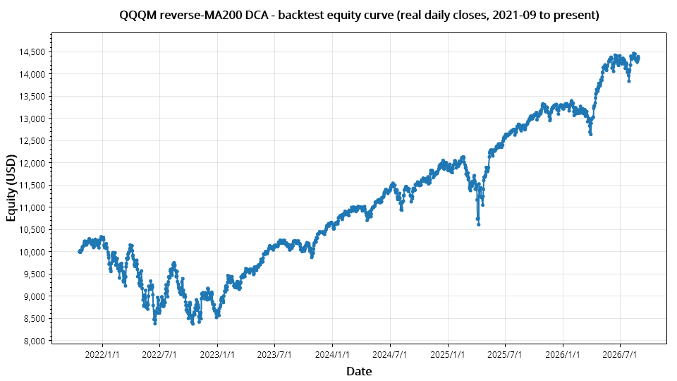
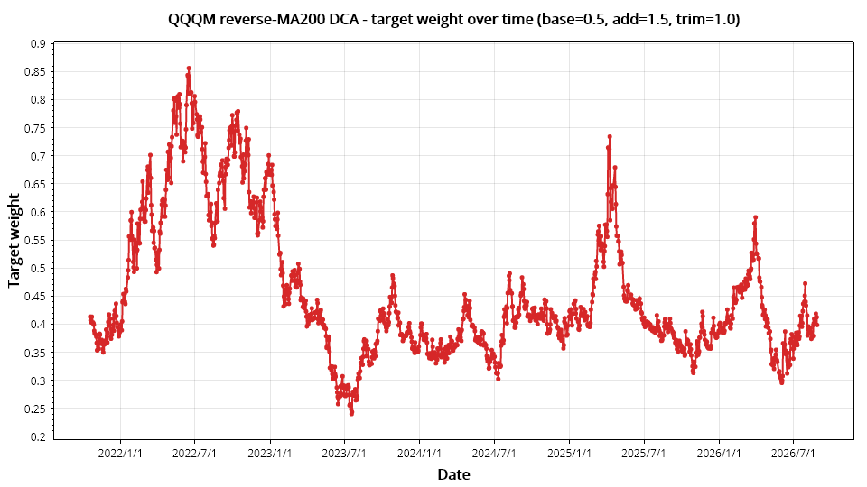

# Quant.Infra.Net

[](https://github.com/memoryfraction/Quant.Infra.Net/actions/workflows/ci.yml)  [](https://dotnet.microsoft.com/download/dotnet/8.0)  [](https://github.com/memoryfraction/Quant.Infra.Net/releases)  [](LICENSE)

> A one-stop .NET **framework** for quantitative trading: multi-source data ingestion, unified broker execution (Binance/IB/Schwab), real-time alerting, and built-in portfolio analytics — go from idea to backtest to paper to live by changing config and a strategy file, not your codebase.

> 📖 [Documentation / GitHub Pages](https://memoryfraction.github.io/Quant.Infra.Net/)

---

## 📈 See it work first / 先看一个真实结果

> **A real, reproducible backtest — not a mock.** The example below runs the bundled `QQQM reverse-MA200 DCA` strategy over **real QQQM daily closes (2021 → 2026)**, with the exact console output and equity curve from the actual run. Nothing is fabricated.





> Target weight over time — the strategy holds more when price is below the SMA200 and trims when above (the contrarian buy-the-dip in action).

**Real run result (real QQQM daily closes, 2021-01-04 → 2026-08-28):**

| Metric | Value | What it means |
|--------|-------|---------------|
| Initial equity | **$10,000** | starting capital |
| Final equity | **$14,435** | **+44.4%** over ~5.7 years |
| CAGR | **7.73%** | annualized return |
| Max Drawdown | **−18.97%** | worst peak-to-trough (2022 bear market) |
| Sharpe | **0.04** | a different risk/return trade-off than buy-and-hold — not better or worse; depends on your risk tolerance, income, and stage of life |
| Win Rate | **53.3%** | |
| Trades | **673** | daily rebalancing decisions |

> **This is a comparison, not a verdict.** Reverse-DCA holds more when price is below the SMA200 and trims when above. Over the same window it shows a *different* risk/return profile (shallower drawdown, lower return). **Neither is objectively better or worse** — the right fit depends on *your* risk tolerance, your income, and your stage of life. Quant.Infra.Net is a tool: it produces the numbers, **you** make the decision.

**Run it yourself (offline, no API keys):**

```bash
dotnet run --project src/Quant.Infra.Net.Runtime.Console -- QqqmDoc
```

The example reads a **local cached snapshot** of real QQQM daily closes (`docs/assets/_qqqm_yfinance.json`) first - zero network, fully deterministic. If that file is missing, it falls back to the free public Stooq feed. Refresh with `node docs/assets/qqqm_fetch_data.js`.

Full walkthrough with the verbatim console output, both charts, and how to modify the strategy: [Complete Walkthrough (EN)](CompleteWalkthrough-en.md).

---

## 📡 Data Sources — the thing people get wrong / 数据来源——很多人踩坑的地方

> **Data source is the #1 reason a quant project quietly dies.** The classic failure: you build on a .NET wrapper for Yahoo Finance, then Yahoo changes their API, the wrapper's author doesn't update for 3–6 months, and your whole pipeline is dead. **This repo is designed so that can't be your single point of failure.**

**The core idea: data source is a *swappable interface*, not a hard dependency.** `ITraditionalFinanceSourceDataService` / `ICryptoSourceDataService` are the contract; the implementation is a config value (`Runtime:DataSource`). When one source breaks or goes stale, you **swap the source, not the strategy**.

**Recommended default, then fallbacks, in order of preference:**

| # | Source | Mechanism | Why |
|---|--------|-----------|-----|
| ⭐ | **Alpaca Market Data** (free IEX tier) — `DataSourceKind.Alpaca` | Core library's `AlpacaClient`, on the **officially maintained** `Alpaca.Markets` .NET SDK | The only layer with an actual SDK maintainer, not a reverse-engineered endpoint. Free API key, no credit card. This is what "run in 60s" points at once you're past the zero-network demo. |
| 2 | **Yahoo Finance via `yfinance`** (Python) | `pythonnet` runs the Python `yfinance` directly | Community-maintained, patched fast — but still an unofficial wrapper. Fine for research. |
| 3 | **Yahoo Finance Chart API** (direct HTTP) | Thin in-repo C# client (`query1.finance.yahoo.com/v8/finance/chart`) | If `yfinance` breaks, this ~50-line endpoint is *your* code to patch. Still unofficial/undocumented. |
| 4 | **Stooq** (free public daily bars) | Plain HTTP to `stooq.com` | Last-resort independent free feed; has intermittently required browser verification (anti-bot) — best-effort, not a dependency to build on. |

> **Bottom line:** the .NET-ecosystem "unofficial wrapper" risk is real for Yahoo/Stooq — which is why the *recommended* path is Alpaca's officially maintained SDK, with Yahoo/`yfinance`/Stooq kept as free, zero-signup fallbacks for research. **You write the strategy once; you swap data sources by config.** All of these are for **research/backtesting only** — for live trading, point the same interface at your broker's feed (Binance/Alpaca/Schwab/IB); the strategy code is unchanged.

---

## ✍️ Modify the strategy — validate your own idea / 改一下策略，验证自己的想法

**This is the moment that convinces people.** The entire QQQM strategy is **one ~30-line method** in `src/Quant.Infra.Net.Runtime.Console/Strategies/QqqmReverseDcaStrategy.cs`. Change the numbers, change the symbol, add your own logic — and re-run the exact same backtest. No framework changes.

**The strategy in one sentence:** every day, compute `SMA200` of QQQM closes — if price is *below* the MA (cheap), increase target weight; if *above* (expensive), reduce it.

**Tweak parameters (zero code) / 调参数（零代码）:**

| Parameter | Default | Meaning |
|-----------|---------|---------|
| `Symbol` | `QQQM` | any symbol your data source serves |
| `MaPeriod` | `200` | SMA window |
| `BaseWeight` | `0.5` | target weight at the MA |
| `AddIntensity` | `1.5` | how hard to add when *below* the MA |
| `TrimIntensity` | `1.0` | how hard to trim when *above* the MA |

Set them in `appsettings.json` under `Orchestration:Parameters`, then re-run the **same** `dotnet run` command and read the new metrics — **your hypothesis, measured against the same real data.**

**Add a brand-new strategy (one file):** create a class implementing `IStrategyDescriptor` (wrapping an `ISignalGenerator`), see `ExampleCustomStrategy.cs` for the minimal case; the `AddQuantInfraNet(..., strategyAssemblies: ...)` reflection scan discovers it automatically; set `Orchestration:Parameters:Strategy = "MyStrategy"`. It now runs in **Backtest, Paper, Testnet, and Live** with identical logic.

---

## What Is This?

Quant.Infra.Net provides a unified C# API that abstracts away the complexity of connecting to multiple financial data sources, brokers, and notification channels. Instead of writing separate integrations for each platform, you write strategy logic once — the library handles the rest.

**Core Capabilities / 核心基础设施:**

| Module | What It Does / 能力说明 |
|--------|------------------------|
| **Data Source / 数据源** | Unified market data ingestion from Yahoo Finance & Binance (Spot/Futures), with local CSV/SQL persistence. <br>聚合多源行情（Yahoo/Binance），并支持本地持久化。 |
| **Broker & Orders / 订单执行** | Standardized trading interfaces for Binance Futures, seamlessly switching between testnet simulation and live execution. <br>币安合约标准化交易接口，无缝切换测试网模拟与实盘下单。 |
| **Notification / 通知推送** | Real-time strategy alerts via DingTalk bots, WeChat Work webhooks, and SMTP/Brevo email pipelines. <br>内置钉钉、企业微信及邮件通道，实现策略信号的即时触达。 |

> For full module details and usage examples, see [User Manual](Manual.md) and [Architecture Overview](Architect.md).

> **🤖 AI Agent access (new):** drive Quant.Infra.Net from Claude Desktop / Cursor / any MCP client with natural language. See [MCP Server guide](manual/mcp-server-en.md).

### Architecture Overview

| Module | Responsibility | Key Interfaces / Services |
|--------|---------------|---------------------------|
| **SourceData** | Multi-source market data ingestion | `ITraditionalFinanceSourceDataService`, `ICryptoSourceDataService` — Yahoo Finance (via yfinance/pythonnet), Binance spot/futures klines, Alpaca US equity, CSV/MySQL/MongoDB readers |
| **Broker** | Unified broker execution layer | `IBrokerService`, `IUSEquityBrokerService` — Binance Futures (spot/order/liquidate with Testnet/Paper/Live switching), Alpaca US Equity, Charles Schwab (quotes/options/orders/positions), Interactive Brokers via InterReact (TWS/Gateway) |
| **Analysis** | Quantitative/statistical tooling | `IAnalysisService` — ADF stationarity test, OLS regression, Z-Score, Shapiro-Wilk normality test, pair-trading spread calculation, rolling statistics |
| **Portfolio** | Position tracking and performance | `PortfolioSnapshot`, `StrategyPerformanceAnalyzer` — CAGR, Sharpe ratio, Calmar ratio, max drawdown, equity curve charting (ScottPlot) |
| **Notification** | Strategy alert dispatch | `IDingtalkService`, `IWeChatService`, `IEmailService` — DingTalk bot, WeChat Work webhook, personal/commercial bulk email |
| **Order** | Order modeling and lifecycle | Unified order models across brokers, order state machine, fill tracking |
| **Shared** | Cross-cutting utilities | `IntervalTrigger`, `RollingWindow<T>`, resolution conversion helpers, extension methods, DataFrame I/O (Deedle) |

---

## Orchestration Layer (Beta)

`Quant.Infra.Net.Orchestration` turns the modules above into a single, runnable pipeline: `DataIngest → Analysis → Signal → TargetPosition → Risk → Execution → PortfolioState → Notification`. Instead of writing glue code, you register one extension method and pick a built-in strategy.

**3 built-in strategies** (switch by changing one config value, no code changes):

| Strategy | `Parameters.Strategy` | Style |
|----------|------------------------|-------|
| Pair trading z-score | `PairTradingZScore` | Statistical arbitrage (OLS spread + z-score) |
| Classic 200-day MA | `MaCross` | Trend following |
| Mean reversion z-score | `MeanReversion` | Oscillation / mean reversion |

**Try it in under a minute** — the demo defaults to the single-symbol `MaCross` strategy on a synthetic `AAPL` series generated in-process (no network, no API keys, no real market data — see below for exactly what runs):

```bash
git clone https://github.com/memoryfraction/Quant.Infra.Net.git
cd Quant.Infra.Net/src
dotnet run --project Quant.Infra.Net.Runtime.Console
```

> Since R6 there is a single unified host: `Quant.Infra.Net.Runtime.Console` (the old standalone demo hosts are retired). One switch in `appsettings.json` — `Runtime:RunMode` — selects the mode: the default `Backtest` prints the performance report directly; set it to `Paper` to see the full event trail: data ingest → signal → risk check → paper execution → portfolio snapshot. A single symbol means one signal / one target position / one execution report, so the whole run is easy to verify by eye. Switch strategies or symbols by editing `Quant.Infra.Net.Runtime.Console/appsettings.json` and re-run.

**What data source, symbol, and strategy does the demo actually use — and how do I swap in my own?** See the dedicated [Orchestration Quick Start Guide](OrchestrationQuickStart-en.md) for the full breakdown plus step-by-step instructions for plugging in a real data source, changing symbols, and writing a custom strategy.

**Use it in your own host** (`Environment` defaults to `Paper` — pure in-memory, zero network calls, safe by default):

```csharp
var builder = Host.CreateApplicationBuilder(args);
builder.Services.Configure<OrchestrationOptions>(builder.Configuration.GetSection("Orchestration"));
builder.Services.AddQuantInfraNetOrchestration();   // Paper environment + pipeline assembled from "Strategy"

var host = builder.Build();
await host.RunAsync();
```

Extension points: pass `customStages`, `customSignalGenerator`, or `customExecutionModel` to `AddQuantInfraNetOrchestration(...)` to replace any part of the default pipeline with your own implementation.

Going live requires two explicit steps — nothing defaults to real trading: set `"Environment": "Testnet"` or `"Live"` in configuration, and register a live `IBinanceUsdFutureService` yourself before calling `AddQuantInfraNetOrchestration()` (it only auto-registers the Paper broker).

Full contract (interfaces, milestones, risk-rule defaults, extension points) is documented in [Orchestration Layer Design](OrchestrationLayerDesign.md).

---

## Backtest Engine (Beta)

`Quant.Infra.Net.Backtest` replays historical data through that **same** pipeline: bar by bar, the same 8-stage `StrategyPipeline`, the same strategy code — with zero network, zero live broker, and no look-ahead bias by construction. A backtest is never a *separate strategy implementation*; it is the identical code path that runs under Paper, re-driven over history.

**Try it in under a minute** — the demo runs `MaCross` over 260 synthetic daily bars (no network, no API keys; the series is synthetic, not real AAPL data):

```bash
git clone https://github.com/memoryfraction/Quant.Infra.Net.git
cd Quant.Infra.Net
dotnet run --project src/Quant.Infra.Net.Runtime.Console
```

(Same unified host; defaults to `Runtime:RunMode = "Backtest"`.)

Expected output (deterministic):

```
Backtest complete: 260 bars, 4 trades
CAGR=13.56%   Sharpe=0.54   Calmar=0.00
MaxDrawdown=0.00%   WinRate=100.0%   ProfitFactor=∞   Commission=0 USD
WinRate=80.0%   ProfitFactor=23.12   Commission=0 USD
```

**What's inside:**

| Capability | Detail |
|---|---|
| **Event-driven replay** | One `StrategyPipeline.RunAsync` per bar — the exact code path of a Paper session, re-driven over history |
| **No look-ahead bias** | `HistoricalDataSet.SliceUpTo(symbol, asOfUtc)` caps visible history at the bar being replayed (pinned by `LookAheadBiasTests`) |
| **Backtest broker** | `BacktestBrokerService` (an `IBinanceUsdFutureService`): accounting identical to the Paper broker, plus commission/slippage and an append-only trade log |
| **Fill timing** | `SameBarClose` (default) or `NextBarOpen` (fill at the next bar's open — causally honest for close-based signals) |
| **Costs** | `CommissionBps` + `SlippageBps`, recorded per trade and summing into `Metrics.TotalCommissionUsd` |
| **Metrics** | `BacktestResult.Metrics` — CAGR / Sharpe / Calmar / max drawdown (reusing `StrategyPerformanceAnalyzer`) + win rate / profit factor / total commission (trade-level), from `EquityCurve` + `Trades` |
| **Parameter sweeps** | `ParameterSweepRunner` — each grid point gets its own broker + its own DI container under `Parallel.ForEachAsync`; results indexed back into grid order |
| **Warm-up** | `WarmupBars` suppresses trading on the first N bars for indicator warm-up |

**Use it in your own host** (offline by design — `Environment` is forced to `Paper`, so no live broker can be wired in):

```csharp
var services = new ServiceCollection();
services.AddQuantInfraNetBacktest(
    configureBacktest: b => { b.InitialEquityUsd = 10000m; b.WarmupBars = 20; },
    configureOrchestration: o =>
    {
        o.Parameters["Symbol"] = "AAPL";
        o.Parameters["Strategy"] = "MaCross";
    });

using var provider = services.BuildServiceProvider();
var result = await provider.GetRequiredService<BacktestRunner>().RunAsync(myHistoricalDataSet, new[] { "AAPL" });
// result.EquityCurve, result.Trades, result.Metrics
```

Custom or the 3 built-in strategies: set `Parameters.Strategy` (`MaCross` / `MeanReversion` / `PairTradingZScore`) or pass `customSignalGenerator` — the **same class** then serves both backtest and Paper. Feed real data by building `HistoricalDataSet` from any `Ohlcv` series (fetched once, up-front — never inside the loop).

Full contract and guardrails (fill-timing matrix, milestones B0–B6, dependency white-list) are documented in [Trading Runtime Design](TradingRuntimeDesign.md); step-by-step usage is in the [Backtest Quick Start Guide](BacktestQuickStart-en.md).

---

## Packages / NuGet 包

The project is published as a family of NuGet packages. Most users only need the top one — its dependencies pull in the rest automatically:

| Package | Version | What it gives you |
|---------|---------|-------------------|
| `Quant.Infra.Net` | 1.5.1 | Core infrastructure: data sources (Yahoo/Binance/Alpaca/Schwab/IB), broker & order execution, statistical analysis, portfolio analytics, notifications |
| `Quant.Infra.Net.Orchestration` | 1.6.0 | Event-driven strategy pipeline: signal → risk → target position → execution → portfolio state |
| `Quant.Infra.Net.Backtest` | 1.6.0 | Event-driven (bar-by-bar) backtest engine with look-ahead-bias guards |
| `Quant.Infra.Net.Runtime` | 1.6.0 | Unified `RunMode` switch (Backtest/Paper/Testnet/Live) + one-file-per-strategy plugin convention — **recommended entry point** |

Dependency chain: `Runtime 1.6.0` → `Backtest 1.6.0` + `Orchestration 1.6.0` → `Quant.Infra.Net 1.5.1`. One `dotnet add package` on `Quant.Infra.Net.Runtime` installs the whole stack; install `Quant.Infra.Net` alone if you only need data/broker/analysis/notification building blocks.

---

## Credentials


> **Maintainer certified in Algorithmic Trading — EPAT®, QuantInsti (2024).**
>
> 📝 EPAT graduation project: [Crypto Perpetual Contract Pair Trading](https://blog.quantinsti.com/crypto-perpetual-contract-pair-trading-project-rong-fan/) (QuantInsti Blog).

---

## Why Use This Library?

### Pain Points in Quant Development

When building quantitative trading systems, most developers encounter these challenges:

| Challenge | What Happens Without This Library | How Quant.Infra.Net Solves It |
|-----------|----------------------------------|-------------------------------|
| **Data source fragmentation** | Each API (Yahoo, Binance, Alpaca, Schwab) returns data in its own format — you write converters for every provider | Unified `ITraditionalFinanceSourceDataService` and `ICryptoSourceDataService` with standardized OHLCV models; new sources are just another implementation of the same interface |
| **Broker boilerplate** | Connecting to Binance futures requires handling API keys, rate limits, WebSocket reconnects; Schwab requires OAuth flow; IB needs TWS/Gateway IPC | Single `IBrokerService` abstraction — swap brokers by changing configuration, not code |
| **Reinventing analysis math** | Implementing ADF tests, regressions, Z-Score normalization from scratch every time | `IAnalysisService` provides 10+ statistical methods ready to call |
| **No alerting pipeline** | Strategies run silently — you only discover results after hours of waiting | Built-in DingTalk, WeChat Work, and email notifications fire on strategy events |
| **Performance tracking is manual** | Computing CAGR, Sharpe, max drawdown requires writing formulas that may contain bugs | `StrategyPerformanceAnalyzer` implements standard metrics with unit tests; ScottPlot integration for charting |

### Who Is This For?

- Quantitative researchers and traders building strategies on the .NET platform
- Developers who want a single NuGet package to handle data, execution, and alerting
- Teams that need consistent broker abstractions across Binance, Alpaca, Schwab, and Interactive Brokers
- Anyone tired of writing the same integration code for every new project

---

## Quick Start

### Step 1: Install via NuGet

```bash
# Create a project (or use an existing one)
dotnet new console -n MyQuantApp
cd MyQuantApp

# Full stack: unified runtime + backtest engine + orchestration pipeline + core
# (one command pulls in everything via the dependency chain above)
dotnet add package Quant.Infra.Net.Runtime

# Core only (data / broker / analysis / notifications - no strategy pipeline)
dotnet add package Quant.Infra.Net --version 1.5.1

# Required for Python-based data sources (Yahoo Finance via yfinance)
dotnet add package pythonnet

# Recommended for dependency injection
dotnet add package Microsoft.Extensions.DependencyInjection

# Then run your strategy with ONE config switch - see the Unified Runtime Quick Start
# "Runtime:RunMode" = Backtest | Paper | Testnet | Live
services.AddQuantInfraNet(rt => rt.RunMode = RunMode.Backtest,
                           o => o.Parameters["Strategy"] = "MaCross",
                           b => b.InitialEquityUsd = 10000);
```

### Step 2: Use in Code

```csharp
using Quant.Infra.Net.SourceData.Service;
using Quant.Infra.Net.Analysis.Service;
using Quant.Infra.Net.Broker.Service;
using Quant.Infra.Net.Notification.Service;
using Microsoft.Extensions.DependencyInjection;

// Register services via DI
var services = new ServiceCollection();
services.AddQuantInfraNet();  // registers all modules

// --- Data: Fetch OHLCV from multiple sources ---
var dataService = services.BuildServiceProvider()
    .GetService<ITraditionalFinanceService>();
var bars = await dataService.GetOhlcvListAsync("AAPL", DateTime.Now.AddDays(-30), DateTime.Now);

// --- Analysis: Pair-trading correlation & ADF test ---
var analysis = services.BuildServiceProvider()
    .GetService<IAnalysisService>();
var correlation = await analysis.CalculateCorrelationAsync(aaplPrices, msftPrices);
var isStationary = await analysis.TestStationarityAsync(spreadSeries);

// --- Broker: Place orders across platforms ---
var broker = services.BuildServiceProvider()
    .GetService<IBrokerService>();
var orderResult = await broker.PlaceOrderAsync(new OrderRequest { Symbol = "AAPL", Side = Side.Buy, Quantity = 10 });

// --- Portfolio: Performance analytics ---
var portfolio = services.BuildServiceProvider()
    .GetService<IPortfolioSnapshotService>();
var snapshot = await portfolio.GetSnapshotAsync(accountId);

// --- Notification: Strategy alerts ---
var dingTalk = services.BuildServiceProvider()
    .GetService<IDingtalkService>();
await dingTalk.SendStrategyAlert("Mean reversion triggered for AAPL/MSFT spread");
```

### Step 3: Configuration

```json
// appsettings.json
{
  "BinanceApi": {
    "ApiKey": "your-api-key",
    "SecretKey": "your-secret-key",
    "Environment": "testnet"   // testnet | paper | live
  },
  "YahooFinance": {
    "PythonPath": "C:\\Users\\you\\Anaconda3\\python.exe"
  }
}
```

---

## Version History

| Version | Date | Description |
|---------|------|-------------|
| **1.6.0** *(current)* | 2026-08-29 | **Three new NuGet packages** — `Quant.Infra.Net.Orchestration` 1.6.0 (event-driven 8-stage strategy pipeline), `Quant.Infra.Net.Backtest` 1.6.0 (bar-by-bar backtest engine with look-ahead-bias guards), `Quant.Infra.Net.Runtime` 1.6.0 (unified `RunMode` switch: Backtest/Paper/Testnet/Live + one-file-per-strategy plugin convention). Core `Quant.Infra.Net` stays at 1.5.1, unchanged. See [Trading Runtime Design](TradingRuntimeDesign.md) and [Complete Walkthrough](CompleteWalkthrough-en.md) |
| **1.5.2** | 2026-08-28 | **Orchestration Layer (Beta)** — new `Quant.Infra.Net.Orchestration` package: `AddQuantInfraNetOrchestration()` DI entry point, 8-stage pipeline, 3 built-in strategies (PairTradingZScore/MaCross/MeanReversion), Paper (in-memory, zero-network) execution by default, risk gate with kill-switch, severity-routed notifications, and a runnable console demo. See [Orchestration Layer Design](OrchestrationLayerDesign.md) |
| 1.5.1 | 2026-08-12 | Code_Standards.md compliance — bilingual XML documentation on all public members, parameter validation audit, version alignment |
| 1.5.0 | 2026-05-28 | **Interactive Brokers (InterReact)** full integration — order, market data, account management via TWS/Gateway; **Charles Schwab** full broker service — quotes, option chains, orders, positions; license changed to MIT; enhanced analysis service unit tests |
| 1.4.0 | 2024-05-16 | Updated API integrations to handle recent broker changes, added comprehensive documentation |
| 1.3.0 | 2024-04-05 | Enhanced notification services with email templates and improved error handling |
| 1.2.0 | 2024-03-10 | Improved Python integration stability and added new statistical analysis methods |
| 1.1.0 | 2024-02-20 | Added support for Schwab broker integration and enhanced portfolio performance metrics |
| 1.0.0 | 2024-01-15 | Initial release with core features: data acquisition, statistical analysis, trade execution, and notifications |

---

## Code Standards

This project follows the coding standards defined in [CodeStandard.md](CodeStandard.md):
- Bilingual (Chinese + English) XML documentation on all public members
- SOLID principles for design
- Parameter validation on all entry points
- UTC time handling and consistent enum management

---

## Notes on Testing

> ⚠️ **Cryptocurrency Exchange Region Notice**: Cryptocurrency exchange regulations vary by country/region. For example, Binance API may not be accessible from Mainland,China or the US but works in Singapore. This repository only provides technical solutions—comply with local laws and take full responsibility for your own actions.
>
> ```bash
> dotnet test --filter "FullyQualifiedName!~Binance"
> ```

---

## Ecosystem

| Project | Description |
|---------|-------------|
| **Quant.Infra.Net** (this repo) | Core quantitative trading library — data, analysis, execution, notifications |
| [**Quant.Infra.Net.Pro**](https://github.com/memoryfraction/Quant.Infra.Net.Pro) | Production-grade Charles Schwab web application with unattended OAuth token management and full dashboard |

---

## License

[MIT](LICENSE) — © 2024–2026 Rong (Rex) Fan


## 💼 Business Inquiries

Using Quant.Infra.Net in a commercial product or team?

| Option | What you get | Start |
|---|---|---|
| **1 · Consulting** | 30–60 min: architecture / data / execution / backtest design | [Book 30 min](https://calendly.com/rex-fan18/30min) |
| **2 · Integration** | Wire it into your broker/data stack; backtest → paper → live | [Email](mailto:rex.fan18@gmail.com) |
| **3 · Bespoke** | Custom modules scoped to your product needs | [Email](mailto:rex.fan18@gmail.com) |
| **4 · E-book** | 《区块链量化投资实战 / Blockchain Quant Trading in Practice》 | [Amazon](https://www.amazon.com/dp/B0D7W89ZQD) |

- **Email**: [rex.fan18@gmail.com](mailto:rex.fan18@gmail.com)
- **Book a call**: [https://calendly.com/rex-fan18/30min](https://calendly.com/rex-fan18/30min)

> The open source release is MIT-licensed and free for commercial use. Paid services cover consulting, onboarding, and bespoke development.

> Full service & pricing details: [Commercial.md](Commercial.md).
---

> **Disclaimer**: See [DISCLAIMER.md](Disclaimer.md) for full disclaimer and limitation of liability / 详见 [免责声明](Disclaimer.md) 了解完整免责条款与责任限制。


